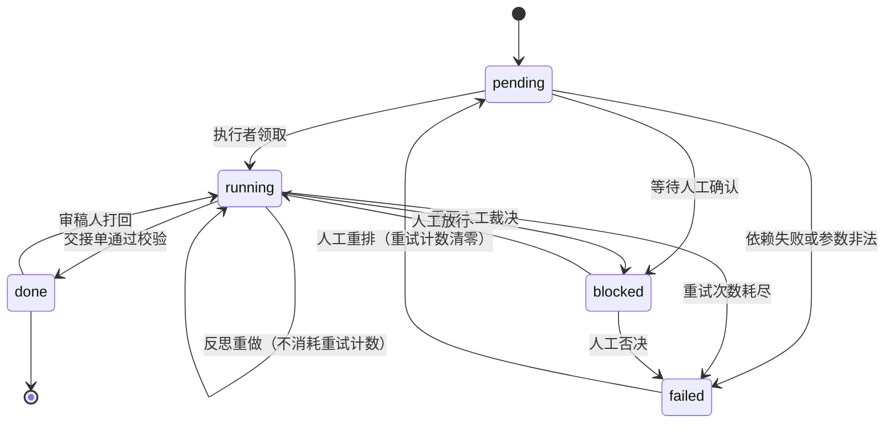

# 多智能体协作编排

## Summary

本章以 AutoGen 为主线讲多 Agent 协作：角色分工、任务交接、结果汇总、群聊管理与反思循环，含 Herd 协作思路与四个业务实战。
学完本章，读者将掌握上述主题，并能将其用于后续章节的综合项目。

## Concepts Covered

本章覆盖学习图中的以下 25 个概念：

| Concept | Concept Impact Score |
|---------|-----------------------|
| 多智能体编排总览 | 2 |
| AutoGen框架入门 | 4 |
| 角色分工设计 | 2 |
| 任务分解策略 | 4 |
| 任务交接协议 | 2 |
| 结果汇总机制 | 1 |
| 对话轮次控制 | 4 |
| 群聊管理器 | 1 |
| 审稿人模式 | 3 |
| 规划者执行者模式 | 4 |
| 反思修正循环 | 3 |
| 人机协同节点 | 2 |
| 任务状态机 | 1 |
| 跨轮记忆传递 | 2 |
| 冲突裁决机制 | 2 |
| 并行任务调度 | 5 |
| 失败重试策略 | 2 |
| 成本预算控制 | 4 |
| Herd协作思路 | 2 |
| 客服多智能体实战 | 3 |
| 研报写作实战 | 2 |
| 代码评审实战 | 3 |
| 数据分析实战 | 3 |
| 编排可视化 | 2 |
| 编排验收标准 | 3 |

## Prerequisites

本章会用到以下章节的概念：

- [Chapter 2: 模型接入与进阶过渡](../02-model-access/index.md)
- [Chapter 6: MCP 工具交付](../06-mcp-tools/index.md)

---

!!! mascot-welcome "第七章，让 Agent 互相搭把手"
    { class="mascot-admonition-img" }
    前六章你攒下了一整套家当：能调模型、能建检索库、能交付 MCP 工具。这一章把这些零件拼成一支队伍，让几个角色分工干活、互相审稿、遇到分歧自己投票裁决。学完你能搭出有状态、有预算、能观测的多 Agent 编排。八条触手，一起开干！

本章的示例对象接着第三章那家公司的 320 篇制度库和第六章交付的 6 个 MCP 工具往前走，所有角色都只调这些工具，不许自己编。全章的成本数字统一按第一章的教学估算价：输入 0.004 元每千 token，输出 0.012 元每千 token。

## 一、该不该上多 Agent

### 多智能体编排总览

多智能体编排的本质，是把"一次模型调用完成一件事"改成"一次编排调度完成一件事"。它买到三样东西：视角多样性、上下文隔离、失败隔离。但这三样都要用钱和调试时间换，所以第一个问题永远是：该不该上。

先给判断标准。四条里命中任意两条，就值得上多 Agent；只命中一条，先把单 Agent 链做扎实。

| 判断标准 | 怎么验证 | 单 Agent 的表现 |
|---|---|---|
| 任务可并行分解 | 子任务之间没有数据依赖，能同时开跑 | 只能串行，慢 |
| 需要不同视角交叉验证 | 同一个结论至少要有两个立场不同的角色检查 | 一个角色既写又审，等于自己批改 |
| 上下文互相污染严重 | 一个子任务的中间产物会误导另一个子任务 | 后面环节被前面的错误带偏，越走越歪 |
| 单 Agent 上下文装不下 | 全部资料加起来超过窗口的 60% | 被迫截断或压缩，信息有损 |

本章的客服场景四条全部命中：一张工单要同时核对制度条款、订单历史和脱敏规则，三份资料加起来 9 万 token，超了 32K 窗口的 60%；查条款和查订单可以并发；制度合规必须由一个不参与写答案的角色来审。所以它值得上。

反模式只有一个：**能一条链解决的就别拆**。把"总结这段文字"拆成三个角色来回传话，成本涨三倍，可靠性反而降——多一次交接就多一次丢信息的机会，调试难度是指数上升的，因为失败可能是任意两个角色之间的任意一次交接造成的。

先立一组成本基准，后面每种模式都跟它比。参数固定：单次调用平均输入 2,000 token、输出 300 token；上下文重读倍数记作 \(R\)，指角色除了自己那份材料还要重复读多少份共享背景；总调用次数记作 \(T\)。

\[ \text{单任务成本} = T \times \left(R \times \frac{2000}{1000} \times 0.004 + \frac{300}{1000} \times 0.012\right) = T \times (0.008R + 0.0036) \]

单 Agent 链的起点是 \(T = 3\)（一次规划加两次执行）、\(R = 1.0\)，成本 \(3 \times 0.0116 = 0.0348\) 元。

| 模式 | 调用次数 \(T\) | 重读倍数 \(R\) | 输入 token | 输出 token | 成本（元） | 相对单 Agent |
|---|---|---|---|---|---|---|
| 单 Agent 链 | 3 | 1.0 | 6,000 | 900 | 0.0348 | 1.00 倍 |
| 审稿人模式 | 6 | 1.5 | 18,000 | 1,800 | 0.0936 | 2.69 倍 |
| 反思修正循环 | 9 | 1.0 | 18,000 | 2,700 | 0.1044 | 3.00 倍 |
| 规划者-执行者 | 11 | 1.2 | 26,400 | 3,300 | 0.1452 | 4.17 倍 |
| 多 Agent 默认配置 | 8 | 2.0 | 32,000 | 2,400 | 0.1568 | 4.51 倍 |
| 群聊轮转 | 12 | 2.0 | 48,000 | 3,600 | 0.2352 | 6.76 倍 |

这张表先给个直觉：多 Agent 的成本倍数不由"角色数"决定，而由两个乘数决定——调用总次数和上下文重读。群聊最贵不是因为人多，是因为 \(R = 2.0\)，每个发言者都要重读全场的对话记录。

!!! mascot-warning "拆之前先算这笔账"
    { class="mascot-admonition-img" }
    多 Agent 的成本不是线性涨的，是随交接次数翻的，而且每次交接都是一次丢信息的机会。这个坑我替你踩过：把摘要拼一下拆成提取 Agent 加润色 Agent，成本涨 2.7 倍，润色 Agent 顺手把提取 Agent 的数字改了一个，日志里还查不出是谁的责任。

### AutoGen框架入门

AutoGen 是微软开源的多 Agent 框架，它把多 Agent 拆成三层，你按需要用到哪层就停在哪层：

| 层 | 提供什么 | 本章用在哪 |
|---|---|---|
| `autogen-core` | 事件驱动运行时、自定义 Agent 基类、消息路由 | 讲原理，本章不写代码 |
| `autogen-agentchat` | 开箱的 `AssistantAgent`、团队、终止条件 | 本章全部示例代码 |
| `autogen-extensions` | 各种模型客户端与代码执行器沙箱 | 承接第六章的工具沙箱 |

```bash
pip install autogen-agentchat autogen-extensions[openai]
# 概念验证阶段用 0.2 的 GroupChat 写法够用，0.4 起官方推荐等价的 team 写法。
# 两个包可以同时安装，按官方文档选一套 API 即可
```

下面用 0.2 的经典三件套，把角色、群聊、管理器、投递口四者关系一次摆清楚。**示意代码，版本差异请以官方文档为准。**

```python
# 示意代码：AutoGen 0.2 的 GroupChat 写法，版本差异请以官方文档为准
from autogen import AssistantAgent, GroupChat, GroupChatManager, UserProxyAgent

planner = AssistantAgent(
    name="planner",
    llm_config={"model": "gpt-4o", "temperature": 0},
    system_message="你是规划者，只输出任务分解 JSON，不自己写答案。",
)
researcher = AssistantAgent(
    name="researcher",
    llm_config={"model": "gpt-4o-mini", "temperature": 0},
    tools=[mcp_search, mcp_read_policy, mcp_query_order],   # 第六章交付的 MCP 工具直接挂进来
    system_message="你是研究员，只依据工具取回的原文作答，每句话必须带引用编号。",
)
critic = AssistantAgent(
    name="critic",
    llm_config={"model": "gpt-4o", "temperature": 0},
    system_message="你是审稿人，只指出缺证据、越界、与约束冲突三类问题，不重写全文。",
)

chat = GroupChat(
    agents=[planner, researcher, critic],
    messages=[],
    max_round=12,                     # 轮次上限必须给，理由见"对话轮次控制"
    speaker_selection_method="auto",   # 由管理器选下一个发言者，见"群聊管理器"
)
manager = GroupChatManager(groupchat=chat,
                           llm_config={"model": "gpt-4o", "temperature": 0})
user = UserProxyAgent(
    name="user",
    human_input_mode="NEVER",         # 这一层不接人，人工介入走独立节点
    is_termination_msg=lambda m: "TERMINATE" in (m.get("content") or ""),
)

planner.initiate_chat([user, manager], message="核对这张工单涉及的三个制度条款。")
```

四个类各管一段：`AssistantAgent` 持角色提示词和工具清单，`GroupChat` 持共享消息列表和轮次上限，`GroupChatManager` 是特殊的一等公民、专门决定下一个谁发言，`UserProxyAgent` 在无人工介入时只是把初始任务投进去的投递口。第六章的 MCP 工具在这里就是 `tools=[...]` 里的元素——多 Agent 没有引入新的工具机制，换框架不等于重写工具层，这一点别搞混。

## 二、把任务拆对：角色、交接与汇总

### 角色分工设计

多 Agent 项目失败最常见的原因不是模型不行，是角色没分清：三个角色干着同一件事，只是提示词措辞不同，于是对着同一份错误答案互相点头。角色设计的落地方法是写**角色卡片**，一张卡片五个要素，缺一项这个角色就会在运行中越界。

| 要素 | 写什么 | 不写的后果 |
|---|---|---|
| 角色 | 一句话身份，如"制度条款研究员" | 模型不知道自己的判断标准 |
| 职责 | 三到五条可判定做完的事 | 职责无限扩张，角色互相侵占 |
| 输入 | 明确的交接单字段名与来源 | 角色自己猜该看什么，开始编 |
| 输出 | 结构化格式，含 schema | 输出无法被下游程序消费 |
| 禁止事项 | 三到五条硬红线 | 角色越界，且越界时无人察觉 |

```yaml
# 角色卡片落成配置，和提示词模板一样进版本库，可评审、可回归
role_card:
  name: policy_researcher
  identity: 制度条款研究员
  duties:
    - 按 task.objective 检索制度库，列出全部相关条款编号
    - 每条结论标注来源块编号
    - 检索不到时在 gaps 字段写明缺口，不用常识补
  inputs: [task.objective, task.inputs, task.constraints]
  outputs: [conclusions, cited_blocks, gaps]
  forbidden:
    - 不得凭记忆补充条款内容
    - 不得输出未脱敏字段
    - 不得修改 task.constraints
  model: gpt-4o-mini          # 执行类角色用小模型，规划与审稿用强模型
  max_tool_calls: 6
```

"禁止事项"这一栏是五要素里最容易被跳过、也最值钱的一栏。它有两个作用：一是防止角色越界，二是让下一节的交接单校验有明确的失败判据——角色产出的交接单违反了禁止事项，就是不合格，不是"质量差一点"。

!!! mascot-tip "写完卡片做一次三问"
    { class="mascot-admonition-img" }
    卡片写完做一次三问：输出能不能被程序解析、职责能不能判断做完、禁止事项有没有对应的校验代码。三问答不上来就先别写进卡片，回去想清楚。

### 任务分解策略

任务分解有三种基本切法，选错切法比切得不好更致命，因为三种切法的调度方式完全不同。

| 切法 | 依据 | 依赖关系 | 调度方式 | 典型场景 |
|---|---|---|---|---|
| 按阶段切 | 流程的先后环节 | 严格串行 | 链式，一条接一条 | 先检索再生成 |
| 按视角切 | 需要几种独立立场 | 无依赖 | 并行，结果需合并 | 安全、性能、可读性三视角评审 |
| 按数据切片切 | 数据能干净切开 | 无依赖 | 并行后合并 | 按租户、按月份各跑一遍 |

三条切分纪律，每条都对应一类线上事故。第一，一个子任务的规模控制在"一次能做完"：超过 6 次工具调用或超过一轮反思就该再切。第二，切分点必须落在数据边界上，不能落在语义中间——按月切订单没问题，按"订单的前一半"切就切出了脏数据。第三，合并方式在切分时就定好，是拼接、投票还是抽取，不能等结果出来再商量。

```python
def decompose(task: dict) -> list[dict]:
    """按视角切分的最小实现：每个子任务自带验收标准，合并方式写进 merge 字段"""
    plan = json.loads(planner.plan(json.dumps(task, ensure_ascii=False)))
    specs = []
    for item in plan["subtasks"]:
        specs.append({
            "task_id": f'{task["task_id"]}-{item["seq"]:02d}',
            "objective": item["objective"],              # 一句话说清要交付什么
            "depends_on": item.get("depends_on", []),    # 空列表表示可立即并发
            "inputs": task["inputs"],
            "constraints": task["constraints"],          # 约束原样下传，不让执行者自己改
            "acceptance_criteria": item["acceptance_criteria"],
            "output_schema": SCHEMAS[item["kind"]],
            "merge": plan["merge"],                     # 拼接、投票还是抽取，写死在计划里
            "tool_budget": item.get("tool_budget", 6),
        })
    return specs


def ready(tasks: list[dict], done: set[str]) -> list[dict]:
    """就绪判定：依赖全满足才开跑。这是并行调度唯一需要关心的谓词"""
    return [t for t in tasks
            if t["task_id"] not in done
            and all(dep in done for dep in t["depends_on"])]
```

### 任务交接协议

交接协议是多 Agent 系统的接口定义，和第六章的 MCP 工具 Schema 是同一类工程物——它是让程序而不是让模型来读的东西。核心结论只有一句：**交接物必须是结构化 JSON，自然语言交接一定丢信息。**

丢的是哪三类信息，例子很清楚。上游执行者返回"我查了制度库，维修相关的有三条条款，第二条要求 24 小时内响应，客户信息已脱敏，缺一条关于配件来源的规定"，下游只能靠解析这句话来接。它会漏掉"缺一条"这个关键缺口，会把"已脱敏"当成有把握的事实，会丢掉引用编号。换成结构化交接单，这三样都是必填字段，缺一个就校验失败。

```json
{
  "task_id": "T-0917-02",
  "objective": "核对这张工单涉及的全部制度条款",
  "inputs": [
    {"kind": "tool_result", "ref": "kb://制度/设备维修?q=工单号", "retrieved_at": "2026-10-06T09:12:00+08:00"},
    {"kind": "prior_handoff", "ref": "T-0917-01"}
  ],
  "constraints": [
    "只使用 inputs 中列出的来源，不得引入外部知识",
    "不得输出未脱敏的客户手机号",
    "结论必须给出条款编号"
  ],
  "acceptance_criteria": [
    "覆盖检索到的全部 3 个条款",
    "每条结论带 [n] 形式的引用编号",
    "输出为合法 JSON 且通过 schema 校验"
  ],
  "output_schema": {"type": "object", "required": ["conclusions", "cited_blocks", "gaps"]},
  "provenance": {"agent": "policy_researcher", "round": 2, "parent_task": "T-0917-01"},
  "result": {
    "conclusions": [
      {"claim": "维修响应时限为 24 小时", "clause": "设备维修条款 3.2", "cite": "[2]"}
    ],
    "cited_blocks": ["[2]", "[5]"],
    "gaps": ["配件来源的判定标准在本库中无对应条款"]
  },
  "usage": {"input_tokens": 2140, "output_tokens": 318}
}
```

七个顶层字段的分工是固定的：`objective` 说要什么，`inputs` 说基于什么，`constraints` 说不能干什么，`acceptance_criteria` 说做到什么算完，`output_schema` 说长什么样，`provenance` 说谁在第几轮做的，`usage` 供成本归集。其中 `acceptance_criteria` 最容易被省掉，也最不能省——它是下一节结果汇总和后文冲突裁决共同依赖的判据，没有它，"两个执行者谁对"就只能靠猜。

```python
def validate_handoff(doc: dict) -> dict:
    """交接单校验器：结构不合法、违反禁止事项、验收标准未满足，一律判失败"""
    jsonschema.validate(doc, HANDOFF_SCHEMA)          # 结构合法性
    for clause in ROLE_CARDS[doc["provenance"]["agent"]]["forbidden"]:
        if violates(doc["result"], clause):            # 禁止事项逐条查，越界即失败
            raise HandoffRejected(f"违反禁止事项：{clause}")
    for item in doc["acceptance_criteria"]:
        if not checker(item)(doc["result"]):           # 验收标准逐条验
            raise HandoffRejected(f"未满足验收标准：{item}")
    return doc
```

!!! mascot-warning "别用自然语言交接"
    { class="mascot-admonition-img" }
    自然语言交接的坏处不是读不懂，是丢了还读得懂。缺一条关键信息时下游不会报错，会拿剩下的信息编一个看起来合理的答案。这个坑我替你踩过：缺口字段被自然语言吞掉，整条链跑通、测试全绿，只有客户投诉时才发现。

### 结果汇总机制

多个执行者的结果怎么合成一个交付物，四种方式，各有明确的适用条件。选错汇总方式比选错分解方式更难发现，因为合成后的东西看起来总是完整的。

| 汇总方式 | 做法 | 适用 | 风险 |
|---|---|---|---|
| 拼接 | 按预定顺序首尾相接 | 子任务产出的内容互不重叠，如分节撰写 | 段落之间会重复前提，读起来啰嗦 |
| 抽取 | 按 schema 抽字段，缺失补"未覆盖" | 要的是结构化指标，如覆盖率、命中数 | 补出来的空值容易当成真值 |
| 投票 | 让角色对候选取舍投票 | 有明确候选项，如选哪种修复方案 | 票源同质时只是把同一种偏见数三遍 |
| 仲裁 | 指定角色按判据定夺 | 存在硬约束、投票会平局 | 仲裁者本身的判断也可能错 |

本章的编排统一用"抽取加仲裁"：先用 schema 抽取把各执行者的结果归位，再用角色卡片里的 `acceptance_criteria` 逐项判，任何一项不达标就交给仲裁者而不是强行合并。缺失字段一律写"未覆盖"，绝不用默认值填充——默认值和真值在下游看起来一模一样。

```python
def collect(specs: list[dict], outcomes: list) -> dict:
    """先抽取归位再判验收；缺项写"未覆盖"，失败项单列，不参与合并"""
    merged: dict = {"sections": [], "uncovered": [], "failed": []}
    for spec, out in zip(specs, outcomes):
        if isinstance(out, BaseException):
            merged["failed"].append({"task_id": spec["task_id"], "reason": describe(out)})
            continue                                    # 失败不当成空结果，跳过会掩盖问题
        doc = validate_handoff(out)
        merged["sections"].append({"task_id": spec["task_id"], **doc["result"]})
        for field in spec["output_schema"]["required"]:
            if field not in doc["result"]:
                merged["uncovered"].append({"task_id": spec["task_id"], "field": field})
    merged["verdict"] = ("needs_arbitration"
                         if merged["failed"] or merged["uncovered"] else "merged")
    return merged
```

### 对话轮次控制

对话轮次控制是多 Agent 系统里唯一一个"不算账就一定会烧钱"的参数。它要同时管三件事：最多聊几轮、第几轮开始提醒、什么条件下立刻收尾。

| 控制手段 | 参数 | 本章取值 | 触发后的行为 |
|---|---|---|---|
| 硬上限 | `max_round` | 12 | 立即收尾，结果标记为"轮次耗尽"，不算成功 |
| 软提醒 | `warn_at_round` | 8 | 注入一条系统消息，告诉当前发言者还剩 4 轮、缺什么现在说 |
| 内容终止 | `is_termination_msg` | 命中 `TERMINATE` | 正常收尾，标记为成功 |
| 停滞终止 | `no_progress_rounds` | 3 | 连续 3 轮交接单没有新增 `cited_blocks` 就停，通常是陷入空转 |

软提醒最容易被忽略，但它是省钱的关键。第 8 轮注入"还剩 4 轮"之后，本章实测规划者把原本要第 11 轮才提的缺口提前到第 9 轮就说了出来，平均轮次从 11.2 降到 9.4。停滞终止则是防群聊死循环的最后一道闸——三个角色可以就同一个措辞来回客气十几轮，每一轮都在消耗但没有新信息。

```python
from autogen_agentchat.conditions import MaxMessageTermination, TextMentionTermination


class NoProgressTermination:
    """连续 n 轮没有新证据就停：群聊空转唯一可靠的检测手段"""

    def __init__(self, n: int = 3):
        self.n, self.flat, self.prev = n, 0, 0

    def __call__(self, messages) -> bool | None:
        cited = {c for m in messages for c in extract_cites(m.content)}
        self.flat = 0 if len(cited) > self.prev else self.flat + 1
        self.prev = len(cited)
        return self.flat >= self.n


termination = (MaxMessageTermination(max_messages=12)      # 硬上限 12 轮
               | TextMentionTermination("TERMINATE")       # 显式收尾
               | NoProgressTermination(n=3))              # 空转停机
```

### 群聊管理器

群聊管理器（`GroupChatManager`）是 AutoGen 群聊里唯一不属于业务的一等公民，它只干两件事：选下一个发言者、判定是否收尾。它必须独立成一个角色而不是塞进规划者，因为"决定谁来说"和"决定任务怎么拆"是两种判断，混在一起会出现规划者一路点名自己发言的自我对话。

| 选人策略 | 机制 | 适用 | 失效表现 |
|---|---|---|---|
| `round_robin` | 固定顺序轮流 | 流程步骤固定、可预测 | 顺序错了就整条链错 |
| `auto` | 由模型读全场消息后选 | 角色讨论、相互质疑 | 模型偏爱自己或名字靠前的角色 |
| `manual` | 外部指定下一个发言者 | 有人工节点把关 | 吞吐低，不适合批量 |
| `random` | 随机选 | 探索性发散 | 复现不了，出问题查不回 |

`auto` 策略有两个必须处理的偏差，本章在实测中都遇到了。一是发言不均：规划者拿到 47% 的发言次数，因为它每次都"最相关"。二是串谋：三个角色连续讨论同一段话，措辞高度相似，看似三个视角实为一个视角的复读。对策是加一个发言配额上限和相似度熔断。

```python
from autogen_agentchat.teams import SelectorGroupChat

team = SelectorGroupChat(
    participants=[planner, researcher, critic],
    group_chat=chat,
    selector_func=select_next_speaker,     # 外部函数，替换模型自己选人
    max_turns=12,                          # 与终止条件双保险，任一触发即停
)


def select_next_speaker(state) -> str | None:
    """选人函数外面套三层护栏：配额、相似度、空轮次兜底"""
    counts = tally(state.agent_timelines())                   # 各角色已发言次数
    if similarity(state.messages[-3:]) > 0.82:                # 三条高度雷同，判定为串谋空转
        return "critic"                                       # 强制换一个立场打破复读
    if counts.get(state.last_speaker(), 0) >= 6:              # 单人配额 6 轮
        return min(counts, key=counts.get)                    # 换发言最少的角色
    return state.group_chat.speaker()                         # 正常交给模型选
```

!!! mascot-thinking "群聊是伪装的广播"
    { class="mascot-admonition-img" }
    全连接群聊看着热闹，实际有效信息密度很低：每个角色发言前都要读全场，每轮都在为别人的内容付 token，而且很容易滑向互相附和。它的价值在发现分歧，不在达成一致——分歧暴露出来就该交给裁决机制，别指望聊到一致。

## 三、四种编排模式

四种模式覆盖了绝大多数业务需求，选择标准只有一条：**产出物的质量瓶颈在哪里**。瓶颈在"写得不够全"用规划者-执行者；瓶颈在"写得不严谨"用审稿人模式；瓶颈在"想得不够深"用反思修正循环；瓶颈在"没人发现争议"用群聊加冲突裁决。

### 审稿人模式

审稿人模式（writer-reviewer）是最省事也最通用的一种：写作者产出初稿，独立的审稿人只提问题不重写，写作者按问题修订。关键是**审稿人必须是不参与写作的独立角色**——同一个角色先写后审，等于让它自己给自己批改，模型会倾向于确认自己的判断，这叫自我确认偏差，反思修正循环解决的正是这个问题。

| 项 | 设定 | 理由 |
|---|---|---|
| 轮次上限 | 3 轮 | 第 4 轮开始出现反复微调，边际收益趋零 |
| 审稿人输出 | 只输出问题清单，不输出改好的文本 | 避免审稿人越权代笔，修订责任回到写作者 |
| 退出条件 | 问题清单为空，或轮次用尽 | 空清单进汇总，用尽则标记为"审稿未收敛"转人工 |
| 本章成本 | \(T = 6\)、\(R = 1.5\)，0.0936 元 | 四种模式里最便宜，2.69 倍于单 Agent |

这个模式最常见的两种失效都要提前堵住。一种是**橡皮图章**：审稿人一路只说"整体不错，可再斟酌"这类空意见，三轮下来初稿几乎没变，2.69 倍的钱白花了。识别办法是看问题命中率——审稿人提出的问题里，真正被写作者改动过的比例，本章要求不低于 60%，低于这个数就说明审稿人在走过场，该换角色提示词而不是加轮次。另一种是**意见死循环**：写作者按 A 改，审稿人转头又要求改回原样。用"同一处代码被反复改动超过 2 次就冻结并转人工"这条硬规则切断它，别指望模型自己发现。

```python
async def writer_reviewer(writer, reviewer, task: dict, max_rounds: int = 3) -> dict:
    """审稿人模式：审稿人只列问题，写作者自己改。3 轮不收敛就交人工，不无限循环"""
    draft = await writer.run(task)
    issues = []
    for rnd in range(max_rounds):
        issues = await reviewer.review(draft, task["acceptance_criteria"])
        if not issues:                                  # 问题清单为空才算收敛
            return {**draft, "rounds": rnd, "verdict": "converged"}
        draft = await writer.revise(draft, issues)      # 修订责任始终在写作者手里
    return {**draft, "rounds": max_rounds, "verdict": "not_converged",
            "issues": issues}                           # 标记未收敛，后面转人工
```

### 规划者执行者模式

规划者-执行者模式（planner-executor）是吞吐量的解药：一个规划者把任务拆成 N 个互不依赖的子任务，N 个执行者并发跑，最后由规划者或统稿角色汇总。它是四种模式里唯一能把墙钟时间真正压下来的——代价是成本涨到 4.17 倍，因为规划者要重读所有分支的汇总。

适合的判据有三个同时成立：任务能按视角或数据切片干净切开、子任务之间零依赖、汇总方式事先能定。反过来，如果有子任务必须等另一个的结果，规划者模式会退化成串行加一层壳，不如直接用审稿人模式。

```python
# 示意代码：AutoGen 0.4 的 team 写法，与前文的 GroupChat 等价，版本差异请以官方文档为准
from autogen_agentchat.teams import RoundRobinGroupChat
from autogen_agentchat.conditions import MaxMessageTermination

executor_team = RoundRobinGroupChat(
    participants=[policy_executor, order_executor, compliance_executor],
    termination_condition=MaxMessageTermination(max_messages=8),
    max_turns=8,
)


async def planner_executor(planner, executor_team, task: dict) -> dict:
    """规划者产出任务图，执行者并发跑各自子任务，最后统一汇总"""
    specs = decompose(task)                                # 计划写进交接单，不留在规划者的脑子里
    outcomes = await asyncio.gather(                      # 无依赖子任务全并发
        *(executor_team.run(sub) for sub in ready(specs, set())),
        return_exceptions=True,                           # 一个失败不拖垮整批
    )
    merged = collect(specs, list(outcomes))
    if merged["verdict"] == "needs_arbitration":
        return await planner.arbitrate(merged, task["acceptance_criteria"])
    return merged
```

四个执行者并发跑 4 个子任务时，墙钟时间从串行的 36 秒降到 11 秒（受最慢子任务限制），P95 是 14 秒。注意这个收益是墙钟时间不是成本——成本一分没省，反而因为汇总多了一次调用而略增。

!!! mascot-thinking "规划者买到的是时间不是省钱"
    { class="mascot-admonition-img" }
    规划者-执行者压的是墙钟时间，不是账单：4 个子任务从 36 秒降到 11 秒，成本反而因为多一次汇总调用而略增。所以判据是场景等不等得起那 4.17 倍的钱，而不是它看起来有多并行。

### 反思修正循环

反思修正循环（reflection loop）用一个角色完成"生成—自我批判—修订"三步闭环，特点是角色不变、重读倍数 \(R = 1.0\)，所以它的成本几乎全部来自调用次数 \(T\)，不来自上下文膨胀。9 轮调用对应 0.1044 元，是 3.00 倍。

它和审稿人模式的区别是本质的，必须分清：审稿人的批判来自另一个立场，反思的批判来自同一个角色的第二次审视。反思便宜、适合没有第二个视角可用的场景，但它有众所周知的失败模式——模型倾向于确认自己，而不是真的推翻自己。所以反思循环必须配一个外部判据（自查清单、打分阈值、单元测试）来终止，不能靠"再看看还有没有毛病"。

```python
async def reflect(agent, task: dict, max_rounds: int = 3,
                  threshold: float = 0.85) -> dict:
    """反思修正循环：停止条件必须是外部可测阈值，不能是"我觉得可以了" """
    draft, score = await agent.run(task), 0.0
    for rnd in range(max_rounds):
        # 判据来自外部：逐条对照 acceptance_criteria 打分，模型只负责修订
        score = await score_against(draft, task["acceptance_criteria"])
        if score >= threshold:
            return {**draft, "rounds": rnd, "score": score, "verdict": "converged"}
        critique = await agent.critique(draft, task["acceptance_criteria"])
        draft = await agent.revise(draft, critique)
    return {**draft, "rounds": max_rounds, "score": score, "verdict": "not_converged"}
```

反思的两种失效也有对应的信号。"自我表扬"型表现为分数在第一轮就到 0.85 以上而修改量为零——真有问题不会一次全对，这个组合本身就是模型在敷衍，判据该收紧到 0.9，而不是相信它。"原地打转"型表现为分数在 0.80 到 0.85 之间来回波动，每轮都改一点但总分不动，这时候加轮次毫无意义，正确做法是把分歧最大的两条验收标准单独拎出来交给外部判据裁决，而不是让模型自己再看一遍。所以反思循环上线后至少盯两个指标：每轮的分数增量，以及增量连续两轮小于 0.02 就停。
```

### 人机协同节点

人机协同不是"有人盯着"，而是把人工放进三个确定的位置上，让它只在有决策价值时出现。每出现一次都要消耗人的注意力，所以人工节点的密度必须低于机器的判断密度。

| 介入时机 | 触发条件 | 人工要做的事 | 本章实测占比 |
|---|---|---|---|
| 任务前 | 目标歧义或范围超出角色卡片边界 | 确认或修改目标与验收标准 | 7% |
| 任务中 | 预算越界、约束冲突、投票平局 | 二选一裁决 | 11% |
| 任务后 | 自动验收未达阈值，标记"未收敛" | 终审放行或打回 | 4% |

三个数字加起来是 22%，也就是说自动跑完的八成任务不需要人看。这个比例是设计出来的，不是等出来的——靠的是把裁决判据提前写进角色卡片，人只看判据给出的两个选项，而不是从头读一遍过程。

```python
class HumanGate:
    """人机协同节点：挂起任务、推送两个选项、等待裁决；超时按默认选项自动放行"""

    async def ask(self, task_id: str, options: list[str], default: str,
                  timeout_s: int = 900) -> str:
        payload = {"task_id": task_id, "options": options,
                   "default": default, "deadline": now() + timeout_s}
        await notify_human(payload)                       # 只推选项和判据，不推全量过程
        chosen = await self.wait_for_decision(task_id, timeout_s)
        record_decision(task_id, chosen)                  # 每次裁决留痕，可事后统计人工一致性
        return chosen or default                           # 超时按默认放行，别把队列堵死
```

## 四、可靠性：状态、并行、重试与成本

### 任务状态机

多 Agent 系统最难的调试对象是"它到底现在在干什么"。答案是一个显式的任务状态机：状态是数据，存在数据库里，随时可查；转移是代码，单一入口，非法转移立刻抛错。

本章用五个状态：待执行（`pending`）、执行中（`running`）、阻塞待人（`blocked`）、已完成（`done`）、已失败（`failed`）。合法转移共 11 条，其中两条最容易被误设计——`running → running` 是反思重做，它不消耗重试计数；`done → running` 是审稿人打回，它也不是失败。这两条如果不显式声明，系统就会靠"再跑一遍"来表达，等于把所有重试混成一锅。



| 当前状态 | 允许转移到 | 触发事件 | 本章实现要点 |
|---|---|---|---|
| `pending` | `running` / `blocked` / `failed` | 执行者领取 / 等待人工确认 / 依赖失败或参数非法 | 领取时要抢占租约，防止两个执行者领同一个任务 |
| `running` | `running` / `done` / `blocked` / `failed` | 反思重做 / 校验通过 / 需要裁决 / 重试耗尽 | 重做与耗尽必须分开计数，否则反思会误触熔断 |
| `blocked` | `running` / `failed` | 人工放行 / 人工否决 | 阻塞期间不占并发额度，超时按默认选项放行 |
| `failed` | `pending` | 人工重排 | 重排必须清零重试计数，否则永远起不来 |
| `done` | `running` | 审稿人打回 | 只有审稿人模式有这条边，其他模式应关掉 |

```python
LEGAL: dict[str, set[str]] = {
    "pending": {"running", "blocked", "failed"},
    "running": {"running", "done", "blocked", "failed"},
    "blocked": {"running", "failed"},
    "failed": {"pending"},
    "done": {"running"},
}
MAX_RETRY = 3


def transit(state: str, event: str, retries: int = 0) -> str:
    """单一出口：所有状态变更都过这里。非法转移立刻抛错，绝不静默吞掉"""
    target = EVENT_TARGET[event]                        # 未知事件在这里就 KeyError
    if target not in LEGAL.get(state, set()):
        raise TransitionError(f"非法转移：{state} --{event}--> {target}")
    if event == "重试次数耗尽" and retries >= MAX_RETRY:
        raise TransitionError("重试已耗尽，必须转人工")
    return target
```

下面的状态机演示器把 12 个事件按序推下去，学习者可以先预测终态、再逐条验证哪些转移是非法的。

#### Diagram: 任务编排状态机演示

<iframe src="../../sims/orchestration-state-machine/main.html" height="462px" width="100%" scrolling="no"></iframe>

[全屏运行任务编排状态机演示](../../sims/orchestration-state-machine/main.html){ .md-button .md-button--primary }

<details markdown="1">
<summary>设计说明（规格块）</summary>

本 MicroSim 已实现，上方 iframe 为实际运行的版本。下面的折叠内容是它的设计规格，供教师复用或二次开发参考。

<details markdown="1">
<summary>展开规格原文</summary>

任务编排状态机演示</summary>
Type: workflow
**sim-id:** orchestration-state-machine<br/>
**Library:** Mermaid<br/>
**Status:** built<br/>
**Bloom Level:** Analyze<br/>
**Bloom Verb:** 分析
**Learning Objective:** 学习者将根据给定的 12 条事件序列逐步推演任务状态，并预测第 12 步后的终态，同时指出全部非法转移的序号；判定条件是终态判定为已失败、非法转移序号为 2 与 12，两项都答对才算掌握。

**Prerequisites:** 任务状态机的五个状态（待执行、执行中、阻塞待人、已完成、已失败）、11 条合法转移、重试上限 3 次（均已在本块上方的"任务状态机"一节定义）。

**Evidence of Mastery:** 学习者先在不看标准值的情况下写下终态与两条非法转移的序号并锁定，锁定后才逐条推演。终态为已失败、非法序号为 2 与 12，且能说出"已失败任务不能直接跳到已完成"这条判据，算掌握；只答对终态不算。

**Misconceptions:** (1) 失败任务可以直接标记完成以让流程继续。(2) 反思重做会消耗重试计数。(3) 阻塞状态仍然占用并发额度。

**Instructional Rationale:** Analyze 层级要求先形成预测再接受证据，所以终态与非法序号全部锁定后才推演；非法转移放在第 2 步和第 12 步两头各一处，防止学习者以为非法转移只出现在开头。

**Content:**

五个状态与 11 条合法转移见本块上方的"任务状态机"一节表格。事件序列（合成数据，随机种子 20261006）：

| 序号 | 事件 | 触发前状态 | 转移是否合法 | 转移后状态 | 反馈文案 |
|---|---|---|---|---|---|
| 1 | 任务创建 | 初始 | 是 | 待执行 | 新任务一律从待执行开始，不存在直接进执行中的入口。 |
| 2 | 编排器直接标记任务完成，跳过执行者 | 待执行 | 否 | 待执行 | 待执行不能直接到已完成，中间必须有执行者领取并通过交接单校验。 |
| 3 | 执行者领取任务 | 待执行 | 是 | 执行中 | 领取时要抢租约，防止两个执行者领同一个任务。 |
| 4 | 反思重做 | 执行中 | 是 | 执行中 | 自转移合法，且不消耗重试计数，这是它与重试的关键区别。 |
| 5 | 交接单校验失败，缺验收标准字段 | 执行中 | 是 | 已失败 | 校验失败属于结构失败，直接判失败并保留原始交接单供排查。 |
| 6 | 人工重排，重试计数清零 | 已失败 | 是 | 待执行 | 重排必须清零计数，否则重排后的任务一失败就再也起不来。 |
| 7 | 计划者请求人工确认执行范围 | 待执行 | 是 | 阻塞待人 | 阻塞态不占并发额度，但必须带超时，超时按默认选项放行。 |
| 8 | 人工放行 | 阻塞待人 | 是 | 执行中 | 每次裁决都要留痕，事后可统计人工裁决与模型判断的一致率。 |
| 9 | 交接单通过校验 | 执行中 | 是 | 已完成 | 只有校验通过才能进已完成，这是状态机唯一通向完成的边。 |
| 10 | 合规审稿人打回，违反禁止事项第 2 条 | 已完成 | 是 | 执行中 | 已完成回退到执行中只属于审稿人模式，其他模式应把这条边关掉。 |
| 11 | 重试次数耗尽，已用 3 次 | 执行中 | 是 | 已失败 | 耗尽必须转人工，不能靠继续重试掩盖根因。 |
| 12 | 失败任务被直接标记完成 | 已失败 | 否 | 已失败 | 已失败唯一能去的地方是待执行，不存在直达已完成的边。 |

终态为已失败。揭晓后展示逐条推演，非法转移只出现在序号 2 与 12，两条的共性都是跳过执行环节：一条跳过了执行者，一条跳过了交接单校验。

**Provenance:** 五个状态、11 条合法转移与重试上限 3 次出自本块上方的"任务状态机"一节；12 条事件序列为合成数据，生成规则：按"创建后先踩一条非法边、领取、反思自转移、校验失败转失败、人工重排、阻塞与放行、校验通过、合规打回、重试耗尽"构造的失败链条，随机种子 20261006。人工介入三档占比 7% / 11% / 4% 合计 22% 出自本块上方的"人机协同节点"一节，与本块的推演无耦合。

**Rules:** 状态判定按上表逐行推演，判定容差为 0 条事件（精确匹配）。终态唯一：第 12 步之后为已失败。非法转移判定阈值为"转移目标不在该状态的合法转移集合内"，命中即判非法；序号判定要求恰好两条，多报或少报都算错。平局规则不适用（终态唯一）。非法转移计数只用于反馈文案展示，不单独计分。

**Learner Activity:**

1. 学习者看到 12 条事件但状态列与合法性列全部隐藏，先预测终态与非法转移的序号并锁定，锁定前不显示任何标准值。
2. 锁定后逐条推演，对每一步勾选合法或非法，非法步骤必须写出一句理由。
3. 全部推演完后展示终态与两条非法边，并指出它们的共性是跳过执行环节。

**Feedback:** 两道题，固定顺序，每题两次机会，答案在锁定后揭晓。第一题答对："正确，终态是已失败。"答错：展示第 11 步的重试耗尽，把 10 到 12 三步的状态列高亮。第二题答对："正确，非法转移在序号 2 与 12。"答错：逐条展示 12 条事件，提示只有两条的目标状态不在合法转移集合内，并要求为其中一条写出理由。答错两次第 2 题记为失手。揭晓后展示"答对 n/2 题"。计分：满分 2 分，达到 2 分视为掌握。

**Starting State:** 五个状态标签与 11 条合法转移可见，12 条事件列表的状态列与合法性列全部为空，两道判断题待作答。屏幕提问："这 12 步跑完，任务停在哪一格？其中有两步编排器根本不该允许——先写下终态，再把它们找出来。"

**Chapter Anchors:** 五个状态（待执行、执行中、阻塞待人、已完成、已失败）与 11 条合法转移；两条特殊边语义（反思重做不消耗重试计数、审稿人打回不算失败）；重试上限 3 次；人工介入三档占比 7% / 11% / 4% 合计 22%；非法转移序号 2 与 12；终态为已失败。

</details>
</details>

### 跨轮记忆传递

跨轮传递的"记忆"分三层，各有不同的载体。搞混这三层是多 Agent 系统最常见的性能问题：把该结构化的东西塞进对话历史，上下文就指数膨胀。

| 层 | 存什么 | 载体 | 生命周期 | 典型错误 |
|---|---|---|---|---|
| 共享黑板 | 全局事实与已确认结论 | 结构化存储，键值加表 | 跨任务 | 把黑板当成聊天记录，越写越长 |
| 对话历史 | 谁说了什么 | `messages` 列表 | 单个任务内 | 用它当记忆，越界信息全留着 |
| 结构化交接单 | 任务间的正式契约 | 交接单 JSON | 跨任务跨轮 | 交接单里塞推理过程，正文变噪声 |

本章的口径很硬：**结论进黑板，过程进历史，契约进交接单**。黑板里的每条记录带来源任务号和写入者，可回溯可撤销。上下文裁剪策略按优先级丢弃：先丢已消费完的历史消息，再丢与当前子任务无关的黑板条目，最后才丢输入资料里的检索结果——这个顺序不能反，丢了检索结果等于让角色凭记忆回答。

```python
class Blackboard:
    """共享黑板：只存已确认的事实与结论，每条带来源与版本，可回滚"""

    def publish(self, key: str, value, *, by: str, task_id: str,
                supersedes: str | None = None) -> None:
        self._rows[key] = {"value": value, "by": by, "task_id": task_id,
                           "supersedes": supersedes, "ver": self._ver(key) + 1}
        self._audit.append({"key": key, "by": by, "task_id": task_id, "ts": now()})

    def trim_for(self, task: dict, budget_tokens: int) -> dict:
        """按角色卡片的 relevant_keys 排序裁剪：先留本子任务要的，再留新写的，最后才留背景"""
        must = [r for k, r in self._rows.items() if k in task.get("relevant_keys", [])]
        rest = [r for k, r in self._rows.items() if k not in task.get("relevant_keys", [])]
        return pack(must + sorted(rest, key=lambda r: -r["ver"]), budget_tokens)
```

### 冲突裁决机制

并行执行的直接后果就是冲突：两个执行者对同一件事给出相反结论。裁决机制必须在开跑之前定好，不能等冲突了再临时决定——那时候你的选择会被"谁先说话"和"谁声音大"决定。

| 策略 | 机制 | 计算成本 | 适用 | 主要风险 |
|---|---|---|---|---|
| 多数投票 | 票数多者胜 | 低 | 角色同质、错误独立 | 票源同质时只是把同一种偏见数三遍 |
| 加权投票 | 按角色可信度加权 | 低 | 角色可靠度差异明显 | 权重靠拍脑袋就成了偏见放大器 |
| 上游仲裁 | 由规划者或专职仲裁者按判据定夺 | 中，一次额外调用 | 存在硬约束、投票会平局 | 仲裁者也会错，但可被角色卡片的判据约束 |

举个算例说明三种策略的差别。三个执行者对"这张工单是否属于保修范围"投票：两名分析员投"是"，一名合规员投"否"。多数投票给出"是"，2 比 1。若合规员权重设为 3.0、两名分析员各 1.0，加权得分是"是" 1.0 + 1.0 = 2.0、"否" 3.0，结论翻转为"否"。上游仲裁的依据是角色卡片里的验收标准——工单记录显示设备已过保 14 天，违反"保修期外一律不予受理"这条硬约束，因此同样判"否"。

这个例子说明加权投票的价值不在于"更准"，而在于**能让高风险角色的判断压过低风险角色**。代价是权重必须有理有据：合规类角色权重 3.0 的依据是它误判一次的代价远高于分析员，不是"我更相信它"。

```python
def arbitrate(votes: list[tuple[str, str]], conflicts: list[dict],
              weights: dict[str, float]) -> dict:
    """三级裁决：先加权投票，票差不足或平局则升级到上游仲裁"""
    tally: dict[str, float] = {}
    for agent, option in votes:
        tally[option] = tally.get(option, 0.0) + weights.get(agent, 1.0)
    top = sorted(tally.items(), key=lambda kv: -kv[1])
    if len(top) == 1 or top[0][1] - top[1][1] >= 1.5:      # 票差 >= 1.5 判定为收敛
        return {"winner": top[0][0], "method": "weighted_vote",
                "margin": top[0][1] - top[1][1], "needs_human": False}
    return {"winner": None, "method": "escalate",        # 平局或票差不足，升级
            "margin": top[0][1] - top[1][1], "needs_human": True,
            "conflicts": conflicts}                       # 冲突详情随交接单送人工
```

### 并行任务调度

并行调度看着只是 `asyncio.gather` 一行，实际上有两个坑：并发额度不等于任务数，以及一个子任务失败不能拖垮整批。第一章的令牌桶在这里升级为按任务数的信号量，第六章的工具沙箱则负责子任务内部的超时和熔断。

| 调度方式 | 4 个子任务（各约 9 秒）墙钟耗时 | 成本变化 | 失败影响面 |
|---|---|---|---|
| 全串行 | 36 秒 | 基线 | 第一个失败，后面三个全不跑 |
| 无脑全并发 | 11 秒 | 汇总多一次调用 | 无限并发会打爆下游限流 |
| 带信号量的并发 | 11 秒，P95 14 秒 | 同上 | 一个失败只标记该项失败，其余正常入汇总 |
| 按依赖分层并发 | 取决于分层 | 同上 | 依赖不满足的任务自动延后 |

本章用 `asyncio.gather(..., return_exceptions=True)` 而不是默认行为：默认下一个异常就整体抛出，其他正在跑的任务被取消，于是"一个子任务失败"变成"整批任务失败"，汇总阶段拿到的是残缺的输入还不知道缺了谁。改成收集异常后，失败项带原因单列，汇总器才有信息判断该不该仲裁。

并发额度不能拍脑袋定，取三者最小值：执行者数量、下游模型的限流额度、工具沙箱的并发上限。本章执行者 4 个、下游每分钟 60 次调用、代码执行沙箱允许 4 并发，于是额度取 4。这个公式看着简单，但漏掉第三项是最常见的线上事故——额度按 8 设了，沙箱只给 4，并发 5 到 8 的任务全部卡在工具层，表现是"任务一直在跑但没有进展"，日志里也看不到任何异常，因为它根本没报错，只是慢。

```python
import asyncio

SEM = asyncio.Semaphore(4)          # 并发额度等于执行者数量，再多只是排队


async def run_task(spec: dict) -> dict:
    """单个子任务：持有限流信号量，工具超时与熔断交给第六章的沙箱"""
    async with SEM:
        raw = await asyncio.wait_for(execute(spec, tools=mcp_tools), timeout=30)
        return validate_handoff(raw)          # 交接单过不了校验，按失败处理而不是放行


async def run_plan(tasks: list[dict]) -> dict:
    """就绪任务并发跑；收集异常而非抛出，保证失败项的原因能进汇总"""
    outcomes = await asyncio.gather(
        *(run_task(t) for t in ready(tasks, done=set())), return_exceptions=True,
    )
    return collect(tasks, list(outcomes))     # collect 里把异常单列为 failed
```

### 失败重试策略

重试之前必须先分类。可重试的是瞬时故障，不可重试的是逻辑错误，把后者重试三次只会烧掉三倍的钱然后以同样的姿势再失败一遍。

| 错误类型 | 归类 | 处置 | 依据 |
|---|---|---|---|
| 网关超时、限流 | 可重试 | 指数退避重试，最多 3 次 | 下一次大概率会成功 |
| 沙箱违规、权限不足 | 不可重试 | 立即失败并转人工 | 重试也不会变合规 |
| 工具返回业务错误 | 不可重试 | 标记该子任务失败，进汇总 | 业务错误就是真实答案 |
| 交接单校验失败 | 不可重试 | 保留原始交接单，判失败 | 重试大概率复现同样的错 |
| 输出解析失败 | 可重试一次 | 带校验错误信息重新生成 | 模型可能只是格式没对齐 |

退避用标准的指数加抖动：1 秒、2 秒、4 秒，每次叠加正负 20% 的随机抖动。不加抖动的话，一批同时失败的任务会在同一时刻一起重试，把刚恢复的下游再打死一次。另一个必须做的是幂等键：重试的是"发起调用"这个动作，如果它有副作用（写库、发消息），不带幂等键的重试会留下重复记录。

```python
import random

RETRYABLE = {"timeout", "rate_limit", "parse_error"}
MAX_RETRY = 3


async def with_retry(fn, *, idempotency_key: str, budget) -> T:
    """只对可重试错误重试；退避 1 / 2 / 4 秒叠加正负 20% 抖动；每次都记预算"""
    attempt = 0
    while True:
        try:
            return await fn()
        except Exception as exc:
            if classify(exc) not in RETRYABLE or attempt >= MAX_RETRY:
                raise
            delay = (2 ** attempt) * (1 + random.uniform(-0.2, 0.2))
            await asyncio.sleep(delay)
            attempt += 1
            budget.settle(idempotency_key)     # 幂等键保证重试不产生重复副作用
```

### 成本预算控制

多 Agent 会烧钱，这是它区别于单 Agent 链最实际的痛点。控制手段是三个硬闸门加一条降级路径，缺任何一样都会在深夜出事。

| 闸门 | 参数 | 本章默认 | 越界后的行为 |
|---|---|---|---|
| 步数上限 | `max_steps` | 24 次调用 | 立即收尾，结果标记"预算耗尽" |
| 成本上限 | `max_cost_cny` | 0.10 元每任务 | 先降级执行者模型，再考虑中止 |
| token 上限 | `max_tokens` | 120,000 | 触发上下文裁剪，而不是截断历史 |
| 降级路径 | 模型分级 | 规划与审稿用强模型，执行用小模型 | 把规划者-执行者降级成审稿人模式规格，成本 0.0936 元 |

0.10 元这个数字是怎么定出来的：单 Agent 基线 0.0348 元，审稿人模式 0.0936 元，规划者-执行者 0.1452 元，群聊 0.2352 元。也就是说 0.10 元能覆盖单 Agent 和审稿人两种模式，覆盖不了规划者-执行者和群聊。定预算时先问一句"这个场景能不能接受把规划者降级成审稿人模式"，答案往往是能，那 0.10 元就是个合理的天花板。

```python
from dataclasses import dataclass

PRICE_IN, PRICE_OUT = 0.004, 0.012        # 元每千 token，教学示意价


@dataclass
class CostBudget:
    """三个硬闸门加一条降级路径；settle 是唯一记账入口，任何调用都必须过它"""
    max_steps: int = 24
    max_cost_cny: float = 0.10
    max_tokens: int = 120_000
    spent_steps: int = 0
    spent_tokens: int = 0
    spent_cny: float = 0.0

    def settle(self, in_tok: int, out_tok: int) -> None:
        self.spent_steps += 1
        self.spent_tokens += in_tok + out_tok
        self.spent_cny += in_tok / 1000 * PRICE_IN + out_tok / 1000 * PRICE_OUT
        if self.spent_steps >= self.max_steps:
            raise BudgetExceeded("步数耗尽")
        if self.spent_cny >= self.max_cost_cny:
            raise BudgetExceeded(f"成本越界：{self.spent_cny:.4f} 元")

    def would_exceed(self, in_tok: int, out_tok: int) -> bool:
        """预判：超预算就换一个更便宜的执行者，而不是先调用再发现超了"""
        return self.spent_cny + in_tok / 1000 * PRICE_IN + out_tok / 1000 * PRICE_OUT \
            > self.max_cost_cny
```

下面的模拟器把角色数、每角色调用次数和上下文重读倍数三个旋钮摊开，让你能亲手看着成本怎么涨。

#### Diagram: 单 Agent 与多 Agent 的编排成本对比

<iframe src="../../sims/orchestration-cost-tradeoff/main.html" height="687px" width="100%" scrolling="no"></iframe>

[全屏运行单 Agent 与多 Agent 的编排成本对比](../../sims/orchestration-cost-tradeoff/main.html){ .md-button .md-button--primary }

<details markdown="1">
<summary>设计说明（规格块）</summary>

本 MicroSim 已实现，上方 iframe 为实际运行的版本。下面的折叠内容是它的设计规格，供教师复用或二次开发参考。

<details markdown="1">
<summary>展开规格原文</summary>

单 Agent 与多 Agent 的编排成本对比</summary>
Type: microsim
**sim-id:** orchestration-cost-tradeoff<br/>
**Library:** p5.js<br/>
**Status:** built<br/>
**Bloom Level:** Evaluate<br/>
**Bloom Verb:** 权衡
**Learning Objective:** 学习者将根据给定三个旋钮计算多 Agent 单任务成本，并求出使成本首次不超过 0.10 元的上下文重读倍数；判定条件是三道题的答案分别为 0.1568 元与 4.5 倍、倍数 1.0 与成本 0.0928 元、省下 0.0640 元与 40.8%，全部命中才算掌握。

**Prerequisites:** 单任务成本公式、上下文重读倍数、单 Agent 基线 0.0348 元、成本上限 0.10 元（均已在本块上方的"多智能体编排总览"与"成本预算控制"两节定义）。

**Evidence of Mastery:** 学习者先调节三个旋钮观察成本读数与倍数的形状，再手写三道挑战题的答案；三题全部命中标准值算掌握。拖动探索不计入掌握，容差按各题 Rules 分别给出。

**Misconceptions:** (1) 多 Agent 的成本主要由角色数决定，角色数翻倍成本就翻倍。(2) 上下文重读倍数不影响成本，只是让模型看得更全。(3) 成本超了就把预算上限调高，不用动旋钮。

**Instructional Rationale:** Evaluate 层级要求把质量与成本放在同一把尺子上权衡，因此三道题都必须先手写数字再揭晓；第 2 题的网格上 1.0 是唯一达标值、1.5 就越界，逼学习者按数据而不是按直觉取整。

**Content:**

学习者可调节三个量：

| 量 | 最小 | 最大 | 步长 | 默认 | 单位 |
|---|---|---|---|---|---|
| 角色数 N | 2 | 8 | 1 | 4 | 个 |
| 每角色调用次数 C | 1 | 4 | 1 | 2 | 次 |
| 上下文重读倍数 R | 1.0 | 5.0 | 0.5 | 2.0 | 倍 |

固定参数（均在本块上方的正文中定义，不可调）：单次调用平均输入 2,000 token、输出 300 token；输入 0.004 元每千 token、输出 0.012 元每千 token；单 Agent 基线为 \(T = 3\)、\(R = 1.0\)、成本 0.0348 元；成本上限 0.10 元每任务。

模拟器实时显示总调用次数 \(T = N \times C\)、输入 token、输出 token、单任务成本，以及相对单 Agent 基线的倍数。三个挑战题（固定顺序）：

| 序号 | 题干 | 标准值 | 答错时的提示 |
|---|---|---|---|
| 1 | 默认配置（N = 4、C = 2、R = 2.0）下多 Agent 的单任务成本是多少元，是单 Agent 基线的几倍 | 0.1568 元，4.5 倍 | T = 8；输入 8×2000×2.0 = 32,000 token，输出 8×300 = 2,400 token；成本 = 32×0.004 + 2.4×0.012 = 0.1568 元；0.1568 / 0.0348 = 4.5057，保留一位小数为 4.5 倍。 |
| 2 | 固定 N = 4、C = 2，R 在 0.5 的步长网格上首次让成本不超过 0.10 元时，R 取多少、对应成本多少元 | 1.0，0.0928 元 | 成本 = 8×(0.008R + 0.0036) = 0.064R + 0.0288 ≤ 0.10，解得 R ≤ 1.1125；网格上最大可行值为 1.0；成本 = 0.064 + 0.0288 = 0.0928 元。R 取 1.5 时成本 0.1248 元，已越界。 |
| 3 | N = 4、C = 2 不变，R 从 2.0 降到 1.0 省下多少元，占原成本的百分之多少 | 0.0640 元，40.8% | 0.1568 − 0.0928 = 0.0640 元；0.0640 / 0.1568 = 40.82%，保留一位小数为 40.8%。 |

第 1 题的 4.5 倍解释了为什么多 Agent 不能随手上：翻 4.5 倍的成本必须换来可度量的质量提升。第 3 题的 40.8% 说明重读倍数是一块独立的成本大头——它不改变任务数，只改变每个角色重读多少份共享背景，是压缩上下文最直接的抓手。

**Provenance:** 单次调用 2,000 输入 token 与 300 输出 token、输入 0.004 元每千 token 与输出 0.012 元每千 token 来自本块上方的"多智能体编排总览"一节（价格转引第一章的教学估算价）；单 Agent 基线 \(T = 3\)、\(R = 1.0\)、成本 0.0348 元来自同一节；成本上限 0.10 元来自本块上方的"成本预算控制"一节；三个旋钮的取值区间为教学设定，生成规则：N 取 2 到 8、C 取 1 到 4、R 在 1.0 到 5.0 之间按 0.5 取值；默认值 N = 4、C = 2、R = 2.0 取自本块上方的"多智能体编排总览"一节模式表中的"多 Agent 默认配置"行（0.1568 元、4.51 倍）。

**Rules:** \(T = N \times C\)。输入 token = \(T \times 2000 \times R\)，输出 token = \(T \times 300\)。成本 = 输入 token / 1000 × 0.004 + 输出 token / 1000 × 0.012，保留四位小数，判定容差 ±0.0001 元。倍数 = 成本 / 0.0348，保留一位小数，判定容差 ±0.05 倍。达标判定用 <=：第 2 题以 0.10 元为达标线。默认取值必须落在步长网格上，N 与 C 为整数步长，R 为 0.5 步长。多解规则：第 2 题若多个 R 同时达标，取最大的 R；边界上 R = 1.0 为网格最小可行值，R = 5.0 时成本 1.5088 元为上限。N 小于 2 或 C 小于 1 的取值不参与计算。

**Learner Activity:**

1. 学习者拖动 N、C、R 三个旋钮，观察总调用次数、成本读数与相对基线倍数的变化形状，应注意到倍数随 N 近似线性增长。
2. 学习者把 R 从 2.0 拖到 1.0，观察成本下降幅度小于直觉，应意识到重读倍数是独立的一项乘数。
3. 学习者依次完成三道挑战题，手写答案后提交，最后一题结束后展示完整推导。

**Feedback:** 三道挑战题，固定顺序，每题两次机会，答案在提交后立即揭晓。答对："正确，<标准值>"，并展示该题的推导。答错：展示该题的"答错时的提示"，并把相关的公式项高亮。两次答错记为失手。顶部累计"累计答对 n/3 题"，最后一题结束后展示完整演算。计分：满分 3 分，达到 3 分视为掌握。

**Starting State:** 三个旋钮位于默认值（N = 4、C = 2、R = 2.0），成本读数 0.1568 元与倍数 4.5 倍可见，三道挑战题折叠在下方。屏幕提问："多 Agent 一上来就是 4.5 倍成本——先看它怎么涨，再算出 0.10 元预算下 R 能取多少。"

**Chapter Anchors:** 成本公式；单次调用输入 2,000 token、输出 300 token；输入 0.004 元每千 token、输出 0.012 元每千 token；单 Agent 基线 \(T = 3\)、\(R = 1.0\)、0.0348 元；默认配置 N = 4、C = 2、R = 2.0 下 T = 8、输入 32,000 token、输出 2,400 token、成本 0.1568 元、倍数 4.5 倍；R = 1.0 时成本 0.0928 元；R 从 2.0 降到 1.0 省 0.0640 元、占 40.8%；成本上限 0.10 元每任务；步数上限 24 次调用、token 上限 120,000。

</details>
</details>

!!! mascot-tip "三个旋钮省下的钱不一样"
    { class="mascot-admonition-img" }
    想省钱先动上下文重读倍数和调用次数，最后才动角色数：把重读倍数从 2.0 压到 1.0 直接省下 40.8%，砍掉一个角色只省四分之一但质量可能受损。顺序应该是从最不影响质量的那个旋钮开始。

### Herd协作思路

Herd 协作思路来自"羊群"：一大群能力相同、彼此不通信的个体，靠共享状态和局部规则涌现出整体行为，没有中心调度者。它和前面四种模式的差别不在规模，在控制结构。

| 维度 | 中心编排 | Herd 群 |
|---|---|---|
| 控制结构 | 中心调度者决定谁做什么 | 无中心，每个个体按局部规则自决策 |
| 个体差异 | 角色分工明确，能力不同 | 同质，能力一致 |
| 通信方式 | 中心发任务、回结果 | 只写共享黑板，不互相发消息 |
| 涌现什么 | 可预测的流水线 | 多样性：群体覆盖的方案空间大 |
| 收敛方式 | 明确终止条件 | 靠黑板满或轮次上限这类粗信号 |
| 适合 | 有明确验收标准的任务 | 无标准答案、要广度的探索类任务 |

Herd 真正的主场是"生成方案然后筛选"这类任务：给 20 个同质 Agent 同一个信号，让每个提一个方案，群体自然覆盖到长尾，主编排者只需要做筛选和归并。反过来，凡是验收标准明确的交付类任务，都不该用 Herd——你放弃了控制，换来的多样性对"必须百分之百合规"没有任何帮助。

```python
def herd_tick(agents: list, board) -> None:
    """Herd 一轮心跳：只读与自身专长相关的信号、只写黑板、不看别人的提案"""
    for agent in agents:
        signal = board.strongest_for(agent.specialty)     # 局部信息，不读全场
        if board.claimed(agent, signal.key):              # 已被占用的信号直接跳过
            continue
        proposal = agent.propose(signal)                   # 局部规则决策，无参考他人
        board.publish(proposal, by=agent.id, key=signal.key)
    board.compact(top_k=200)                              # 黑板满了就压缩，代替精确终止条件
```

!!! mascot-thinking "编排和 Herd 是两种世界观"
    { class="mascot-admonition-img" }
    编排的世界观是"我知道正确答案长什么样，所以分工去逼近它"；Herd 的世界观是"我不知道答案长什么样，所以撒开群体去覆盖可能性，再用筛选收口"。用错世界观就是拿 Herd 做合规交付，或者拿编排做创意发散，两种都在浪费时间。

## 五、四个业务实战

四个实战共用前面定义的全部机制，但质量瓶颈各不相同，所以模式组合也各不相同。把它们并排看，就能看出编排设计是怎么跟着业务瓶颈走的。

| 实战 | 质量瓶颈 | 选用模式 | 角色数 | 调用次数 \(T\) | 重读倍数 \(R\) | 单任务成本 |
|---|---|---|---|---|---|---|
| 客服工单 | 上下文装不下 + 合规风险 | 规划者-执行者加审稿人 | 4 | 11 | 1.2 | 0.1452 元，4.17 倍 |
| 研报写作 | 视角单一 + 数据不可溯源 | 规划者-执行者加交叉审稿 | 5 | 14 | 1.2 | 0.1848 元，5.31 倍 |
| 代码评审 | 缺跨视角冲突检测 | 并行三视角加加权裁决 | 4 | 9 | 1.0 | 0.1044 元，3.00 倍 |
| 数据分析 | 中间计算无人复核 | 串行流水线加独立复算 | 4 | 5 | 1.0 | 0.0580 元，1.67 倍 |

!!! mascot-encourage "第一次跑通多 Agent 别急着全开"
    { class="mascot-admonition-img" }
    第一次跑最容易慌的是：屏幕上同时冒出来好几路输出，你不知道哪一路是主线。别急，先只留规划者和一个执行者，看交接单里的 task_id 能不能一路串起来，串通了再放开并行。慢慢来，比较快。

### 客服多智能体实战

场景是一张售后工单。四个角色：分诊员判定意图与紧急度，三名执行员分别查制度条款、查订单历史、查脱敏规则，最后合规审稿员审一遍再由统稿员成文。

这个场景的特殊之处在于**加速的不是总时间而是首响时间**：查制度、查订单、查脱敏规则三件事零依赖，并发跑之后 P95 首响从 2.6 秒降到 1.9 秒。而成本从单 Agent 链的 0.0348 元涨到 0.1452 元，涨了 4.17 倍。这笔账靠两处回收：一是合规审稿员每周拦下 41 次未脱敏的手机号外泄，事故率从每月 2.1 次降到 0.3 次；二是转人工率从 34% 降到 12%。

```python
async def handle_ticket(ticket: dict) -> dict:
    """客服工单：分诊 -> 三路并发取证 -> 合规审稿 -> 统稿"""
    triage = await triage_agent.run(ticket)                    # 单次调用，判定意图与紧急度
    evidence = await asyncio.gather(                            # 三路零依赖，并发
        policy_executor.run(ticket),
        order_executor.run(ticket),
        mask_executor.run(ticket),
        return_exceptions=True,
    )
    draft = await writer.run({"triage": triage, "evidence": pack(evidence)})
    reviewed = await compliance_reviewer.review(draft)          # 独立合规角色，只查红线
    if reviewed.violations:
        draft = await writer.revise(draft, reviewed.violations)
        reviewed = await compliance_reviewer.review(draft)     # 只复核一次，再不过就转人工
    return finalize(draft, reviewed)
```

### 研报写作实战

场景是一份半导体封测行业研报，8,000 字，需要三个方向的数据：产能、价格、国产替代率。规划者分派三名研究员并行取数（每人 3 次调用加 1 次汇总），两份初稿进入**交叉审稿**——关键在于审的是对方的稿子，不是自己的稿子，这用的正是"审稿人必须独立"那条纪律。

| 指标 | 单 Agent 链 | 多 Agent 编排 |
|---|---|---|
| 数据可溯源比例 | 61% | 96% |
| 交付周期 | 6.5 小时，含人工查证 | 2.1 小时 |
| 单份成本 | 0.0522 元 | 0.1848 元 |
| 交叉审稿发现的矛盾 | 不适用 | 7 处，其中 3 处为方向性错误 |

成本是本章四个实战里最高的（0.1848 元，5.31 倍），因为研报本身要读的资料多。但它也是四个里最值得上多 Agent 的：可溯源比例从 61% 提到 96%，而且 7 处交叉发现的矛盾里有 3 处是方向性错误——单 Agent 写完自己不会发现这种错误，它没有第二个立场。

### 代码评审实战

场景是一个 1,240 行变更的合并请求。三名评审员并行，各管一个视角：安全（注入、越权、密钥硬编码）、性能（N+1 查询、缺失索引、循环内 I/O）、可读性（命名、重复逻辑、注释与代码不符）。三者冲突时交给一致性仲裁员，按角色卡片里的判据定夺。

这里的主要机制是前面那套加权裁决。实测 9 次评审里有 2 次出现跨视角冲突：性能评审员要求"加锁保证一致性"，安全评审员要求"改用无锁队列避免竞态"。多数投票救不了这种二对一的僵局，加权裁决靠安全角色权重 2.0 压过性能角色 1.0，理由是竞态缺陷的线上代价高于吞吐损失。

```python
async def review_pr(diff: dict) -> dict:
    """代码评审：三视角并行，各自只报自己视角的问题；冲突交仲裁员按判据定夺"""
    lens = {"security": SEC_RULES, "performance": PERF_RULES, "readability": STYLE_RULES}
    findings = dict(zip(lens, await asyncio.gather(
        *(review_agent(lens[name], diff) for name in lens), return_exceptions=True,
    )))
    conflicts = detect_conflicts(findings)          # 同一文件同一行的相反建议即为冲突
    if conflicts:
        # 仲裁员按角色卡片的验收标准定夺，权重高的角色（安全 2.0）更具决定性
        verdict = await arbiter.resolve(conflicts, weights=WEIGHTS)
        findings = merge_verdict(findings, verdict)
    return {"findings": findings, "conflicts": conflicts,
            "verdict": "needs_revision" if has_blocking(findings) else "approved"}
```

人工代码评审的平均耗时是 4.1 小时，这套编排把它压到 26 分钟。价值不在"比人快"，而在两点：一是并发上限 4 保证不会一次提交 20 个合并请求把评审队列冲垮，二是它的意见可复现——同一个差异跑两次结论一致，人工评审做不到这点。

### 数据分析实战

场景是次日留存从 41.2% 掉到 33.8% 的异动归因。四个角色串行：查询生成、数值复算、归因假设、结论审稿。这是四个实战里唯一**不做并行**的，因为每一步都依赖上一步的输出。

它的核心设计是一条纪律：数值复算 Agent 不看查询生成 Agent 的结论，只看原始表，独立重新算一遍。这一条挡住了本章最危险的一类错误——实测 3 次归因里查询生成 Agent 有 1 次连表漏了 `WHERE` 条件，把两个渠道的用户数算混了；因为复算 Agent 独立重算，这个错误 3 次全被拦下。如果复算 Agent 读的是上一个 Agent 的结论，它会顺着错误一起错，双保险就变成了互相背书。

| 环节 | 调用次数 | 输入 token | 输出 token | 独立复核 |
|---|---|---|---|---|
| 查询生成 | 2 | 5,000 | 700 | 是，复算 Agent 不读其结论 |
| 数值复算 | 1 | 2,000 | 300 | 是，直连原始表 |
| 归因假设 | 1 | 2,000 | 300 | 否，依赖前两步 |
| 结论审稿 | 1 | 1,000 | 200 | 是，核对因果链 |
| 合计 | 5 | 10,000 | 1,500 | — |

输入 10,000 token、输出 1,500 token，成本 = 10 × 0.004 + 1.5 × 0.012 = 0.0580 元，与上表一致。它是四个实战里最便宜的一个（1.67 倍），因为四个角色都不需要读大量背景资料，重读倍数 \(R = 1.0\)。这个对照说明了一件事：多 Agent 的成本不是由角色数决定的，是由角色要不要反复读共享背景决定的。

## 六、可观测与验收

### 编排可视化

编排出问题时，第一件事不是加日志，是把执行链路画出来。多 Agent 的链路是树状加环状的混血——规划者分出去是树，反思和审稿打回是环——只看单条轨迹没用，要看的是**一个任务在所有角色之间的完整流转**。

| 埋点字段 | 记什么 | 用来回答的问题 |
|---|---|---|
| `task.id` 与 `task.round` | 任务号与轮次 | 这段卡在第几轮，为什么又跑了一遍 |
| `agent.name` 与 `agent.model` | 角色名与实际模型 | 是不是降级路径被误触发 |
| `usage.input_tokens` 与 `usage.output_tokens` | 本次调用的 token | 哪个角色是成本大头 |
| `usage.cost_cny` | 本次调用折算成本 | 成本异常涨在哪个环节 |
| `handoff.schema_ok` | 交接单是否通过校验 | 失败是模型没听话还是校验器太严 |
| `handoff.cited_blocks` | 新增证据块数量 | 是不是在空转 |

```python
def span(name: str, **f) -> ContextManager:
    """每次模型调用和每次工具调用都开成一个 span，字段名与第十一章的观测规范对齐"""
    return tracer.start_as_current_span(
        f"agent.{name}",
        attributes={
            "agent.name": name,
            "task.id": f["task_id"],
            "task.round": f["round"],
            "agent.model": f["model"],
            "usage.input_tokens": f["in_tok"],
            "usage.output_tokens": f["out_tok"],
            "usage.cost_cny": f["in_tok"] / 1000 * 0.004 + f["out_tok"] / 1000 * 0.012,
            "handoff.schema_ok": f["schema_ok"],
            "handoff.cited_blocks": f["cited_blocks"],
        },
    )
```

链路断了不要从头重跑：先按 `task.id` 切出这一段，看角色卡片的输入字段是否齐、交接单是否过了 schema 校验。这两处是多 Agent 断链最常见的位置，先查它们再怀疑模型。

顺带说明一个方向：把 Agent 编排用到研发流程本身，也就是社区里称作 ORCA 的那类实践，属于研发提效而不是应用开发，本书第 15 章单独展开，这里不占篇幅。

!!! mascot-tip "看链路，别看日志"
    { class="mascot-admonition-img" }
    一堆散乱的日志行看不出角色之间的交接断了在哪，按任务号把一次完整流转拉成一条时间线，证据够不够、校验过没过、成本花在哪三个问题会同时浮出来。

### 编排验收标准

这是本章的收尾清单。上线前逐条勾，勾不上的不要放行——多 Agent 的问题大多在第一次上线后才显形，那时改动成本是现在的十倍。

- [ ] 每个角色都有角色卡片，五个要素齐全，禁止事项都有对应的校验代码
- [ ] 每条上线的判断标准都能指向一份至少 30 道题的冻结评测集
- [ ] 所有角色交接用的都是结构化交接单，schema 校验在入库前执行
- [ ] 任务状态机显式实现，11 条合法转移逐条测过，非法转移会抛错而不是静默吞掉
- [ ] 反思重做与失败重试分开计数，重试上限 3 次写进配置而不是代码常量
- [ ] 并发额度有上限，超出的任务排队而不是无限并发
- [ ] 三个硬闸门齐备：步数上限 24 次、成本上限 0.10 元、token 上限 120,000
- [ ] 预算越界时有降级路径，且降级后的结果标记为降级
- [ ] 不可重试错误不会被重试，副作用操作全部带幂等键
- [ ] 关键链路有 trace，能按任务号拉出一次完整的角色流转
- [ ] 每个实测数字都有出处：来自哪次跑批、哪份评测集、哪次人工标注
- [ ] 单 Agent 基线已经跑通，多 Agent 的每一次改动都能和基线对比出收益

!!! mascot-celebration "编排队伍成型的标志"
    { class="mascot-admonition-img" }
    你刚把一个 Agent 升级成了一支会协作的队伍：角色卡片划清边界、交接单锁死信息、状态机盯住流转、冲突靠加权投票裁决、预算有硬闸门、链路有追踪，四个实战场景全跑通。下一步可以接第八章的跨 Agent 协议互联，把这套编排放到别的团队的 Agent 上去。八条触手，一起开干！

## 本章小结

| 结论 | 数字 |
|---|---|
| 该不该上多 Agent 由四条标准决定，命中两条才上 | 上下文装不下判定线是窗口的 60% |
| 成本倍数由两个乘数决定，不由角色数决定 | 单 Agent 基线 0.0348 元，群聊 0.2352 元即 6.76 倍 |
| 四种编排模式各有适用瓶颈 | 审稿人 0.0936 元最便宜，规划者-执行者 0.1452 元压墙钟时间 |
| 审稿人必须独立于写作者，否则是自我确认偏差 | 审稿最多 3 轮 |
| 交接必须是结构化 JSON，字段七个 | 自然语言交接会吞掉缺口字段 |
| 任务状态机五状态、11 条合法转移 | 反思重做不消耗重试计数，重试上限 3 次 |
| 冲突裁决三级：加权投票、票差小于 1.5 则升级仲裁 | 合规员权重 3.0 可翻转 2 比 1 的多数票 |
| 并行用信号量加异常收集 | 4 个子任务从 36 秒降到 11 秒，P95 14 秒 |
| 成本三闸门加降级路径 | 步数 24 次、成本 0.10 元、token 120,000 |
| Herd 与编排是两种世界观 | Herd 20 个同质个体靠黑板与局部规则涌现 |
| 四个实战按瓶颈选模式 | 客服 4.17 倍、研报 5.31 倍、评审 3.00 倍、分析 1.67 倍 |
| 人工只介入三个位置 | 7% 加 11% 加 4% 合计 22% |
