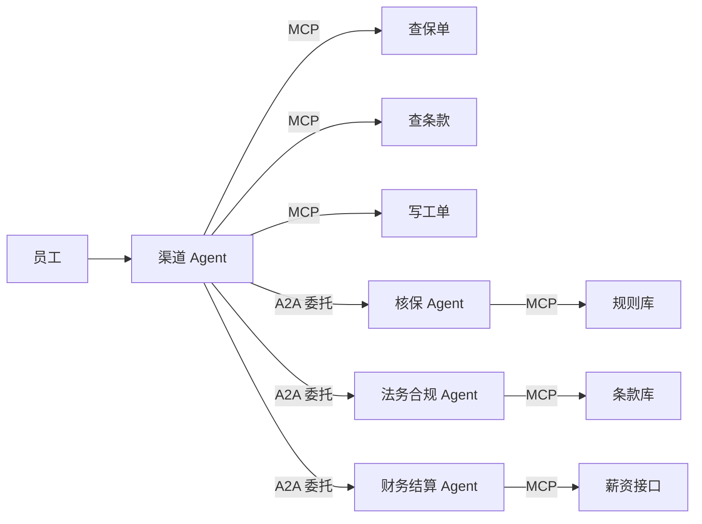

# 跨 Agent 协议互联

## Summary

本章讲 A2A 横向互联：能力发现、任务委托、状态同步与跨框架消息，阐明 MCP 与 A2A 互补的分工模型。
学完本章，读者将掌握上述主题，并能将其用于后续章节的综合项目。

## Concepts Covered

本章覆盖学习图中的以下 20 个概念：

| Concept | Concept Impact Score |
|---------|-----------------------|
| A2A横向互联观 | 1 |
| MCP与A2A互补模型 | 1 |
| Agent身份标识 | 1 |
| 能力发现机制 | 3 |
| 能力卡片设计 | 1 |
| 任务委托协议 | 2 |
| 任务状态同步 | 1 |
| 跨框架消息格式 | 1 |
| OpenAI Agent SDK | 1 |
| LangChain Agent互联 | 1 |
| 会话迁移机制 | 3 |
| 信任与鉴权 | 1 |
| 计费归属划分 | 2 |
| 跨组织协作 | 1 |
| 协议选型对照 | 1 |
| 联邦评测方法 | 1 |
| 互联故障排查 | 1 |
| 协议演进跟踪 | 2 |
| 混合编排实战 | 1 |
| 互联上线清单 | 2 |

## Prerequisites

本章会用到以下章节的概念：

- [Chapter 6: MCP 工具交付](../06-mcp-tools/index.md)
- [Chapter 7: 多智能体协作编排](../07-multi-agent/index.md)

---

!!! mascot-welcome "第八章，两个方向"
    { class="mascot-admonition-img" }
    前七章里你的 Agent 都是自己家的：一路向下接工具，一路内部互相派活。这一章开始它要跟别人家的 Agent 打交道了。落点是一件企业理赔单：前端渠道 Agent 不查数据库，只委托另外三个平级 Agent 拿到结论。八个触手分两个方向开工，八条触手，一起开干！

本章的示例对象从头到尾只有一套：一套企业保险理赔系统，由 4 个 Agent 组成。前端渠道 Agent（`did:acme:claims:channel`）负责跟员工对话，核保 Agent、法务合规 Agent、财务结算 Agent 分属不同部门、不同框架、不同机房。所有数字——延迟、token、成本、成功率——都来自这条理赔链路，你换成一个真实的跨部门流程时，知道该按什么比例缩放，而不是去猜。

## 一、纵向与横向：两种协议各管什么

### A2A横向互联观

先回顾第六章的 MCP：MCP 的连接对象是工具，方向是自上而下，一个 Agent 调用它根本不认识的工具。方向反过来才出现本章的问题——两个能力不同、代码库不同、甚至公司都不同的 Agent，谁来调用谁？A2A（Agent-to-Agent）解决的就是这个横向问题：把 Agent 当成一个"有身份证、有能力清单、接受结构化委托、会回报状态"的远端服务，而不是一个只能被本进程调用的函数。

横向与纵向的差别不在技术难度，在契约责任。纵向调用失败通常只影响一次工具调用，调用方完全看得见日志；横向调用失败可能是对方限流、对方模型崩了、对方把任务转手给了第三方，你看到的只是一句"超时"。所以横向互联多出一整层协议工作：身份、能力发现、状态同步、归属与信任，这些在 MCP 里统统不需要考虑。

本章这条理赔链路上就有三处横向调用：渠道 Agent 委托核保 Agent 拿承保结论，委托法务合规 Agent 查条款适用性，委托财务 Agent 算应付金额。端到端成功交付的 P95 延迟是 2.4 秒，其中编排器自身只占 320 毫秒，能力发现 80 毫秒，三次委托各约 660 毫秒。

### MCP与A2A互补模型

这是全章的纲：MCP 向下管工具，A2A 向右管同侪，两者不是竞争关系，而是同一棵调用树上的两个层级。一个 Agent 内部用 MCP 访问数据库、检索库、代码执行器；这个 Agent 作为一个整体对外暴露 A2A 能力卡片，被别的 Agent 委托。能力边界就落在 Agent 与工具之间，这条线画准了，互联才不会做成一锅粥。

| 维度 | MCP（纵向） | A2A（横向） |
|---|---|---|
| 连接对象 | 工具、函数、资源 | 平级 Agent |
| 方向 | Agent → 工具，自上而下 | Agent ↔ Agent，对等协商 |
| 典型协议 | MCP over stdio / Streamable HTTP | A2A over HTTP，JSON-RPC 语义 |
| 单位交付 | 单次调用返回值 | 长任务，有状态、有截止时间 |
| 谁来选能力 | 调用方已知工具名 | 调用方先发现，再决定委托 |
| 鉴权粒度 | 工具级权限 | 委托方身份 + 被委托方策略 |
| 失败处理 | 抛错、重试、降级 | 状态回报、补偿、人工介入 |
| 典型场景 | 查库、检索、算账、调外部 API | 跨部门核保、跨组织协作、跨框架复用 |

两者配合的形态可以用一张图说清：渠道 Agent 是唯一的编排点，它向下用 MCP 调自己的三个工具（查保单、查条款、写工单），向右用 A2A 委托三个外部 Agent。



#### Diagram: MCP 与 A2A 分工路由决策

<iframe src="../../sims/mcp-a2a-routing-decision/main.html" height="962px" width="100%" scrolling="no"></iframe>

[全屏运行MCP 与 A2A 分工路由决策](../../sims/mcp-a2a-routing-decision/main.html){ .md-button .md-button--primary }

<details markdown="1">
<summary>设计说明（规格块）</summary>

本 MicroSim 已实现，上方 iframe 为实际运行的版本。下面的折叠内容是它的设计规格，供教师复用或二次开发参考。

<details markdown="1">
<summary>展开规格原文</summary>

MCP 与 A2A 分工路由决策</summary>
Type: workflow
**sim-id:** mcp-a2a-routing-decision<br/>
**Library:** html<br/>
**Status:** built<br/>
**Bloom Level:** Evaluate<br/>
**Bloom Verb:** 判定
**Learning Objective:** 学习者将逐条判定八个需求的协议路由（直接调用、内部 HTTP 适配、框架内交接、MCP 向下、A2A 向右、A2A 加契约审计），判定条件是八条全部与 Content 表一致且能对任意一条给出判定所依据的三个条件中至少两个。

**Prerequisites:** MCP 纵向调用、A2A 横向委托、框架内交接、能力卡片、协议选型对照（均已在本块上方的"MCP与A2A互补模型""任务委托协议""协议选型对照"三节定义）。

**Evidence of Mastery:** 学习者先对八条需求逐条锁定路由，再提交判定依据；八条路由全部正确算掌握，答对七条且有一条能指出正确依据为部分掌握。只浏览不锁定不算证据。

**Misconceptions:** (1) A2A 是更先进的协议，所以所有跨组件调用都应该换成 A2A。(2) 把对方的接口包装成 MCP 工具就能替代 A2A。(3) 同一公司内的 Agent 之间也必须走 A2A。

**Instructional Rationale:** Evaluate 层级的判断要求先形成路由结论再接受反馈，因此八条路由全部锁定后才揭晓标准答案；序号 5 是本块的核心，它考的是"何时不该上 A2A"，逼学习者放弃"协议越正式越好"的想当然。

**Content:**

| 序号 | 需求 | 正确路由 | 答错时的反馈 |
|---|---|---|---|
| 1 | 在你自己的 Python 进程内计算保费 | 直接调用 | 同一进程内的函数调用不需要任何协议，套一层 MCP 只会增加序列化开销与失败面 |
| 2 | 调用外部机构提供的合同审查 Agent，它自己调内部规则库 | A2A（向右） | 对方是另一家机构的独立 Agent，契约与身份只能靠 A2A 承载 |
| 3 | 运行时才知道需要什么能力，且对方是独立服务 | A2A（向右） | 能力未知意味着必须先做能力发现，这是 A2A 卡片机制存在的理由 |
| 4 | 调用自家部署的合同库检索能力 | MCP（向下） | 连接对象是工具而非 Agent，方向自上而下，属于第六章的 MCP 范畴 |
| 5 | 同公司同部署的两个 Agent 之间交接任务 | 框架内交接 | 三条判定条件只满足一条（同部署），零网络开销更划算，套 A2A 是净增复杂度 |
| 6 | 需要对方给结论并承诺截止时间与失败回报 | A2A（向右） | 截止时间与失败回报是委托契约字段，只有 A2A 委托体承载它们 |
| 7 | 调用一个只暴露固定 HTTP 接口的内部服务 | 内部 HTTP 适配 | 能力固定且不需要发现机制，目录加一层适配比完整 A2A 更省 |
| 8 | 跨组织协作，需要身份、隔离与结算 | A2A 加契约加审计 | 跨组织还要审计与计费归属，纯 A2A 信封不足以覆盖这些条款 |

判定所依据的三个条件（任一需求至少命中两个才算依据充分）：调用方在运行时才知道需要什么能力；双方不在同一部署且不能共享内存；调用频率与复杂度足以抵消协议开销。序号 5 只命中第二条，序号 1 与 7 三条都不命中。

**Provenance:** 八条需求为合成教学用例（随机种子 20261006），每条按"连接对象、是否需要能力发现、是否需要契约字段"三项规则生成并人工复核；序号 5 的示例取自本章"渠道 Agent 与核保 Agent"同部署的真实形态。协议开销 60 毫秒、卡片冷拉 80 毫秒、TTL 300 秒三数出自本块上方的"A2A横向互联观"与"能力发现机制"两节。

**Rules:** 每条需求一次判定，路由取值限定为六项（直接调用、内部 HTTP 适配、框架内交接、MCP 向下、A2A 向右、A2A 加契约加审计）。得分 = 判定正确的条数，满分 8 分；>= 7 分视为掌握，< 7 分需重做。判定容差为 0 条，不设部分正确。同一序号两次判定不一致时以第二次为准。总分相同时不设并列，全部提交项一起判定。

**Learner Activity:**

1. 学习者看到八条需求，先逐条选定路由并锁定，锁定前不显示标准答案。
2. 八条全部锁定后提交并揭晓，学习者对照反馈文案逐条回看自己的依据。
3. 学习者应特别回看序号 5 与序号 7：这两条的正确答案都是"不上 A2A"。

**Feedback:** 八条判定，固定顺序，每条两次机会，答案在提交后立即揭晓。答对："正确，序号 n 应路由到 X。"答错：先展示该条的三项判定条件命中情况，再展示该条的反馈文案。两次答错记为失手。全部判定结束后展示"答对 n/8 分"，并要求学习者解释序号 5 为什么不选 A2A。计分满分 8 分，达到 7 分视为掌握。

**Starting State:** 八条需求纵向排列，路由选择器默认为空，右侧判定条件说明可见，三项判定条件以文字列出。屏幕提问："同一进程内的函数、跨公司的 Agent、自家的工具，三者该走哪条路？先锁定八条，再看标准答案。"

**Chapter Anchors:** MCP 向下管工具、A2A 向右管同侪；对照表的八个维度；本章理赔链路 3 次横向委托；端到端 P95 2.4 秒；协议选型对照的三个判定条件；卡片冷拉 80 毫秒与 TTL 300 秒。

</details>
</details>

!!! mascot-thinking "先问方向，再问协议"
    { class="mascot-admonition-img" }
    拿到一个需求先问一句：这个能力在同一个进程里，还是在别人家的服务里。同一个进程就用 MCP，别为了协议更先进去绕一圈网络；别人家的服务就用 A2A，别把对方的接口硬塞进工具列表里假装它是工具。方向搞错，后面所有的身份、状态、计费设计全部白做。

### Agent身份标识

Agent 身份要解决一个具体问题：收到委托的一方，怎么知道对面是谁、能不能接。标识至少包含三段：组织标识（谁家的）、主体标识（这家里的哪个 Agent）、版本标识（第几代实现）。缺任何一段都会出事——只有服务名，日志里出现两个同名实例时无法归因；只有组织名，无法区分同一家的不同 Agent，权限就没法分开授予。

本章的标识格式统一为 `did:组织:部门:Agent名:版本`，渠道 Agent 是 `did:acme:claims:channel:v2`。用可解析的结构化标识而不是随手起的别名，是因为下游要做三件事：从标识里解析出所属组织决定是否允许跨组织调用、从版本段判断能力卡片是否需要重新拉取、把标识写进日志做全链路归因。

| 标识段 | 示例 | 作用 | 缺失后果 |
|---|---|---|---|
| 组织 | acme | 跨组织准入判断 | 无法区分内外部调用，信任边界失效 |
| 部门 | claims | 权限授予与计费归集 | 成本无法按部门分摊 |
| Agent 名 | channel | 唯一标识与路由 | 同一部门多个 Agent 无法区分 |
| 版本 | v2 | 能力卡片兼容性判断 | 升级后旧卡片仍在用，行为漂移 |

### 能力发现机制

能力发现回答的是"对面有哪些活我能派、派过去会怎样"。三种实现方式：静态注册（把能力卡片写死在编排器配置里，改一次要发版）、注册中心查询（去一个目录服务拉取列表）、描述文件抓取（顺着对方给出的卡片 URL 直接取）。本章三种都用，但角色不同：同组织内的三个 Agent 走静态注册，跨组织协作方走注册中心，新接入的框架适配走描述文件抓取。

本章的理赔编排器启动时一次性拉取三张卡片，耗时 80 毫秒，之后缓存在进程内，TTL 300 秒。选 TTL 300 秒是个折中：能力变更最坏 5 分钟生效，而每次委托省掉一次网络往返（约 60 毫秒）。要注意发现的结果必须带版本号入缓存，否则对方升级了能力而你还在用旧卡片，调用会以一种极难排查的方式失败。

```python
CARD_TTL_SECONDS = 300


class CapabilityRegistry:
    """编排器侧的发现缓存：首次冷拉，之后按 TTL 续期"""

    def __init__(self, static: dict[str, str], directory_url: str = "") -> None:
        self.static = static          # 同组织 Agent：配置里写死的卡片地址
        self.directory_url = directory_url   # 跨组织：注册中心
        self.cache: dict[str, tuple[dict, float]] = {}

    async def resolve(self, agent_id: str) -> dict:
        now = time.monotonic()
        if agent_id in self.cache:
            card, fetched = self.cache[agent_id]
            if now - fetched < CARD_TTL_SECONDS:
                return card
        url = self.static.get(agent_id) or f"{self.directory_url}/{agent_id}/card"
        card = await http_get_json(url)          # 未命中或过期，重新抓取
        self.cache[agent_id] = (card, now)
        return card
```

### 能力卡片设计

能力卡片是横向互联里唯一必须在委托之前确定的东西，它是对方的"营业执照加价目表"。字段不齐的代价是委托方只能猜：不知道要付多少钱、不知道多久能返回、不知道失败时该不该重试。本章统一成 8 组字段：身份、能力声明、输入输出 Schema、认证要求、限流、SLA、版本、计费。

| 字段组 | 关键字段 | 委托方拿它做什么 |
|---|---|---|
| 身份 | `agent_id`、`organization`、`endpoint` | 决定路由与准入 |
| 能力声明 | `skills[]`（名称、摘要、适用场景） | 判断该不该派给它 |
| 输入输出 Schema | `input_schema`、`output_schema` | 生成委托参数、校验交付物 |
| 认证要求 | `auth_methods[]`、`token_audience` | 换取凭证，不误用类型 |
| 限流 | `rate_limit.rpm`、`max_concurrency` | 决定并发与排队策略 |
| SLA | `sla.p95_latency_ms`、`deadline_policy` | 定截止时间与是否重试 |
| 版本 | `card_version`、`schema_version` | 判断卡片是否过期 |
| 计费 | `pricing.mode`、`unit_price_cents` | 成本预估与归属判断 |

下面这张卡片是核保 Agent 的真实形态，`pricing.mode` 写清了按次计价，这直接决定了第四节计费归属那一段怎么算账。

```json
{
  "agent_id": "did:acme:underwriting:risk:v3",
  "organization": "acme",
  "endpoint": "https://underwriting.acme.internal/a2a",
  "card_version": "3.1.0",
  "schema_version": "2026-05",
  "skills": [
    {
      "id": "risk-score",
      "summary": "给出工单的承保结论与风险分",
      "applies_to": ["理赔", "续保"],
      "input_schema": {
        "type": "object",
        "required": ["claim_id"],
        "properties": {
          "claim_id": {"type": "string", "pattern": "^CL-[0-9]{8}$"},
          "channel": {"type": "string", "enum": ["app", "web", "phone"]}
        }
      },
      "output_schema": {
        "type": "object",
        "required": ["decision", "risk_score"],
        "properties": {
          "decision": {"type": "string", "enum": ["accept", "manual_review", "reject"]},
          "risk_score": {"type": "number", "minimum": 0, "maximum": 100}
        }
      }
    }
  ],
  "auth_methods": ["oauth2_client_credentials"],
  "token_audience": "a2a:underwriting",
  "rate_limit": {"rpm": 60, "max_concurrency": 8},
  "sla": {"p95_latency_ms": 800, "deadline_policy": "return_partial"},
  "pricing": {"mode": "per_call", "unit_price_cents": 1.5}
}
```

!!! mascot-warning "卡片少一个字段，线上多一次故障"
    { class="mascot-admonition-img" }
    这个坑我替你踩过：卡片里没写 SLA，编排器按默认 2 秒设截止时间，而对方 P95 是 0.8 秒、长尾 3.2 秒，于是 3% 的委托被误判超时并重试，对方被重复扣费。写卡片时按 8 组字段逐项过一遍，比上线后查重复扣费的账单便宜得多。

## 二、委托与状态：把对话变成契约

### 任务委托协议

委托的最小闭环只有五个问题，但一个都不能少：谁委托（`delegator`）、委托什么（`task` + `input`）、期望交付什么（`expected_output` 的 Schema）、什么时候要（`deadline_ms`）、失败怎么回报（`failure_report`）。少一个，纠纷就出现：没有截止时间，委托方只能干等；没有交付 Schema，交付回来还得反问"这算不算完成"。

结构化是硬要求。第七章的多 Agent 内部派活可以用自然语言，因为同一份代码、同一个进程，解析失败立刻能看见；横向委托的双方没有共享日志，自然语言里的"尽快给我结果"在对方那里没有任何可执行含义。本章的做法是所有委托字段进 JSON Schema 校验，不通过就在编排侧直接拒发，根本不给对方处理的机会。

```json
{
  "task_id": "task-7f3c1a92",
  "idempotency_key": "CL-20261006-0031:risk-score",
  "delegator": "did:acme:claims:channel:v2",
  "delegate": "did:acme:underwriting:risk:v3",
  "skill": "risk-score",
  "input": {"claim_id": "CL-20261006-0031", "channel": "app"},
  "expected_output_schema_ref": "a2a:underwriting/risk-score@2026-05",
  "deadline_ms": 2000,
  "failure_report": {
    "codes": ["DEADLINE_EXCEEDED", "RATE_LIMITED", "SCHEMA_INVALID", "INTERNAL"],
    "channel": "inline",
    "retryable": ["RATE_LIMITED"]
  }
}
```

`retryable` 这个列表值得单独说：把"能不能重试"写进契约，而不是让编排侧的模型临场判断。本章的理赔链路里，只有 `RATE_LIMITED` 允许重试一次，其余错误一律上报人工——`DEADLINE_EXCEEDED` 重试等于让用户多等 2 秒，而已经发出去的核保请求会重复扣 1.5 分。

!!! mascot-thinking "委托五问，少一问就扯皮"
    { class="mascot-admonition-img" }
    写委托体时把这五个问题当成模板逐个填空：谁委托、委托什么、期望交付什么、什么时候要、失败怎么回报。最常漏的是后两问，于是编排方只能干等，对接方觉得"你已经超时了别怪我"。这个坑我替你踩过，扯皮两小时不如提前写十个字。

### 任务状态同步

状态同步是委托之后最容易做浅的部分。七态状态机足够覆盖本章全部场景：`created`、`accepted`、`running`、`awaiting_input`、`completed`、`failed`，外加 `rejected`（对方因限流或鉴权当场不接，不要混进 failed 统计成功率）和 `compensated`（交付后被撤销，用于跨组织的可回滚操作）。

| 状态 | 谁推进 | 进入条件 | 委托方动作 | 幂等要求 |
|---|---|---|---|---|
| created | 委托方 | 委托已发出 | 等待 | 同 `idempotency_key` 复用同一 `task_id` |
| accepted | 被委托方 | 通过鉴权与限流 | 开始计时 | 重复 accepted 直接丢弃 |
| running | 被委托方 | 开始执行 | 可查进度 | 乱序到达的 running 不得回退 accepted |
| awaiting_input | 被委托方 | 缺必要输入 | 补输入或取消 | 补输入同样走幂等键 |
| completed | 被委托方 | 交付物通过校验 | 消费交付物 | 重复 completed 返回首次结果 |
| failed | 被委托方 | 命中不可重试错误 | 按 `retryable` 决定 | 重复 failed 幂等 |
| rejected | 被委托方 | 鉴权或限流拒收 | 退避后再试 | 不计入成功率分母 |

状态推送的可靠性靠幂等键兜底：`(delegator, idempotency_key)` 唯一，重复投递返回首次结果而不是再执行一遍。状态回退一律丢弃——网络乱序会让 `running` 晚于 `completed` 到达，此时接受回退就会把一个已完成的任务重新拉回执行中，本章的核保请求会被跑两遍。

```python
def apply_event(task: dict, event: dict) -> tuple[dict, bool]:
    """状态事件只允许前进或幂等重复；回退事件直接丢弃并记审计日志"""
    order = ["created", "accepted", "running", "awaiting_input",
             "completed", "failed", "rejected", "compensated"]
    cur, nxt = order.index(task["state"]), order.index(event["state"])
    if event["state"] == task["state"]:
        return task, False                       # 幂等重复，返回首次结果
    if nxt < cur:
        audit.warn("state_regression", task_id=task["task_id"],
                   frm=task["state"], to=event["state"])
        return task, False                       # 乱序回退，不执行
    if event["state"] == "completed" and not validate_against(
            event["artifact"], card.output_schema):
        return {**task, "state": "failed",
                "error": "SCHEMA_INVALID"}, True  # 交付不合 Schema，直接判失败
    return {**task, "state": event["state"], "artifact": event.get("artifact")}, True
```

!!! mascot-tip "把回退当故障处理"
    { class="mascot-admonition-img" }
    状态机只许前进这条规则，本章的调试日志里救过一次事故：某个渠道超时 3 秒后开始重试，重试携带的旧 `task_id` 把已完成的任务推回了 running，核保规则被跑了两遍。加一句"回退即丢弃并告警"，这类问题会从事故变成一条监控指标。

#### Diagram: 跨 Agent 任务交接状态同步

<iframe src="../../sims/task-handoff-state-timeline/main.html" height="762px" width="100%" scrolling="no"></iframe>

[全屏运行跨 Agent 任务交接状态同步](../../sims/task-handoff-state-timeline/main.html){ .md-button .md-button--primary }

<details markdown="1">
<summary>设计说明（规格块）</summary>

本 MicroSim 已实现，上方 iframe 为实际运行的版本。下面的折叠内容是它的设计规格，供教师复用或二次开发参考。

<details markdown="1">
<summary>展开规格原文</summary>

跨 Agent 任务交接状态同步</summary>
Type: timeline
**sim-id:** task-handoff-state-timeline<br/>
**Library:** vis-timeline<br/>
**Status:** built<br/>
**Bloom Level:** Analyze<br/>
**Bloom Verb:** 追踪
**Learning Objective:** 学习者将追踪一次理赔委托 task-7f3c1a92 的十二条状态事件，判定哪一条是必须丢弃的状态回退，并算出接受该回退后重复扣费金额；判定条件是所选序号为 6 且重复扣费为 4.5 分（3 次乘以 1.5 分）。

**Prerequisites:** 七态状态机、幂等键 `idempotency_key`、`deadline_ms`、按次计价 1.5 分、卡片 P95 800 毫秒（均已在本块上方的"任务状态同步""能力卡片设计""任务委托协议"三节定义）。

**Evidence of Mastery:** 学习者先预测哪一条事件会被丢弃并提交，再回答两道挑战题；三项全部与 Content 表一致算掌握。容差 ±0 条与 ±0.05 分。只观察时间轴不提交判定不算证据。

**Misconceptions:** (1) 状态事件按到达顺序处理即可，重复事件无害。(2) 回退事件无害，因为对方的实现不会故意回退。(3) 委托超时后重试不会产生额外费用。

**Instructional Rationale:** Analyze 层级要求先预测再接受证据，因此回退判定先锁定后揭晓；序号 6 之后紧跟的重复 completed 是本块的教学核心，它演示了"回退会触发重执行、幂等重复不会"这个区别。

**Content:**

一次理赔委托的十二条状态事件，时刻为相对委托发出的毫秒数：

| 序号 | 时刻 ms | 事件 | 编排侧接受后状态 | 是否应执行 |
|---|---|---|---|---|
| 1 | 0 | created | created | 是 |
| 2 | 12 | accepted | accepted | 是 |
| 3 | 140 | running | running | 是 |
| 4 | 310 | running | running | 是 |
| 5 | 780 | completed | completed | 是 |
| 6 | 905 | running | 回退至 running | 否，必须丢弃 |
| 7 | 980 | completed | 保持 completed | 幂等重复，不重执行 |
| 8 | 1035 | running | 回退至 running | 否，必须丢弃 |
| 9 | 1120 | completed | 保持 completed | 幂等重复，不重执行 |
| 10 | 5200 | running | 回退至 running | 否，必须丢弃 |
| 11 | 5400 | completed | 保持 completed | 幂等重复，不重执行 |
| 12 | 5490 | completed | 保持 completed | 幂等重复，不重执行 |

序号 6 的来源是编排侧重试时复用了同一个 `task_id`（通道缓冲把旧事件补发出来）。若接受该回退，核保规则被重新执行一遍，按次计价 1.5 分意味着多扣 1.5 分；本时间轴上回退被接受了三次（序号 6、8、10），每次按次计价 1.5 分，合计重复扣费 4.5 分。序号 7、9、11、12 与当前状态相同，属于幂等重复，必须返回首次结果而不是再执行一遍。

答题反馈文案：序号 6 之所以必须丢弃，不是因为对方有意回退，而是因为完成态是终态，一旦被拉回 running，被委托方会重新调用模型与规则库，一次委托就变成两次计费；正确的处理是丢弃事件并记一条审计日志，同时把这次回退本身作为监控指标上报。挑战题第三问的答案是"不应判超时"：completed 实际发生在 780 毫秒，远小于 `deadline_ms` 的 2000 毫秒，延迟到达只影响观测时刻，不改变任务已经完成的事实。

**Provenance:** 十二条事件的时刻与序号为合成数据（随机种子 20261006），生成规则：accepted 在 12 毫秒、running 在 140 与 310 毫秒、首次 completed 在 780 毫秒；回退与幂等重复事件按"通道乱序补发"规则生成，序号 6 至 12 共七条。780 毫秒的首次完成时刻出自本块上方的"能力卡片设计"（SLA P95 800 毫秒）与"任务状态同步"一节的 P95 2.4 秒口径；1.5 分按次计价、`deadline_ms` 2000 均出自"能力卡片设计"与"任务委托协议"两节。

**Rules:** 回退判定规则为"当前状态的序号大于事件状态的序号即判回退"，必须丢弃并记审计日志；事件序号等于当前状态序号即判幂等重复，返回首次结果且不执行。丢弃判定容差 ±0 条。可调量为超时阈值：最小 500 毫秒、最大 5000 毫秒、步长 100 毫秒、默认 2000 毫秒、单位毫秒，默认值落在步长网格上。重复扣费 = 被接受的回退次数 × 1.5 分，保留一位小数，判定容差 ±0.05 分。超时判定用 >=：事件到达时刻 >= 超时阈值且状态非终态才判超时。回退次数为 0 时扣费为 0.0 分；回退次数上限为 3 次，源于一次委托最多重试一次与通道补发两次。

**Learner Activity:**

1. 学习者看到十二条事件，先预测哪一条必须被丢弃并提交，锁定前不显示标准答案。
2. 揭晓后学习者调节超时阈值，从 500 毫秒拖到 5000 毫秒，观察首次 completed（780 毫秒）在哪个阈值下被判超时。
3. 学习者依次完成三道挑战题：回退序号、重复扣费金额、延迟到达是否判超时，三题全部手写答案后提交。

**Feedback:** 三道挑战题，固定顺序，每题两次机会，答案在提交后立即揭晓。答对："正确，<标准值>"并展示该题反馈文案。答错：展示该题的判定规则推导（例如当前状态序号 5 大于事件序号 3 即判回退），再展示反馈文案。两次答错记为失手。结束后展示"答对 n/3 题"，并提示回退与幂等重复的区别。计分满分 3 分，达到 2 分视为掌握。

**Starting State:** 时间轴显示十二条事件的事件名与时刻，三道挑战题折叠在下方，回退判定与扣费金额的标准答案隐藏，超时阈值停在默认 2000 毫秒。屏幕提问："completed 之后又来了一条 running——删掉它，还是接受它？先猜哪一条该删，再算清代价。"

**Chapter Anchors:** 七态状态机与只许前进规则；幂等键 `CL-20261006-0031:risk-score`；`deadline_ms` 2000；首次完成 780 毫秒与卡片 P95 800 毫秒；序号 6 为必须丢弃的回退；幂等重复返回首次结果；重复扣费 4.5 分（3 次乘以 1.5 分）；超时阈值区间 500 到 5000 毫秒、步长 100 毫秒。

</details>
</details>

### 跨框架消息格式

跨框架互联的第一道摩擦不是协议，是消息格式。本章三个 Agent 分属不同框架：渠道 Agent 用 OpenAI Agent SDK，核保 Agent 用 LangChain，财务 Agent 是自研服务。三者对"一次调用"的内部表示完全不同，但对委托方来说必须收敛成同一个信封。

信封只需要五个必填字段加一个可选字段：`message_id`（去重用）、`task_id`（挂到委托）、`role`、`parts`（内容分块）、`metadata`（截止时间、幂等键、框架标签），可选的 `extensions` 留给框架私有数据。关键纪律是 `parts` 用统一的内容分块类型（文本、结构化对象、文件引用），不要把框架私有的消息类直接序列化——那是最容易在版本升级时炸掉的写法。

| 字段 | 必填 | 跨框架映射 | 缺了会怎样 |
|---|---|---|---|
| `message_id` | 是 | 三家都取本地 UUID | 无法去重，重投产生重复交付 |
| `task_id` | 是 | SDK 会话 ID / LangChain `run_id` / 自研工单号 | 消息挂不上任务，状态机断裂 |
| `role` | 是 | 统一 user / assistant / system | 对方判错说话人，模型行为异常 |
| `parts` | 是 | 文本转文本、工具结果转结构化对象 | 交付物无法校验 Schema |
| `metadata` | 是 | 各自补齐截止时间与幂等键 | 超时与重试策略失效 |
| `extensions` | 否 | 框架私有，原样透传不解析 | 丢失框架特有能力 |

## 三、框架落地

### OpenAI Agent SDK 互联

OpenAI Agent SDK 的角色是编排器侧的执行框架：它管工具调用循环与交接，但对外要用 A2A 暴露自己。下面这段把委托构造和状态轮询串起来，是把一个 SDK 内的 `Agent` 包装成 A2A 端点的最小骨架。

```python
# 示意代码，版本差异以官方文档为准
from agents import Agent, Runner

channel_agent = Agent(
    name="claims-channel",
    instructions="员工理赔咨询助手，核保结论一律委托核保 Agent，不得自行猜测",
    handoffs=["underwriting-risk"],      # 内部协作仍走框架交接，跨组织才走 A2A
)


async def handle_claim(question: str, card: dict) -> dict:
    task = build_delegation(card, skill="risk-score",
                            input={"claim_id": "CL-20261006-0031"})
    ack = await a2a_send(task)                 # 返回 202 与 task_id
    final = await a2a_poll(ack["task_id"],
                           until=["completed", "failed"],
                           deadline_ms=task["deadline_ms"])
    if final["state"] == "completed":
        return {"answer": narrate(final["artifact"]), "task_id": ack["task_id"]}
    return {"answer": "核保系统繁忙，已转人工", "task_id": ack["task_id"],
            "state": final["state"]}
```

一处容易做错的地方：`handoffs` 与 A2A 委托不要混用。同组织、同一部署内的 Agent 用框架内交接，零网络开销、还能共享对象；跨框架或跨组织必须走 A2A，因为对端不会解析你的框架私有对象。混用的后果是编排器里同时存在两套状态语义，排查时看不出某次调用到底走了哪条路。

### LangChain Agent互联

LangChain 侧要做的是把一条 LCEL 链或 `create_react_agent` 产出的对象包装成 A2A 服务端。跨框架互联的真正工作量在适配层：入站消息要转成本框架的消息类型，出站交付物要转成统一信封的 `parts`，中间必须有一层显式映射，不依赖任何隐式序列化。

```python
# 示意代码，版本差异以官方文档为准
from langchain.agents import create_agent

risk_agent = create_agent(model="gpt-4o-mini", tools=[fetch_rules, score_risk])


def to_langchain(envelope: dict) -> list[dict]:
    """统一信封 → LangChain 消息列表；只认 parts，不解析任何框架私有字段"""
    return [{"role": m["role"], "content": render_part(m)}
            for m in envelope["parts"] if m["type"] == "message"]


async def handle(envelope: dict) -> dict:
    result = await risk_agent.ainvoke({"messages": to_langchain(envelope)})
    artifact = {"decision": ..., "risk_score": ...}     # 先按卡片 Schema 组装
    check(artifact, output_schema=load_schema("risk-score"))   # 校验通过再发
    return to_envelope(task_id=envelope["task_id"], artifact=artifact)
```

两行是这一节的重点：`artifact` 先按对方声明的 Schema 组装再校验，而不是把模型的自由文本直接发出去。委托方按 `expected_output_schema_ref` 校验失败会直接判 `SCHEMA_INVALID`，本链路一旦发生，编排器只能走人工——所以发送前的校验不是冗余，是唯一一道便宜的防线。

!!! mascot-encourage "适配层看着枯燥，但它救事故"
    { class="mascot-admonition-img" }
    跨框架互联的活儿大半落在这一层显式映射上，写起来枯燥，但它是你唯一能控制边界的地方。先老老实实把入站出站两组映射各写十条用例跑通，再去优化别的——慢慢来，比较快。

### 会话迁移机制

会话迁移处理一个具体场景：对话进行到一半，编排器发现某一步必须换一个框架的 Agent 来做（比如本地 LangChain Agent 处理不了这份合同审查），上下文要平移到对面去。三种策略：整段复制（简单、贵）、摘要加尾窗（默认）、指针引用（最省但对方要能回调你）。

本章默认用摘要加尾窗：把前 14 轮压成 200 字以内的摘要，保留最近 6 轮原文，跨框架平移的上下文从 9,800 token 降到 2,100 token，降幅 79%。指针引用只用在同一组织内、对方有回调凭证的场景，因为它引入了反向依赖——一旦原编排器重启，被引用的会话就没了。

迁移必须带三样东西：`resume_token`（新会话继续用的游标）、`origin_task_id`（回溯用，让新 Agent 知道自己在接手哪件事）、`transferred_context`（摘要加尾窗的产物）。少带 `origin_task_id` 是最常见的坑：对面 Agent 不知道这是接手，会当成新任务重新问一遍全部背景，员工看到的是把话又说一遍。

```python
SUMMARY_BUDGET_CHARS = 200
KEEP_RECENT_TURNS = 6


def pack_for_handoff(history: list[dict], origin_task_id: str,
                     resume_token: str) -> dict:
    """把会话压成跨框架可接手的包；摘要给前段，原文给尾窗，两者缺一不可"""
    older, recent = history[:-KEEP_RECENT_TURNS], history[-KEEP_RECENT_TURNS:]
    digest = summarize(older, budget_chars=SUMMARY_BUDGET_CHARS)
    return {
        "origin_task_id": origin_task_id,          # 缺它，对面会当成新任务重问背景
        "resume_token": resume_token,              # 断线重连时的继续游标
        "transferred_context": {
            "summary": digest,
            "recent_turns": recent,                # 最近 6 轮原文
            "turn_count": len(history),
            "truncated": len(older) > 0,
        },
    }
```

这个包里最容易被忽略的是 `turn_count`：有了它，对面 Agent 才知道自己看到的是第 7 到第 15 轮而不是全部对话，可以据此决定要不要主动追问，而不是假装掌握了全部上下文。

| 策略 | 上下文 token | 恢复精度 | 依赖 | 适用 |
|---|---|---|---|---|
| 整段复制 | 9,800 | 完整 | 无 | 短会话、一次性任务 |
| 摘要加尾窗 | 2,100 | 中 | 无 | 跨框架默认策略 |
| 指针引用 | 200 | 取决于原会话存活 | 原编排器可回调 | 同组织长会话 |

### 混合编排实战

现在把三章的东西拼成一条真实链路：渠道 Agent 内部用 MCP 调三个工具，向外用 A2A 委托三个外部 Agent，其中两个是不同框架。本章的混合编排配置长这样，框架差异被压在一层适配里。

```yaml
# 混合编排配置：框架差异只在 adapter 段声明
orchestrator:
  framework: openai_agents          # 编排侧框架
  own_tools_via: mcp                # 自己的工具走 MCP
  peer_agents_via: a2a              # 平级 Agent 走 A2A

mcp_servers:
  - name: policy-db
    transport: streamable_http
    url: https://policy.acme.internal/mcp
  - name: claim-store
    transport: streamable_http
    url: https://store.acme.internal/mcp

a2a_peers:
  - agent_id: did:acme:underwriting:risk:v3
    adapter: generic_a2a            # 对面是 LangChain，已适配
    card_url: https://underwriting.acme.internal/.well-known/card.json
    timeout_ms: 2000
    retry: {max_attempts: 1, only_on: [RATE_LIMITED]}
  - agent_id: did:acme:legal:compliance:v2
    adapter: generic_a2a            # 对面是自研服务
    timeout_ms: 1500
  - agent_id: did:acme:finance:settlement:v1
    adapter: openai_agents
    timeout_ms: 1200
```

这份配置里有两个关键设计：`retry.only_on` 把重试限制在一种错误上，不重试 `DEADLINE_EXCEEDED`；`adapter` 字段把框架差异集中在三行里，换掉一个框架只改一处。健康检查也可以从这里派生：三个 peer 的卡片抓取成功率本章实测 100%（启动时 3 张卡片全部拉到，耗时 80 毫秒），任何一张失败就应该阻止编排器进入就绪状态，而不是等第一次委托才暴露。

## 四、治理：信任、成本与上线

### 信任与鉴权

横向调用的鉴权比纵向多一层考虑：纵向调用时"能不能调这个工具"由本进程决定，横向调用时对方必须先判断"你有没有资格委托我"。本章的做法是三段：委托方用 `oauth2_client_credentials` 换访问令牌，令牌的 audience 指向被委托方（如 `a2a:underwriting`），被委托方按令牌里的部门与能力做策略判定。

令牌的 audience 必须精确到 Agent，不能图省事用一个全网通配的 audience。理由是可撤销性：令牌 audience 指向具体 Agent，撤销某个合作方只需吊销它对这一个 Agent 的授权；用通配 audience 则必须吊销全部授权，一家公司内部几十个 Agent 要跟着一起重发令牌。同理，令牌有效期设 1 小时，短到泄露损失可控，长到不至于让编排器频繁换票。

### 计费归属划分

跨 Agent 调用一旦跨了组织，钱归谁是最容易拖到上线前才吵起来的问题。本章这条理赔链路一次调用的构成是：编排器自身 2,100 token，外部三个 Agent 合计 7,800 token，一次合计 9,900 token，按 0.004 元每千 token 折算是 0.0396 元。

三种划分方案对比：

| 方案 | 怎么算 | 这次理赔谁付 | 优点 | 缺点 |
|---|---|---|---|---|
| 委托方全额 | 调用方承担全部 token 成本 | 渠道 Agent 所在部门付 0.0396 元 | 结算简单，用量与预算直接对齐 | 编排方承担全部跨框架成本，内部不公平 |
| 各付各的 | 提供方按 `unit_price_cents` 收固定单价 | 核保 0.015 元、法务 0.012 元、财务 0.009 元 | 预算可预期，提供方有版本迭代动力 | 与实际用量脱钩，重活干得多但收得一样 |
| 平台抽成 | 平台按 8% 抽佣，其余归提供方 | 平台 0.0032 元，其余归各自 Agent | 平台有动力拉新，账目统一 | 需要平台级账务系统，落地最重 |

本章选第一种，但内部必须做二次分摊：0.0396 元按调用来源归集到理赔业务线 60%、合规 25%、财务 15%。第一步解决对外结算，第二步解决内部预算，两者别混在一起谈——混着谈的结果通常是对外谈得很爽、内部月底没人认账。

!!! mascot-warning "对外结算和内部预算不是一件事"
    { class="mascot-admonition-img" }
    最容易出事的做法是拿一个方案同时对外谈和对内摊：合同签了"各付各的"，内部却按全额记到编排方头上，月底一算超支，谁也说不清是谁付的钱。把这两件事拆成两张表分别签字，比事后解释便宜一百倍。

### 跨组织协作

跨组织协作与同组织互联的差别集中在三件事：能力卡片必须公开、契约必须外部评审、故障必须可隔离。本章的外部合作方是一个独立机构的律师 Agent，用描述文件抓取方式发现能力，签约条款固定为每月 2,000 次调用上限、超出按 0.02 元一次计费。

三条必须写进契约的隔离规则：合作方只能看到委托方显式传入的字段，看不到编排器的内部记忆；合作方的交付物按最坏情况当不可信输入处理，字段要逐个校验；合作方连续失败 5 次即熔断并转人工，不做无限重试。契约之外还要有退出路径：会话迁移机制让最后一批在途任务有地方收尾，计费归属划分让账目在停止合作时能结清。

### 协议选型对照

不是所有互联都值得上 A2A。三个判断条件：调用方在运行时才知道自己需要一个能力（值得）、双方不在同一部署且不能共享内存（值得）、调用频率与复杂度足以抵消协议开销（值得）。三条都不满足时，直接走 HTTP 加一层内部适配更省事。

| 场景 | 选型 | 理由 | 本章实例 |
|---|---|---|---|
| 同一进程内的函数调用 | 直接调用 | 协议开销大于收益 | 编排器内部工具封装 |
| 单向固定接口 | 内部 HTTP 适配 | 能力固定，不需要发现机制 | 查保单服务 |
| 同组织多 Agent | MCP + 框架内交接 | 共享部署，接即可 | 渠道 Agent 与核保 Agent |
| 跨框架同组织 | A2A | 消息表示不兼容，需要统一信封 | 本章 OpenAI SDK 与 LangChain 并存 |
| 跨组织协作 | A2A + 契约 + 审计 | 需要身份、隔离与结算 | 外部律师 Agent |

### 联邦评测方法

联邦评测解决一个测量难题：每个 Agent 只知道自己内部的质量，加起来的端到端质量没人说得清。做法是把评测任务分散到各 Agent 的所有者手里——委托任务集统一出题、各自测自己那一段、汇总成端到端指标。本章的委托任务集是 40 条真实理赔单脱敏样本，每个 Agent 的所有者只需标注自己那一段的成功或失败。

指标三层：段内成功率（核保 40 条中 38 条成功，0.95）、跨段衔接成功率（法务交付的条款编号核保能识别，37/40，0.925）、端到端成功率（34/40，0.85）。三层分开的意义在于归因：端到端掉了 0.10 时，段内几乎没掉，说明问题出在衔接而不是各段能力，改协议比改模型划算。

| 层级 | 指标 | 本章数值 | 归因指向 |
|---|---|---|---|
| 段内 | 核保成功率 | 38/40 = 0.95 | 核保自身规则与模型 |
| 段内 | 法务条款匹配率 | 37/40 = 0.925 | 条款库覆盖度 |
| 衔接 | 跨段字段可用率 | 37/40 = 0.925 | 两侧 Schema 是否对齐 |
| 端到端 | 委托交付成功率 | 34/40 = 0.85 | 协议可靠性与超时 |

三个数字连起来看：段内几乎没掉而端到端掉了，说明这次差距来自衔接而不是各段能力。联邦评测的真正价值就是把"端到端掉了 0.10"这句抱怨，变成一句可以执行的改动——改协议对齐字段，而不是换模型。

```python
def federated_report(reports: list[dict]) -> dict:
    """各 Agent 所有者只报自己那一段；这里做汇总与段间损耗计算"""
    seg = {r["agent"]: sum(1 for x in r["cases"] if x["ok"]) / len(r["cases"])
           for r in reports}
    end_to_end = sum(r["ok"] for r in reports[0]["cases"]) / len(reports[0]["cases"])
    worst_seg = max(seg.values())                       # 段内最好的一段
    return {
        "segment": seg,                                  # 各段自有质量
        "end_to_end": end_to_end,                        # 端到端交付成功率
        "handoff_loss": worst_seg - end_to_end,          # 差值即衔接损耗
    }
```

`handoff_loss` 是这套方法的核心指标：0.95 减 0.85 等于 0.10，这 0.10 全是衔接损耗。段内指标掉说明该段自己要改，损耗大说明该改协议。

### 互联故障排查

互联故障的排查顺序必须是沿链路回放，记下第一个出错的环节——这和第三章的失败归因是同一套方法。四个高频故障有明确的根因，不要按表象去改：

| 现象 | 第一个出错环节 | 根因 | 修法 |
|---|---|---|---|
| 委托一直 200 但没有状态推进 | 被委托方 | 事件推送被中间层缓冲，状态只在库里不在通道 | 轮询兜底，或改用长连接推送 |
| 重复扣费，同一 `task_id` 跑两遍 | 委托方 | 重试未带 `idempotency_key` | 重试必须复用原键 |
| 交付物被判 `SCHEMA_INVALID` | 两侧之间 | 一侧升级了 `schema_version` 未通知 | 卡片带版本，编排侧版本不匹配即降级 |
| 延迟 P95 从 0.8 秒涨到 2.4 秒 | 编排侧 | 能力卡片缓存过期后每次委托重拉 | 恢复 TTL 300 秒缓存 |

排查手段上，本章只留两条：委托链路日志和状态事件日志，两条都用 `task_id` 关联，且每次状态迁移都记下前一状态与触发来源。任何一次"委托了但没收到状态"的怀疑，先在这两条日志里对齐 `task_id`，十次里有九次能直接定位。

!!! mascot-encourage "找不到 task_id 的那一次"
    { class="mascot-admonition-img" }
    跨框架联调最劝退的时刻是日志里什么也搜不到，但只要两条日志都用 `task_id` 关联，这种时刻就基本消失。真到了没有 `task_id` 的那一天，先别改代码，按这条路径补齐埋点再复现。

### 协议演进跟踪

协议在变，跟踪要有固定节奏，不能等出事了再查。本章的规则是每季度过一次协议版本清单，四个维度各看一项：A2A 规范版本、`schema_version` 本章使用的是 `2026-05`、框架 SDK 的破坏性变更、以及卡片字段的废弃预告。

破坏性变更的处理有一条硬纪律：先支持新旧两版，再废弃旧版，并且给旧版留至少两个季度的窗口。`schema_version` 之所以按年月而不是整数递增，就是为了让"我这版是什么时候的"一眼可辨——对方卡片是 `2026-02`、你的是 `2026-05`，三个月之内的差异通常还能靠兼容层兜住，超过半年就该约对方升级了。

### 互联上线清单

最后一个概念是收尾：把前面所有要求压成一份可勾选的清单。上线前逐项确认，任何一项答不上来就不上线。这份清单的顺序是有意的——从身份到契约到成本，最后才是压测，顺序反了会发现契约改不动了。

- [ ] 每个对外 Agent 有结构化 `agent_id`，含组织、Agent 名、版本三段。
- [ ] 能力卡片 8 组字段齐全，`input_schema` 与 `output_schema` 都通过校验。
- [ ] 卡片带 `sla.p95_latency_ms` 与 `pricing`，编排侧据此设截止时间与成本预估。
- [ ] 卡片缓存 TTL 300 秒，启动时抓取失败即不就绪。
- [ ] 委托体校验 `deadline_ms` 与 `failure_report.retryable`，重试只对可重试错误。
- [ ] 重试复用同一 `idempotency_key`，连续失败 5 次熔断转人工。
- [ ] 状态机只许前进，重复状态幂等，返回事件记审计日志。
- [ ] 跨框架消息信封五个必填字段齐全，`extensions` 不参与校验。
- [ ] 令牌 audience 精确到单个 Agent，有效期 1 小时，撤销不影响其他 Agent。
- [ ] 跨组织交付物按不可信输入逐字段校验，隔离规则进契约。
- [ ] 计费归属方案对外已达成一致，内部二次分摊的部门比例已写入配置。
- [ ] 联邦评测三层指标有基线，端到端成功率不低于 0.85。
- [ ] 委托链路与状态事件两条日志都用 `task_id` 关联，可按 `task_id` 检索。
- [ ] `schema_version` 与协议版本清单本季度已复核，旧版兼容窗口有结束日期。

!!! mascot-celebration "横向这张网织完了"
    { class="mascot-admonition-img" }
    从身份标识到上线清单，跨 Agent 的横向互联有了完整的骨架：MCP 向下管工具、A2A 向右管同侪，卡片定契约，状态机保可靠，归属划分清账目。下一次你的 Agent 要跟别人家的系统说话，就有章可循了。八条触手，一起开干！

## 本章小结

| 概念 | 一句话结论 | 关键数字 |
|---|---|---|
| A2A横向互联观 | Agent 当远端服务而不是函数，契约责任自己扛 | 端到端 P95 2.4 秒 |
| MCP与A2A互补模型 | MCP 向下、A2A 向右，两层不是替代关系 | 一次理赔 3 次横向委托 |
| Agent身份标识 | 组织、Agent 名、版本三段缺一不可 | 编排器自身占 320 毫秒 |
| 能力发现机制 | 静态、注册中心、描述抓取按关系选 | 缓存 TTL 300 秒，冷拉 80 毫秒 |
| 能力卡片设计 | 8 组字段是委托前的唯一契约 | 限流 60 RPM，P95 0.8 秒 |
| 任务委托协议 | 五问闭环加结构化字段，只有一种错误可重试 | 按次 1.5 分，1 次重试 |
| 任务状态同步 | 七态只许前进，幂等靠 `idempotency_key` | 重复委托省 1.5 分 |
| 跨框架消息格式 | 统一信封五个必填字段，别序列化框架私有对象 | 三框架并存 |
| OpenAI Agent SDK | 编排侧执行框架，对外要用 A2A 包一层 | 超时上限 2 秒 |
| LangChain Agent互联 | 适配层显式映射，发送前先校验 Schema | 校验失败即人工 |
| 会话迁移机制 | 摘要加尾窗是跨框架默认，指针引用只限同组织 | 9,800 降到 2,100 token |
| 信任与鉴权 | audience 精确到单个 Agent，有效期 1 小时 | 撤销不影响他人 |
| 计费归属划分 | 对外一种方案、内部二次分摊，两件事分开谈 | 0.0396 元按 60/25/15 分摊 |
| 跨组织协作 | 字段最小化、交付物不可信、连续失败即熔断 | 上限 2,000 次/月 |
| 协议选型对照 | 运行时才发现、跨部署、复杂度够，才上 A2A | 纯 HTTP 三种场景不上 |
| 联邦评测方法 | 任务集统一出题、各段自评、三层汇总 | 端到端 0.85 |
| 互联故障排查 | 沿链路回放记第一个出错环节，两条日志对 `task_id` | 四个高频故障四个根因 |
| 协议演进跟踪 | 先支持新旧两版再废弃，旧版留两季度 | `schema_version` 为 `2026-05` |
| 互联上线清单 | 14 项逐条勾，答不上来就不上线 | 顺序从身份到压测 |