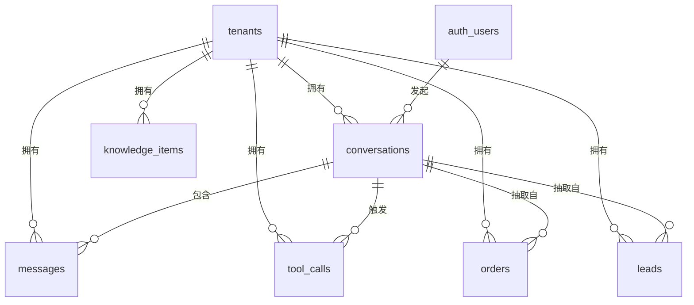

# AI 应用后端集成

## Summary

本章用 Supabase 为 AI 应用落库：数据建模、行级安全、会话持久化、实时订阅与边缘函数，实现业务快速落地。
学完本章，读者将掌握上述主题，并能将其用于后续章节的综合项目。

## Concepts Covered

本章覆盖学习图中的以下 16 个概念：

| Concept | Concept Impact Score |
|---------|-----------------------|
| Supabase项目搭建 | 4 |
| 数据表建模 | 4 |
| 行级安全策略 | 5 |
| 会话持久化 | 6 |
| 向量扩展pgvector | 7 |
| 文件存储集成 | 4 |
| 认证与授权 | 6 |
| 实时订阅推送 | 4 |
| 边缘函数集成 | 4 |
| 业务审计日志 | 5 |
| 数据备份恢复 | 5 |
| 租户隔离设计 | 6 |
| 订单业务落库实战 | 5 |
| 留资系统实战 | 6 |
| 数据迁移方案 | 6 |
| 后端成本估算 | 5 |

## Prerequisites

本章建立在以下章节的概念之上：

- [Chapter 1: 开发基础与工程规范](../01-dev-foundations/index.md)
- [Chapter 2: 模型接入与进阶过渡](../02-model-access/index.md)

---

!!! mascot-welcome "第九章，数据要落地了"
    { class="mascot-admonition-img" }
    前八章你的 Agent 会推理、会调工具、会互相协作，可一到"数据存哪、用户是谁、这个文件谁下的"就卡住了。这一章把这三件事一次性解决，落点是一套真上线的中小企业 AI 助手。整章的数字都来自它：3 个租户、18,000 个会话、186,000 条知识向量。八条触手，一起开干！

本章的示例对象从头到尾只有一套：星桥——一套面向中小企业的 AI 业务助手，3 家租户（星桥科技、澜海贸易、云禾供应链），两条业务线是知识问答与销售线索。所有数字——延迟、条数、成本、越权行数——都来自它，你换成自己的业务时知道该按什么比例去缩放，而不是去猜。

## 一、后端选型：先决定不做什么

### Supabase项目搭建

先说为什么不是"裸 FastAPI + 自建 Postgres"。裸方案不是错，是要多付四笔账，而这四笔账恰好压在 AI 应用最要命的地方：会话要持久化、多租户要隔离、向量要检索、文件要存。

| 维度 | 裸 FastAPI + 自建 Postgres | Supabase |
|---|---|---|
| 搭建成本 | 装库、建库、备份、监控各半天，合计约 3 天 | 建项目约 10 分钟 |
| 认证 | 自己写密码哈希、令牌签发、刷新、吊销，约 300 行 | 自带邮箱与第三方登录，策略直接读令牌声明 |
| 行级安全 | 自己按 `tenant_id` 拼 `WHERE`，漏一处就是越权 | 数据库级 RLS，写漏的策略默认拒绝 |
| 向量检索 | 要么手动给 Postgres 装扩展，要么再上一套专用库 | 自带 pgvector，HNSW 索引开箱可用 |
| 实时推送 | 自己起 WebSocket 网关、心跳、重连 | 表变更直接订阅 |
| 运维负担 | 备份、升级、连接数、慢查询全自己扛 | 平台托管，备份与策略仍归你 |

"搭建 3 天"要算清楚，免得被当成拍脑袋：装 Postgres 0.5 天，写一套恢复脚本与定时任务 0.5 天，接对象存储与 CDN 0.5 天，令牌签发与刷新写完并测过 1.5 天，合计 3 天。这里不含业务表——业务表两种方案都得写。结论不是"Supabase 更好"，而是"AI 应用里会话持久化、向量检索、多租户这三件事的需求密度最高，正好落在它自带的能力上"；如果你的团队已有成熟的数据库规范和运维体系，自建同样合理。

建项目实际只有四步，第三步之后本地库与云端结构完全一致，本地开发不再有两套表定义：

```bash
npm install -g supabase                     # 命令行工具，版本以官方文档为准
supabase init                               # 生成 config.toml 与 supabase/ 目录
supabase link --project-ref <项目引用>      # 关联到云端项目
supabase db push                            # 把本地迁移脚本推到云端
supabase functions deploy chat-auth         # 部署边缘函数，函数名自取
```

初始化后会生成两份配置，必须分清：`config.toml` 是本地开发与自托管配置，**进版本库**；`.env` 里放项目地址、匿名密钥和 service 角色密钥，后者是唯一能绕过 RLS 的钥匙，只能待在边缘函数与后台任务里，绝不许发到浏览器或打进前端包。

```yaml
# .env.example 只写字段名不写值；真实值由密钥管理注入，参见第一章"环境变量安全管理"
SUPABASE_URL: https://<项目引用>.supabase.co
SUPABASE_ANON_KEY: <浏览器可用的匿名密钥>
SUPABASE_SERVICE_ROLE_KEY: <仅服务端与边缘函数可用，会绕过 RLS>
MODEL_API_KEY: <模型调用密钥>
```

### 数据表建模

建表之前先立一条规矩：**所有业务表都带 `tenant_id`，没有例外**。多租户隔离全靠这一列成立，一张漏掉的表就是一个跨租户泄漏的口子，而漏掉的表往往正是上线前一周才顺手加的那张。

三张主干表先落地。`conversations` 是会话，`messages` 是消息，`tool_calls` 记每一次工具调用——Agent 的每个副作用都能在这里找到对应的一行：

```sql
-- 租户：所有业务表的根
create table tenants (
  id         uuid primary key default gen_random_uuid(),
  name       text        not null unique,
  plan       text        not null default 'pro' check (plan in ('pro','enterprise')),
  created_at timestamptz not null default now()
);

-- 会话：一次对话一行，用 agent_kind 区分业务线
create table conversations (
  id          uuid primary key default gen_random_uuid(),
  tenant_id   uuid        not null references tenants(id),
  user_id     uuid        not null references auth.users(id),
  title       text,
  agent_kind  text        not null default 'chat'
              check (agent_kind in ('chat','order','lead')),
  status      text        not null default 'open'
              check (status in ('open','closed','archived')),
  model       text        not null,
  token_total integer     not null default 0,
  created_at  timestamptz not null default now(),
  updated_at  timestamptz not null default now()
);
-- 列表页最常见的查询是"某人最近的会话"，这个复合索引让它走索引顺序扫描
create index conversations_recent on conversations (tenant_id, user_id, updated_at desc);

-- 消息：一次问答写两行；client_msg_id 是幂等键，重试不会写出重复对话
create table messages (
  id              bigint generated always as identity primary key,
  conversation_id uuid        not null references conversations(id) on delete cascade,
  tenant_id       uuid        not null references tenants(id),
  role            text        not null check (role in ('system','user','assistant','tool')),
  content         text        not null,
  client_msg_id   text,
  tokens_in       integer     not null default 0,
  tokens_out      integer     not null default 0,
  latency_ms      integer,
  created_at      timestamptz not null default now()
);
-- 部分唯一索引：只有带幂等键的行参与唯一约束，助手消息不占位
create unique index messages_idempotent on messages (conversation_id, client_msg_id)
  where client_msg_id is not null;
create index messages_by_conv on messages (conversation_id, id);
```

知识块与工具调用两张表随后。`knowledge_items` 的向量列这里先留空，等下一节装好扩展再加——先建表后加列在真实迁移里更常见，因为安装扩展需要管理员权限：

```sql
create table knowledge_items (
  id          bigint generated always as identity primary key,
  tenant_id   uuid        not null references tenants(id),
  doc_id      text        not null,
  chunk_index integer     not null,
  text        text        not null,
  source_path text,
  visibility  text        not null default 'tenant'
              check (visibility in ('tenant','role')),
  role_tags   text[]      not null default '{}',
  created_at  timestamptz not null default now(),
  unique (doc_id, chunk_index)          -- 同一文档的同一块只能一行，重跑入库不会翻倍
);

create table tool_calls (
  id              bigint generated always as identity primary key,
  tenant_id       uuid        not null references tenants(id),
  conversation_id uuid        references conversations(id),
  tool_name       text        not null,
  arguments       jsonb       not null,
  result          jsonb,
  status          text        not null default 'ok'
                  check (status in ('ok','error','timeout')),
  duration_ms     integer     not null,
  created_at      timestamptz not null default now()
);
```

六个表的关系如下，注意每条业务边都穿过 `tenants`，这是 RLS 能一刀切的前提：



按本章的量级，这些表一个月长成什么样是可以预估的，预估值直接用于第十四节的成本估算和第十三节的迁移演练：

| 表 | 一行代表什么 | 本章月量级 | 关键约束与作用 |
|---|---|---|---|
| `tenants` | 一个企业客户 | 3 行 | 名称唯一 |
| `conversations` | 一次对话会话 | 18,000 行 | `(tenant_id, user_id, updated_at)` 复合索引 |
| `messages` | 一条消息 | 252,000 行 | `client_msg_id` 部分唯一索引做幂等 |
| `knowledge_items` | 一个知识块 | 186,000 条 | `(doc_id, chunk_index)` 唯一，防重跑翻倍 |
| `tool_calls` | 一次工具调用 | 410,000 行 | 保留 90 天，超期按月归档 |
| `audit_logs` | 一次敏感操作 | 96,000 行 | 只追加不修改，见第十节 |

252,000 条消息的算法是 18,000 个会话乘平均 14 轮；工具调用按每轮平均 2.3 次算，410,000 里知识问答占 6 成，订单与留资两条业务线占 4 成。

!!! mascot-tip "墨墨的小抄"
    { class="mascot-admonition-img" }
    三条建表纪律：主键用数据库默认生成，时间戳一律 `timestamptz`，金额一律 `numeric` 不要 `float`——浮点数在金额上迟早差一分钱，而差一分钱就等于财务对不上账。`client_msg_id` 这类幂等键要在写接口那一步就留好，事后补是补不回来的。

## 二、隔离：整章的纲

### 行级安全策略

行级安全（Row-Level Security，简称 RLS）是 Postgres 的数据库级权限机制：策略直接写在表上，写漏了默认拒绝，写全了越权路径自然消失。心智模型一句话——**RLS 是数据库自己执行的 `WHERE` 条件，和你的应用代码无关**。前端传了别人的 `tenant_id` 也没用，因为数据库在返回结果之前已经把行过滤掉了。

RLS 靠三样东西工作，缺一不可：表上开启 RLS、至少一条策略、以及一个能取到身份的函数。开启和策略必须成对出现，只写策略不开开关是最常见的致命配置：

```sql
-- 第一步：开关。策略写在开启之前是合法的，但开启之前策略不生效
alter table conversations enable row level security;
alter table messages      enable row level security;

-- 第二步：读策略。USING 管"能看到哪些行"，同时管改与删
create policy conv_read_tenant on conversations
  for select
  using (tenant_id = auth.current_tenant_id());

-- 第三步：写策略。WITH CHECK 管"能写进哪些行"，两列都要约束：
-- 租户取自令牌，不许前端自称；归属人必须是令牌里的本人
create policy conv_write_tenant on conversations
  for insert
  with check (
    tenant_id = auth.current_tenant_id()
    and user_id = auth.uid()
  );
create policy conv_update_tenant on conversations
  for update
  using (tenant_id = auth.current_tenant_id())
  with check (tenant_id = auth.current_tenant_id());
```

策略里出现的 `auth.current_tenant_id()` 是我们自己写的辅助函数，把"从令牌里取租户并安全转成 UUID"这件事收敛到一处。令牌里没有 `tenant_id` 声明时它返回空值而不是抛错，条件因此恒为假——这正是我们要的**失败即拒绝**：

```sql
create or replace function auth.current_tenant_id()
returns uuid language sql stable as $$
  -- nullif 挡住空字符串：''::uuid 会直接报错，把一次配置错误变成 500
  select nullif(auth.jwt() ->> 'tenant_id', '')::uuid;
$$;

-- 表属主默认绕过 RLS；加上 force 之后连属主自己也受限，
-- 迁移脚本与后台任务必须显式声明角色，这是它该付的代价
alter table conversations force row level security;
```

验证不能靠"我测过了没问题"，要靠一条**用别人的令牌执行的查询**。上面那条检查可以逐表跑，返回非 0 就阻断发布；它给出的 0 行不是"暂时没发现漏洞"，而是"这个租户视角下不存在任何一行不属于它的数据"。

| 现象 | 根因 | 修法 |
|---|---|---|
| 用户 A 读到用户 B 的全部数据 | 忘了开 RLS，表对查询角色默认开放 | 发布前断言 `relrowsecurity = true`，不通过就退出 |
| 读正常但写入报权限错 | 只写了 `for select`，没写插入与更新的 `WITH CHECK` | 三种操作各补一条策略 |
| service 角色查得到全部数据 | service 角色被设计成绕过 RLS，专供边缘函数与后台任务 | 它绝不能出现在浏览器请求头里 |
| 策略齐全但一条也读不到 | 令牌没有 `tenant_id` 声明，函数返回空值，条件恒为假 | 登录时写入声明，旧令牌必须清掉 |
| 一半表隔离、一半表泄漏 | 只给部分表开了策略，后加的表忘了 | 建表与开策略绑进同一迁移事务 |

!!! mascot-warning "策略写了不等于生效"
    { class="mascot-admonition-img" }
    RLS 最大的坑不是策略写错，是忘了打开它：`create policy` 成功不代表生效，`enable row level security` 漏了，全表对该角色可见，而且你的功能测试用自己的数据跑得好好的。这个坑我替你踩过：上线三天后有人发现另一个租户的会话列表能被翻出来。

`force row level security` 之后连表属主（也就是迁移脚本和后台任务用的那条连接）也受限，它们必须显式切换到一个受信任的角色。代价是多一句 `set local`，收益是"没有任何一把万能钥匙能从表上直接通行"——这是把安全性从纪律变成机制的那一步。

#### Diagram: RLS 漏配导致的数据越权

<iframe src="../../sims/rls-misconfig-leak/main.html" height="637px" width="100%" scrolling="no"></iframe>

[全屏运行RLS 漏配导致的数据越权](../../sims/rls-misconfig-leak/main.html){ .md-button .md-button--primary }

<details markdown="1">
<summary>设计说明（规格块）</summary>

本 MicroSim 已实现，上方 iframe 为实际运行的版本。下面的折叠内容是它的设计规格，供教师复用或二次开发参考。

<details markdown="1">
<summary>展开规格原文</summary>

RLS 漏配导致的数据越权</summary>
Type: microsim
**sim-id:** rls-misconfig-leak
**Library:** p5.js<br/>
**Status:** built<br/>
**Bloom Level:** Analyze<br/>
**Bloom Verb:** 分析
**Learning Objective:** 学习者将逐表预测 8 张业务表在当前配置下"澜海贸易的普通客服"能读到的行数，并算出合计泄漏行数；判定条件是泄漏行数答为 338,000 行、越权表数为 2 张、且能指出 `attachments` 的 0 行属于失败即拒绝而非越权。

**Prerequisites:** 行级安全策略、`enable row level security`、`USING` 与 `WITH CHECK`、`auth.current_tenant_id()`、失败即拒绝、service 角色（均已在本块上方的"行级安全策略"一节定义）。

**Evidence of Mastery:** 学习者先在不看结果的情况下写下三道题的答案并锁定，再揭晓。泄漏行数、越权表数、故障归类三项全部一致算掌握；泄漏行数容差 ±1,000 行；"0 行属于失败即拒绝"必须以文字理由给出，只选标签不算。

**Misconceptions:** (1) 写好策略就等于开了策略。(2) 读不到数据一定是故障，越权才是。(3) 越权只影响读，不影响写。

**Instructional Rationale:** Analyze 层级要求先预测再揭晓，因此三题在揭晓任何一格数字之前全部锁定。`attachments` 那行是本块的核心教学点：它读到的行数是 0，比"越权"更早暴露——正确的默认姿态是拒绝，所以"看不见数据"往往比"看见别人的数据"更安全，也更早暴露漏配。

**Content:**

8 张业务表逐张呈现，每次聚焦一张，学习者作答后揭晓。

| 序号 | 表 | 本租户应有行数 | 当前配置 | 实际可见行数 | 故障类型 |
|---|---|---|---|---|---|
| 1 | `conversations` | 6,000 | 已开启，读写策略齐全 | 6,000 | 正常 |
| 2 | `messages` | 84,000 | 已开启，读策略齐全、插入策略漏写 | 84,000 | 读正常，写被拒 |
| 3 | `knowledge_items` | 62,000 | 已开启，策略齐全 | 62,000 | 正常 |
| 4 | `tool_calls` | 137,000 | 忘了开启 | 411,000 | 越权 |
| 5 | `leads` | 620 | 已开启，策略齐全 | 620 | 正常 |
| 6 | `orders` | 1,400 | 已开启，策略齐全 | 1,400 | 正常 |
| 7 | `attachments` | 300 | 已开启，策略里把 `tenant_id` 写成了 `id` | 0 | 失败即拒绝 |
| 8 | `audit_logs` | 32,000 | 忘了开启 | 96,000 | 越权 |

三道题（固定顺序）：

| 序号 | 题干 | 标准答案 | 答错时的提示 |
|---|---|---|---|
| 1 | 8 张表里越权的共几张、合计泄漏多少行 | 2 张，338,000 行 | 序号 4 泄漏 411,000 − 137,000 = 274,000 行，序号 8 泄漏 96,000 − 32,000 = 64,000 行，两者相加 338,000。 |
| 2 | `attachments` 读到 0 行，属于越权故障还是可用性故障 | 可用性故障 | 策略条件恒为假，数据库直接拒绝返回，把越权挡住了——这是失败即拒绝的正常表现。 |
| 3 | 若给 `tool_calls` 补上 `for select` 策略但仍然漏掉开启，实际可见行数是多少 | 411,000 行 | 漏掉开启就等于没开 RLS，补策略不改变任何事，这正是序号 4 的成因。 |

答题反馈文案：序号 4 与 8 的共同点是"忘了开启"，症状都是行数正好等于全库的三倍，说明跨租户数据被完整返回；序号 7 相反，它一行也没漏出去，是因为策略引用了一个不该引用的列，条件恒假被数据库拒掉。序号 2 是最容易被忽略的一类：读完全正常，但 Agent 往会话里写工具结果时会被拒绝，表现为"问答能答、一调工具就 500"，很容易被误判成工具本身有问题。真正危险的顺序是：漏配的表越权读出别人的数据，用户一截图，事后才发现；而正确次序是先跑那条"用别人的令牌数一遍"的检查，把 0 行泄漏变成发布的前置条件。

**Provenance:** 各表"本租户应有行数"来自本块上方的表清单——会话 18,000 行、消息 252,000 行、知识块 186,000 条、工具调用 410,000 行、留资 1,860 条、订单 4,200 条、审计 96,000 行，均按 3 个租户均分得到每租户值。实际可见行数与故障类型为合成数据（生成规则：按"正常、忘开启导致全库可见、条件恒假导致零行、只写读策略"四种状态分配，随机种子 20261006）。泄漏行数由 Rules 计算得出，不是人工填写。

**Rules:** 越权泄漏行数 = 实际可见行数 − 本租户应有行数，仅对实际值大于应有值的行求和；零行不计入泄漏。泄漏合计的判定容差为 ±1,000 行。可见率 = 实际可见行数 ÷ 本租户应有行数，保留两位小数。故障分类判定用严格比较：泄漏行数 > 0 判为越权，实际可见行数 < 本租户应有行数判为可用性故障，两者相等且配置完整判为正常。全部行数为整数，不涉及小数舍入。本租户八表应有行数合计 323,320 行为上限，可见率上界为 1.00；实际值达到全库行数时判定为越权而非异常。切换身份会清空已提交的答案，三道题之间互不携带答案，无平局规则。

**Learner Activity:**

1. 学习者先看到 8 张表与本租户应有行数，不看结果，逐表写下实际可见行数与故障类型，全部锁定。
2. 三道题依次作答：泄漏行数与越权表数、零行故障归类、补策略但不开启的后果。
3. 揭晓后学习者把实际值减去本租户应有行数，核对泄漏行的构成，并指出哪张表最先被监控发现。

**Feedback:** 三道题，固定顺序，每题两次机会，答案在提交后立即揭晓。答对："正确，<标准答案>"。答错：展示该题的"答错时的提示"，并高亮对应序号的行。第二次答错后展示完整推导，该题记为失手。顶部累计"累计答对 n/3 题"。三题结束后展示汇总：本租户应见 323,320 行、实际可见 661,020 行、泄漏 338,000 行、少读 300 行，并提示：漏开启的表比写错的表危险得多，因为前者不产生任何报错。计分满分 3 分，答对 2 分视为掌握。

**Starting State:** 左侧列出 8 张业务表与本租户应有行数，右侧为作答区，标准值全部隐藏。屏幕提问："8 张表里两张忘了开策略，一张条件写错——先猜越权了多少行，再看哪张表最先露馅。"

**Chapter Anchors:** 本章月量级（会话 18,000、消息 252,000、知识块 186,000、工具调用 410,000、留资 1,860、订单 4,200、审计 96,000）；每租户应见 323,320 行；实际可见 661,020 行；泄漏 338,000 行（`tool_calls` 274,000 + `audit_logs` 64,000）；少读 300 行；`attachments` 因条件恒假读到 0 行属失败即拒绝；`messages` 缺插入策略表现为"问答正常、调工具报 500"。

</details>
</details>

### 租户隔离设计

RLS 解决的是"同一个库里不同租户互不可见"，但它回答不了一个更前置的问题：**这些租户该不该共用一个库**。这一节是对 RLS 的补充，三种方案在安全性、成本、运维之间各有位置。

选型的真实成本差异可以直接用本章的单价算出来。共享库里数据库实例的 68 元由 N 个租户分摊，每租户再按自己的存储与出网量付费；独立库则是每个客户一份完整的固定费用：

| 方案 | 隔离手段 | 单租户月成本（示意） | 一次策略失误的影响面 | 运维复杂度 |
|---|---|---|---|---|
| 共享库 + RLS | 同库不同表，行级策略约束 | 22.67 + 0.45 + 25.20 = 48.32 元 | 全部租户合计 323,320 行 | 一套策略、一套备份、一套迁移 |
| 独立库（独立项目） | 物理隔离，越权根本不可能 | 68.00 + 0.45 + 25.20 = 93.65 元 | 最多 1 个租户约 107,773 行 | N 套配置、N 次升级、N 份固定费用 |
| 混合（按客户分档） | 大客户独立库，长尾客户共享 | 按所选方案取值 | 取两种之一 | 两套都要会 |

22.67 元来自 68 元除以 3 个租户；0.45 元是每租户平均 21 GB 存储按 0.0217 元每 GB·月计；25.20 元是每租户 70 GB 出网按 0.36 元每 GB 计，第七节会解释为什么出网比存储贵两个数量级。

混合方案的分档规则建议写死成一条可执行的判断，而不是临场商量：合同年化金额超过 50 万元、或明确要求数据物理隔离、或属于金融与医疗等强合规行业，走独立库；其余全部走共享库。本章的 3 个租户里澜海贸易是医疗器械供应商，走独立库，另外两家共享——这样本章的账单变成 2 × 48.32 + 93.65 = 190.29 元，比全共享多 45.33 元，这 45.33 元就是合规的价钱。

!!! mascot-thinking "隔离强度是一条坡，不是一个开关"
    { class="mascot-admonition-img" }
    共享库加 RLS 的真实强度是"能防住手滑、挡不住误配"，独立库才是"连误配都越不过去"，但代价是每个客户一份固定费用。判断标准不是安全洁癖，是这个租户出了数据事故你要赔多少钱。

#### Diagram: 三种隔离方案在不同规模下的成本

<iframe src="../../sims/tenant-isolation-cost/main.html" height="932px" width="100%" scrolling="no"></iframe>

[全屏运行三种隔离方案在不同规模下的成本](../../sims/tenant-isolation-cost/main.html){ .md-button .md-button--primary }

<details markdown="1">
<summary>设计说明（规格块）</summary>

本 MicroSim 已实现，上方 iframe 为实际运行的版本。下面的折叠内容是它的设计规格，供教师复用或二次开发参考。

<details markdown="1">
<summary>展开规格原文</summary>

三种隔离方案在不同规模下的成本</summary>
Type: diagram
**sim-id:** tenant-isolation-cost
**Library:** html<br/>
**Status:** built<br/>
**Bloom Level:** Evaluate<br/>
**Bloom Verb:** 权衡
**Learning Objective:** 学习者将按三档租户规模比较共享库加 RLS、独立库与混合方案的后端月成本，并在给定 45 元月度成本上限下选出可容纳的租户数上限；判定条件是共享库在 12 租户档为 375.80 元、独立库为 1,123.80 元、混合方案在 12 租户档为 443.80 元。

**Prerequisites:** 共享库加 RLS、独立库、混合分档方案、固定成本分摊、出网计费（均已在本块上方的"租户隔离设计"一节定义）。

**Evidence of Mastery:** 学习者先在三档规模上分别锁定方案排序，再作答三道题。三题标准值全部一致算掌握；成本容差 ±0.01 元；第 2 题的"打平"档必须自己说出而不是猜。切换滑块探索不计入掌握。

**Misconceptions:** (1) 租户越多，共享库一定越划算且没有上限。(2) 独立库一定比共享库安全，不存在中间档。(3) 成本只与租户数有关，与出网量无关。

**Instructional Rationale:** Evaluate 层级的关键是把安全性与成本放在同一把尺子上权衡，因此三道题都要求先写判断再看标准值。第 3 题是本块的核心——它会逼学习者承认"在 1 租户档两种方案完全打平"，从而理解分档规则要按规模切换，而不是一条规则走到底。

**Content:**

三个可调节量：

| 量 | 最小 | 最大 | 步长 | 默认 | 单位 |
|---|---|---|---|---|---|
| 租户数 N | 1 | 24 | 1 | 3 | 个 |
| 单租户月出网量 E | 10 | 200 | 10 | 70 | GB |
| 单租户月存储量 S | 5 | 60 | 5 | 21 | GB |

三档固定规模的成本对照（固定单价来自本块上方的成本口径）：

| 租户数 N | 共享库加 RLS | 独立库 | 混合方案（1 个独立 + N-1 个共享） |
|---|---|---|---|
| 1 | 93.65 元 | 93.65 元 | 93.65 元 |
| 3 | 144.96 元 | 280.95 元 | 190.29 元 |
| 12 | 375.80 元 | 1,123.80 元 | 443.80 元 |

三道题（固定顺序）：

| 序号 | 题干 | 标准答案 | 答错时的提示 |
|---|---|---|---|
| 1 | 12 个租户时哪种方案月成本最低，多少钱 | 共享库加 RLS，375.80 元 | 共享库 68 元固定加 12 × (0.45 + 25.20) = 68 + 307.80 = 375.80 元；混合方案因多出一份 68 元固定费用为 443.80 元。 |
| 2 | 三档里哪一档共享库与独立库成本相同 | 1 租户档，两种都是 93.65 元 | 只有一个租户时没有固定费用可分摊，两者完全打平；这正是分档规则要按规模切换的原因。 |
| 3 | 12 租户档独立库比共享库多花多少，倍数是多少 | 多 748.00 元，约 2.99 倍 | 1,123.80 − 375.80 = 748.00 元；748.00 ÷ 375.80 ≈ 1.99，倍数应算独立库总额 ÷ 共享库总额 = 1,123.80 ÷ 375.80 ≈ 2.99。 |

答题反馈文案：固定费用是分档的真正原因——68 元的数据库实例费用在 1 个租户时全额由它承担，到 12 个租户时被摊薄到每租户 5.67 元，所以共享库的规模效应到 12 租户才真正显现。混合方案的成本不是三种里最低的，它换来的是把大客户的物理隔离要求单独满足；本月 3 租户时它比全共享贵 45.33 元，这笔钱换的是合规，不该按性价比评价。越权影响面与成本是两条独立的轴：共享库一次策略失误的影响面等于全部租户行数合计 323,320 行，独立库最多波及 1 个租户约 107,773 行，两者相差 3 倍，远小于成本相差的 2 倍——所以"贵 2 倍买 3 倍的止损"对高价值租户是划算的，对长尾租户则不划算。

**Provenance:** 单价 68 元（组织实例）、0.0217 元每 GB·月（存储）、0.36 元每 GB（出网）取自本块上方的"租户隔离设计"成本口径与本章"后端成本估算"一节；三档成本由 Rules 计算得出，不是厂商报价。越权影响面 323,320 行与 107,773 行取自本块上方的方案对比表。全部价格为教学用示意价。

**Rules:** 共享库成本 = 68 + N × (0.45 + 25.20)，当 N 大于 1 时固定费用按 N 分摊，即 68 ÷ N + N × (0.45 + E × 0.36)，取整到 0.01 元；N 等于 1 时该式退化为 93.65 元。独立库成本 = N × (68.00 + 0.45 + E × 0.36)，取整到 0.01 元。混合方案成本 = 独立库 1 份 + 共享库 1 份 = 93.65 + (68 ÷ (N-1) + (N-1) × (0.45 + E × 0.36))，N 小于等于 1 时退化为 93.65 元。E 取 70 GB、S 取 21 GB 时 0.45 元固定成立，E 变化时按 E × 0.36 元计。判定容差 ±0.01 元。倍数取两位小数，打平判定为两者之差的绝对值小于 0.01 元，此时两种选择都算对。N 等于 24 时不外推独立库的实际限额，那属于超出本块范围。

**Learner Activity:**

1. 学习者拖动租户数，观察三条成本曲线的形状，应注意到共享库与独立库在 1 租户处相交，之后差距持续拉大。
2. 学习者拖动单租户出网量，观察三方案同向上涨，意识到固定费用摊薄并不随出网量改善。
3. 学习者依次完成三道题，手写答案后提交，最后一题结束后展示完整演算过程。

**Feedback:** 三道题，固定顺序，每题两次机会，答案在提交后立即揭晓。答对："正确，<标准答案>"。答错：展示该题的"答错时的提示"，并把三档对照表中对应行高亮。两次答错记为失手，该题不再计分。顶部累计"累计答对 n/3 题"。三题结束后展示全部演算，并提示：分档规则要按规模切换，1 租户时两种方案打平、12 租户时共享库明显便宜，中间才是混合方案的区间。计分满分 3 分，答对 2 分视为掌握。

**Starting State:** 三个量位于默认值（N = 3，E = 70，S = 21），三档成本对照表可见，三道题折叠在下方且标准值隐藏。屏幕提问："独立库贵在固定费用，可 1 个租户时它一分钱都不多要——先算三档，再回答哪一档两者打平。"

**Chapter Anchors:** 数据库实例 68 元/月；存储 0.0217 元每 GB·月；出网 0.36 元每 GB；单租户存储 21 GB、出网 70 GB；共享库单租户 48.32 元、独立库 93.65 元；1 / 3 / 12 租户三档成本 93.65 / 144.96 / 375.80 与 93.65 / 280.95 / 1,123.80 元；混合方案 12 租户 443.80 元；独立库 12 租户比共享库多 748.00 元、约 2.99 倍；越权影响面 323,320 行对 107,773 行；本章 3 租户混合账单 190.29 元、比全共享多 45.33 元。

</details>
</details>

## 三、AI 数据的四件套

### 会话持久化

会话持久化就是把前两章的"对话历史管理"落到真实的表上。它要同时满足三件事：写要有幂等键（网络重试不会写出重复对话）、读要有 token 预算（历史无限长而窗口有限）、状态要能续接（关掉页面再回来还在原处）。

写侧的幂等靠那个部分唯一索引兜底。同一个 `client_msg_id` 第二次提交会撞唯一约束被整批拒绝，这比"先查有没有再决定写不写"可靠——后者在并发下必然有窗口期：

```python
import os
from supabase import create_client          # 客户端版本差异以官方文档为准

db = create_client(os.environ["SUPABASE_URL"], os.environ["SUPABASE_ANON_KEY"])


async def save_turn(conv_id: str, tenant_id: str, user_id: str, client_msg_id: str,
                    user_text: str, answer: str, usage: dict) -> None:
    """一次问答写两行。client_msg_id 相同则整批被唯一约束拒绝，重试不产生重复"""
    conv = db.table("conversations").select("status,token_total") \
        .eq("id", conv_id).single().execute().data
    if conv["status"] != "open":
        raise ValueError("会话已关闭，禁止续写")   # 归档后仍能读，但不能再追加

    db.table("messages").insert([
        {"conversation_id": conv_id, "tenant_id": tenant_id, "role": "user",
         "content": user_text, "client_msg_id": client_msg_id},
        {"conversation_id": conv_id, "tenant_id": tenant_id, "role": "assistant",
         "content": answer, "tokens_in": usage["in"], "tokens_out": usage["out"],
         "latency_ms": usage["latency_ms"]},
    ]).execute()
    db.table("conversations").update({
        "token_total": conv["token_total"] + usage["in"] + usage["out"],
        "updated_at": now_utc(),
    }).eq("id", conv_id).execute()
```

读侧的裁剪是这个概念的核心。本章单条消息平均 620 个 token（一问一答两条），一个 14 轮的会话历史就是 28 条消息、约 17,360 个 token，是 4,000 预算的 4.34 倍——不裁剪就必然超窗，而超窗时模型侧的自动截断丢的往往正是开头那句关键的上下文：

```python
def load_history(conv_id: str, budget_tokens: int = 4000, keep_last_turns: int = 3) -> list[dict]:
    """最近 keep_last_turns 轮无条件保留；更早的按预算从新到旧回填，放不下就跳过"""
    rows = db.table("messages") \
        .select("role,content,tokens_in,tokens_out,created_at") \
        .eq("conversation_id", conv_id).order("id", desc=True).execute().data

    kept, used = [], 0
    for idx, m in enumerate(rows):
        cost = (m["tokens_in"] or 0) + (m["tokens_out"] or 0) or estimate_tokens(m["content"])
        if idx < keep_last_turns * 2 or used + cost <= budget_tokens:
            kept.append(m)
            used += cost
        # 否则跳过这条继续试更早的：长消息被跳过后，短消息仍有机会进上下文
    return list(reversed(kept))       # 回到时间正序，模型看到的是连贯对话
```

按这套规则，4,000 预算下保留最近 3 轮共 6 条消息（3,720 个 token），第 4 轮放不下（3,720 + 620 = 4,340 超出预算），所以实际回填 6 条。超过 30 轮的长会话不靠裁剪硬扛，而是在第 30 轮时追加一条 `role='system'` 的摘要消息，把前 30 轮压到 300 个 token 左右，再从摘要之后开始记。

### 向量扩展pgvector

pgvector 是 Postgres 的向量扩展，提供 `vector(n)` 列类型、三个距离算子和 HNSW 索引。本章的嵌入维度是 1024（与第三章的 `zh-embed-base` 一致），**维度写死在列定义里，换嵌入模型就必须改这一处并重建索引**，这是它最大的约束也是最省心的地方。

余弦距离的公式如下，`pgvector` 的 `<=>` 算子返回的正是这个值，取值范围 0 到 2，越小越近：

\[ d(\mathbf{a}, \mathbf{b}) = 1 - \frac{\mathbf{a} \cdot \mathbf{b}}{\lVert \mathbf{a} \rVert \cdot \lVert \mathbf{b} \rVert} \]

因此相似度就是 \(1 - d\)：相似度 0.86 对应距离 0.14，把"相似度不低于 0.75"写成检索条件时就是距离小于等于 0.25。

```sql
create extension if not exists vector;
alter table knowledge_items add column embedding vector(1024);

-- HNSW 索引：m 是每个节点保留的邻居数，ef_construction 是建索引时的候选宽度
create index knowledge_items_hnsw on knowledge_items
  using hnsw (embedding vector_cosine_ops)
  with (m = 16, ef_construction = 64);

-- 已有数据要回填：新增列默认全为空，空向量参与检索会让结果失真
update knowledge_items set embedding = :batch_vectors where embedding is null;
```

检索语句与第三章混合召回最终收敛的那一路一致。租户条件出现两次不是冗余：一次是给审计看的显式约束，一次是 RLS 的兜底：

```sql
select id, doc_id, chunk_index, left(text, 80) as preview,
       1 - (embedding <=> :query_vec) as score
  from knowledge_items
 where tenant_id = auth.current_tenant_id()      -- 显式条件，便于事后审计 SQL
   and visibility = 'tenant'
   and (embedding <=> :query_vec) < 0.25          -- 距离 ≤ 0.25 即相似度 ≥ 0.75
 order by embedding <=> :query_vec
 limit 8;
```

两个参数别照抄不调：`hnsw.ef_search` 默认 40，决定查询时的候选宽度（调大召回更全、延迟更高），`hnsw.max_scan_tuples` 默认 20，决定翻索引翻到什么程度就放弃。过滤条件与向量的组合是 pgvector 相对专用向量库最大的优势——租户、角色、状态都是同一套 SQL 的条件，而专用库要在向量库里重建一份元数据再回查业务库，中间那段窗口期就是不一致的来源。

| 维度 | pgvector | 专用向量库 | 本章选型 |
|---|---|---|---|
| 10 万向量 Top10 延迟 | 18 毫秒 | 12 毫秒 | pgvector |
| 过滤条件与事务 | 与业务表同一套 SQL、同一事务 | 需重建元数据再回查，存在短暂不一致 | pgvector |
| 运维组件 | 无新增组件 | 多一套要监控、要备份的集群 | pgvector |
| 千万级向量 | 需调高 `maintenance_work_mem` 并分区，索引构建从分钟变成小时 | 天然分片 | 换专用库 |

本章的 186,000 条向量，HNSW 索引首次全量构建耗时 2 分 40 秒，每日增量 12,000 条约 9 秒，`ef_search` 取默认值 40 时 Top8 检索 18 毫秒。切换门槛给一个数字：向量行数低于 100 万、过滤条件以租户和角色为主时 pgvector 足够；上到千万级或需要跨库聚合时，再评估专用库。

### 文件存储集成

Supabase Storage 是 S3 兼容的对象存储，桶（bucket）有公开与私有两种策略。AI 应用的文件几乎都该私有——客户上传的制度文件、内部导出报表，没有一个是能匿名访问的；需要给人看的时候发一个带签名的临时地址。

| 桶名 | 存什么 | 可见性 | 单文件上限 | 本章量级 |
|---|---|---|---|---|
| `knowledge-docs` | 客户上传的制度与产品资料原文件 | 私有，按租户目录 | 50 MB | 620 个，1.1 GB |
| `attachments` | 问答中上传与生成的文件 | 私有，按会话目录 | 20 MB | 900 个/月，1.6 GB |
| `exports` | 订单与报表的导出文件 | 私有，按角色 | 20 MB | 340 个/月，0.6 GB |

三类桶现存合计 62 GB（含 14 个月历史导出）。**路径第一段必须是租户 ID，这条由服务端强制拼接**——只要让前端自己传完整路径，它就能传别人的目录：

```sql
insert into storage.buckets (id, name, public, file_size_limit)
values ('knowledge-docs', 'knowledge-docs', false, 52428800),   -- 50 MB，私有
       ('attachments',     'attachments',     false, 20971520),   -- 20 MB
       ('exports',         'exports',         false, 20971520);

-- 对象策略与 RLS 同构：先用 bucket_id 收窄，再用路径第一段匹配租户
create policy "docs read own tenant" on storage.objects
  for select to authenticated
  using (
    bucket_id = 'knowledge-docs'
    and (storage.foldername(name))[1] = auth.current_tenant_id()::text
  );
```

```python
from pathlib import Path
from uuid import uuid4


def store_document(tenant_id: str, filename: str, blob: bytes) -> str:
    """路径由服务端拼：<租户>/<年月>/<随机名><后缀>，前端传不了别人的目录"""
    suffix = Path(filename).suffix.lower() or ".bin"
    key = f"{tenant_id}/{today():%Y%m}/{uuid4().hex}{suffix}"
    db.storage.from_("knowledge-docs").upload(
        "knowledge-docs/" + key, blob,
        {"content-type": guess_type(filename), "upsert": "false"})
    return key


def signed_download(key: str, expires_s: int = 300) -> str:
    """预签名地址 5 分钟有效。链接本身等于授权，谁拿到都能下，审计日志必须记这一条"""
    return db.storage.from_("knowledge-docs").create_signed_url(key, expires_s)
```

### 认证与授权

认证回答"你是谁"，授权回答"你能动哪一行"。在这个平台上两者交汇于同一份 JSON Web Token：认证决定令牌里有哪些声明，RLS 与存储策略只读这些声明。理解了这个结构，"租户归属"就不该存前端、不该存会话变量、更不该由业务代码拼接，它应该只存在于令牌里。

| 声明 | 含义 | 谁写入 | 谁读取 |
|---|---|---|---|
| `sub` | 用户 UUID | 认证服务签发 | `auth.uid()` |
| `role` | 数据库角色（`authenticated`） | 平台 | 连接属性 |
| `tenant_id` | 所属企业 | 登录时由边缘函数写入自定义声明 | `auth.current_tenant_id()` |
| `app_role` | 业务角色（`owner` / `agent` / `auditor`） | 同上 | 策略中的授权判断 |
| `email` | 邮箱 | 认证服务 | 通知与展示 |

声明不可篡改，但也不可收回，这是它的第二个关键性质：访问令牌 1 小时过期、刷新令牌 30 天，**租户归属一旦变更，旧令牌必须立刻作废**。否则一个刚换租户的用户还能用旧令牌读到旧租户的数据，而每一条策略都会认为他"完全合法"，这类漏洞从日志里完全看不出来。

| 能力 | `owner` | `agent` | `auditor` |
|---|---|---|---|
| 读本租户知识库 | 是 | 是 | 是 |
| 写知识库（上传、删除） | 是 | 否 | 否 |
| 读全量会话 | 是 | 仅自己 | 是 |
| 读审计日志 | 是 | 否 | 是 |
| 改策略与切换模型 | 是 | 否 | 否 |

前端有时要读令牌里的声明做界面控制，那就在本地解码——但**解码不等于验签**，签名验证只能在服务端做：

```python
import base64
import json


def claims(token: str) -> dict:
    """只做本地解码供界面判断用；任何权限判定都必须以服务端验签后的声明为准"""
    payload = token.split(".")[1]
    payload += "=" * (-len(payload) % 4)          # base64url 常缺 1 到 3 个补位字符
    return json.loads(base64.urlsafe_b64decode(payload))
```

!!! mascot-neutral "声明是唯一的身份来源"
    { class="mascot-admonition-img" }
    `tenant_id` 写在令牌里，是让"谁是谁"这件事只有一个来源——前端改不了、SQL 改不了、日志也留痕。代价是令牌一旦签发就无法收回，所以租户归属一变，旧令牌必须作废。

## 四、实时与算力下沉

### 实时订阅推送

AI 应用的实时推送有三类，价值和实现难度差别很大：第一类是自己发出去的消息回显，第二类是 Agent 的中间步骤（工具调用、检索进度），第三类是**异步任务进度**。第三类是本章重点——批量生成、长文档解析动辄几十秒到几分钟，用户不可能守着一个 HTTP 连接干等，而超时断开之后进度就彻底丢了。

两条通道各有分工：`postgres_changes` 订阅的是表变更，推送的是"某行变了"这个事实；`broadcast` 是服务端主动往频道里发消息，推送的是"进度到了 27%"这类业务状态。**业务进度不要靠推断表变更**，靠推断的结果是每张状态表都得订阅一遍，且中间态根本不会落表。

| 用途 | 通道 | 本章月推送量 | 说明 |
|---|---|---|---|
| 工具调用过程回显 | `postgres_changes` 订阅 `messages` | 节流后 68,000 条 | 逐条推 252,000 条毫无意义，按 300 毫秒一批节流 |
| 批量生成进度 | `broadcast` 频道 `job:<任务 ID>` | 180,000 条 | 每前进 5% 推一跳，一个任务约 20 跳 |
| 会话列表更新 | `postgres_changes` 订阅 `conversations` | 18,000 条 | RLS 已在推送侧生效，只推本租户变更 |
| 文件处理完成 | `broadcast` 频道 `job:<任务 ID>` | 2,400 条 | 与进度同一条通道换事件名 |

服务端发一跳：

```python
async def publish(job_id: str, done: int, total: int) -> None:
    """频道名带任务 ID，每个任务一条，互不串台"""
    await db.channel(f"job:{job_id}").send({
        "type": "broadcast", "event": "progress",
        "payload": {"job_id": job_id, "done": done, "total": total},
    })
```

客户端订阅，并且必须校验订阅者有权订阅这个任务：

```python
async def watch_job(job_id: str, tenant_id: str, user_id: str) -> None:
    """频道名可猜，所以订阅前要核对归属，否则任何人都能订别人的批量任务"""
    task = db.table("jobs").select("id,tenant_id,status").eq("id", job_id).single().execute().data
    if task["tenant_id"] != tenant_id:
        raise PermissionError("任务不属于当前租户")

    def on_progress(payload: dict) -> None:
        p = payload["payload"]
        pct = int(p["done"] / p["total"] * 100)
        print(f"批量生成 {p['done']}/{p['total']}  {pct}%")
        if p["done"] == p["total"]:
            print("完成，可以拉结果了")

    channel = db.channel(f"job:{job_id}")
    channel.on("broadcast", {"event": "progress"}, on_progress)
    await channel.subscribe()
```

### 边缘函数集成

边缘函数跑在离用户最近的节点上，延迟低，但它不是"免费的服务器"，有两条硬约束：**单次调用的 CPU 时间有上限**，**冷启动有几十到几百毫秒**。判断某段逻辑该不该放边缘，只问三个问题：它要不要访问数据库（要，就近更快）、它是不是长耗时计算（不是，否则超时会拖累同节点其他请求）、它会不会碰到敏感数据（会，就得先想清楚响应体里能带出什么）。

| 逻辑 | 放哪 | 理由 |
|---|---|---|
| 校验令牌并签发带 `tenant_id` 的新令牌 | 边缘 | 每个请求都要做，必须快；离用户近，握手延迟低 |
| 限流与配额扣减 | 边缘 | 必须在请求进入数据库之前就挡住超额流量 |
| 改写模型请求（补提示、注入系统提示） | 边缘 | 只改写不生成，单次 CPU 约 8 毫秒 |
| 调用大模型并流式转发 | 后端 | 长连接会占满边缘节点的 CPU 时间 |
| 向量化与批量入库 | 后端任务 | 单条要几百毫秒 CPU，边缘函数扛不住 |
| 跨表聚合的统计报表 | 后端 | 需要长查询与连接复用 |

本章边缘函数每月调用 26 万次，其中 18.4 万次是令牌校验与限流，平均 CPU 耗时 9 毫秒，P95 冷启动 180 毫秒；模型调用一次都没放进边缘。这条分工线画得越清楚，边缘的账单越省——第七节的成本表里边缘函数调用这一项是 0.00 元。

```bash
# 边缘函数用用户的访问令牌调用；缺令牌直接 401，进不到数据库
curl -s -X POST "$SUPABASE_URL/functions/v1/chat-auth" \
  -H "Authorization: Bearer $USER_ACCESS_TOKEN" \
  -H "Content-Type: application/json" \
  -d '{"action":"refresh_claims"}' | python -m json.tool
```

```json
{
  "ok": true,
  "claims": {"sub": "b7f1c9e2-...", "tenant_id": "2f9a41d7-...", "app_role": "agent"},
  "quota": {"used": 118, "limit": 200},
  "expires_in": 3600
}
```

配额的三个数字是本章的真实口径：普通坐席每月 200 次结构化抽取，`owner` 每月 2,000 次，超出后边缘函数在签发令牌时就拒绝，根本不会打到模型。

!!! mascot-warning "边缘函数不是第二个后端"
    { class="mascot-admonition-img" }
    边缘函数有 CPU 时间上限，硬塞一次模型调用进去，超时的请求会把同一节点上的其他人一起拖下水，这个坑我替你踩过。记住分工：校验、改写、限流在边缘；调用、生成、入库在后端。

## 五、可追溯与可恢复

### 业务审计日志

审计日志记录"谁在什么时候对什么数据做了什么"，只追加、永不修改。AI 应用里它有特殊的不可替代性：Agent 的每一次工具调用都是一次写操作，出事时你必须能回答"这条订单是谁、通过哪一次工具调用写进去的"。没有这条链，一次数据错误的追责就只能靠回忆。

用数据库触发器而不是应用层写日志，理由是触发器绕不过去：异常路径、临时脚本、SQL 控制台里的手工操作，应用层日志全都记不全。

```sql
create table audit_logs (
  id           bigint generated always as identity primary key,
  tenant_id    uuid        not null references tenants(id),
  actor_id     uuid        not null,            -- 操作者的 UUID
  actor_kind   text        not null check (actor_kind in ('human','agent','system')),
  action       text        not null,            -- 如 knowledge.upload、order.approve
  object_type  text        not null,            -- 如 document、order、lead
  object_id    text        not null,
  before_state jsonb,
  after_state  jsonb,
  request_id   text        not null,            -- 串起同一次请求的多条日志
  created_at   timestamptz not null default now()
);
create index audit_recent on audit_logs (tenant_id, created_at desc);
create index audit_object on audit_logs (object_type, object_id, created_at desc);
```

```sql
create or replace function audit_row_change() returns trigger
language plpgsql security definer as $$
declare
  v_row    jsonb;
  v_tenant uuid;
begin
  -- 分支里才碰 old 或 new：插入触发器里 old 尚未赋值，直接引用会报错
  if tg_op = 'DELETE' then
    v_row := to_jsonb(old);
    v_tenant := old.tenant_id;
  else
    v_row := to_jsonb(new);
    v_tenant := new.tenant_id;
  end if;

  insert into audit_logs (tenant_id, actor_id, actor_kind, action,
                          object_type, object_id, before_state, after_state, request_id)
  values (
    v_tenant,
    coalesce(nullif(auth.jwt() ->> 'sub', '')::uuid, gen_random_uuid()),
    case when coalesce(auth.jwt() ->> 'sub', '') = '' then 'system' else 'human' end,
    lower(tg_op) || '_' || tg_table_name,
    tg_table_name,
    coalesce(v_row ->> 'id', ''),
    case when tg_op in ('UPDATE','DELETE') then to_jsonb(old) end,
    case when tg_op in ('INSERT','UPDATE') then to_jsonb(new) end,
    coalesce(current_setting('request.headers', true)::jsonb ->> 'x-request-id', '')
  );

  if tg_op = 'DELETE' then return old; else return new; end if;
end;
$$;

create trigger audit_orders after insert or update or delete on orders
  for each row execute function audit_row_change();
```

追一次可疑写入时，`request_id` 是把"这一行数据从哪来"串成线的钥匙：

```sql
select created_at, actor_id, action, object_id, request_id
  from audit_logs
 where tenant_id = auth.current_tenant_id()
   and object_type = 'orders' and object_id = 'ORD-2026-0417'
 order by created_at;
```

本章审计日志每租户每月增 32,000 行、三租户 96,000 行，保留 180 天后归档到冷存储。`before_state` 与 `after_state` 只在更新与删除时非空，全量存整行会让这张表一个月长到几个 GB——真要那么做，也该只存变化字段。

### 数据备份恢复

备份的核心指标是两个：RPO（恢复点目标，能容忍丢多少数据）与 RTO（恢复时间目标，能容忍停多久）。没有这两个数字，备份就只是"看着安心"。

\[ \text{RPO} = \text{备份间隔} + \text{归档日志复制延迟} \]

本章的归档日志复制延迟实测 40 秒，归档间隔 5 分钟，因此 RPO 约 5 分钟；平台的时间点恢复粒度到分钟，把 RPO 压到 1 分钟，但代价是 RTO 变成 8 分钟（整项目拉起），比逻辑恢复慢。

| 层 | 方式 | 频率 | RPO | RTO | 保留 |
|---|---|---|---|---|---|
| 逻辑备份 | `pg_dump` 全量 + 归档日志 | 每日 03:00 全量 + 日志连续 | 5 分钟 | 2 小时 | 全量 14 份 |
| 平台时间点恢复 | 控制台恢复到指定时刻 | 按需 | 1 分钟 | 8 分钟 | 7 天 |
| 对象存储 | 版本化 + 跨区复制 | 写入即版本化 | 0 | 15 分钟 | 30 天 |
| 向量索引 | 不单独备份 | — | 随库 | 随库 | — |

向量索引不单独备份的理由很实际：HNSW 索引可以从 `knowledge_items` 重建，186,000 条约 2 分 40 秒，比备份索引文件更省事，而且不会出现"索引文件和表对不上"的经典损坏。

```bash
# 全量逻辑备份：自定义格式便于并行恢复，压缩后再传对象存储
pg_dump "$DATABASE_URL" -Fc -f starbridge-$(date +%Y%m%d-%H%M).dump

# 恢复演练只在演练环境做，绝不能在生产库上试
pg_restore -d "$DRILL_DATABASE_URL" --clean --if-exists starbridge-20261006-0300.dump

# 校验备份可读：能列出表和表数据才算数，只看文件大小不算
pg_restore -l starbridge-20261006-0300.dump | grep -c 'TABLE DATA'
```

最近一次演练结论：620 个文件的桶、186,000 条向量、32,000 行审计日志全部恢复完成耗时 34 分钟（RTO 目标 2 小时），RPO 实测 5 分钟。演练的价值不在于"测过了"，而在于它暴露了两件真事——`storage.objects` 的策略**不在** `pg_dump` 的范围内，恢复后必须重跑一遍策略脚本；以及备份文件放在同一个项目里等于没备份，它应该躺在另一个项目。

!!! mascot-encourage "这两节确实枯燥"
    { class="mascot-admonition-img" }
    备份和迁移没有一屏好看的效果，全是凌晨三点的检查清单。但它们是唯一在事故当天还能救你命的东西，本章的演练结论很实：34 分钟恢复，RPO 实测 5 分钟。照着跑一遍，你会睡得着。

### 数据迁移方案

AI 应用的后端迁移比一般业务多两件麻烦：**向量要重算**（嵌入模型换了，旧向量全部作废）、**RLS 策略要重放**（策略是代码不是数据，不在备份里）。这两件事都得提前排期，否则切流当天才发现旧库里的向量和新模型对不上。

| 方案 | 做法 | 停机 | 适用 | 风险 |
|---|---|---|---|---|
| 大爆炸切换 | 停机导全量 + 重放增量，然后切流量 | 20 到 40 分钟 | 早期项目、表少 | 停机窗口内的新数据要人工补 |
| 双写 + 校验 + 切读 | 旧库写、新库同时写，一致后切读，最后停旧写 | 0 | 有真实流量、不能停机 | 双写期的一致性必须持续校验 |
| 表级灰度 | 逐表切，读流量按表名路由 | 0 | 只想迁几张表 | 跨表关联要临时兼容两套 |

本章用的是双写，读流量固定在星桥科技一个租户上，一致率要求 99.95%。**新库写失败要记账而不是回滚主流程**——回滚会把一次辅助迁移的失败放大成主业务的失败，这是双写方案最常见的翻车方式：

```python
async def write_through(row: dict) -> None:
    """先写旧库保证主流程；新库失败只入差异队列，绝不回滚旧库写入"""
    await legacy.upsert("orders", row)
    try:
        await target.upsert("orders_v2", adapt(row))
    except Exception as exc:
        await diff_queue.put({"pk": row["id"], "phase": "dual_write", "err": str(exc)})


async def consistency_report(window: tuple[str, str]) -> dict:
    """按主键对齐两侧逐字段比对；一致率 = 一致条数 / 比对条数"""
    keys = await legacy.keys("orders", window)
    same = 0
    for k in keys:
        a = adapt(await legacy.get("orders", k))
        b = adapt(await target.get("orders_v2", k))
        if a == b:
            same += 1
    return {"compared": len(keys), "consistent": same,
            "rate": round(same / max(len(keys), 1), 5)}
```

换嵌入模型的那笔账要用第三章的块大小来算：186,000 条向量、每条 400 个 token，按每千 token 0.0005 元的教学示意价，全量重算 74,400 千 token，费用 37.2 元；按单条 12 毫秒、8 路并发计算，约 5 分钟跑完。这笔钱和这 5 分钟都不是问题，问题在于**排期**——迁移窗口通常只有一小时，重算和校验必须分开跑。

完整顺序固定为六步，每步都有明确的判定条件，不能跳：

1. 建新库结构与策略，用上一节的方法逐表验证 0 行泄漏。
2. 灌入基础数据（租户、用户、角色映射）。
3. 全量导入历史数据，向量留空。
4. 开启双写，连续观察一致率，目标不低于 99.95%。
5. 重算并回填向量（若换模型），校验检索结果条数一致。
6. 切读，观察 24 小时后再停旧写。

## 六、两个实战

### 订单业务落库实战

订单的难点是**确定性与算术**：抽取出来的每一个字段都要能被机器判真假。流程固定为五步：会话 → AI 抽取结构化要素 → Schema 校验 + 业务校验 → 落库草稿 → 人工复核 → 正式单。任何一步不过都转人工，绝不猜着补全。

| 字段 | 类型 | 必填 | 校验规则 | 抽取失败时的处理 |
|---|---|---|---|---|
| `order_no` | text | 系统生成 | `ORD-` 加年月日加 6 位序号 | 系统生成，不依赖模型 |
| `customer_name` | text | 是 | 长度 2 到 20 字 | 留空并标 `needs_review` |
| `phone` | text | 是 | 11 位、以 1 开头 | 留空并标 `needs_review` |
| `sku_list` | jsonb | 是 | 每项 `sku` 必须在商品主数据里，`qty` 为 1 到 9999 整数 | 整单转人工 |
| `unit_price` | numeric(12,2) | 系统回填 | 一律取商品主数据价 | 不采信模型输出 |
| `amount_total` | numeric(12,2) | 系统计算 | 等于明细之和，容差 0.01 元 | 由系统算，模型不得直接给总额 |
| `pay_method` | text | 是 | 枚举：微信、支付宝、银行转账、货到付款 | 无法判定时取"待确认"并转人工 |
| `delivery_address` | text | 是 | 长度 10 到 200 字 | 留空并标 `needs_review` |
| `expected_delivery_date` | date | 否 | 晚于今天 | 置空 |

**金额一律不采信模型输出**。模型只负责抽 `sku` 与 `qty`，单价由主数据回填，总额由系统求和——然后再拿模型自己给的总额比一次，比不上就说明它编了数，这类幻觉占校验失败的 12%。

```sql
create table orders (
  id                     bigint generated always as identity primary key,
  tenant_id              uuid        not null references tenants(id),
  order_no               text        not null,
  conversation_id        uuid        references conversations(id),
  customer_name          text,
  phone                  text,
  sku_list               jsonb       not null default '[]',
  amount_total           numeric(12,2) not null default 0,
  pay_method             text        not null default '待确认',
  delivery_address       text,
  expected_delivery_date date,
  review_status          text        not null default 'needs_review'
                         check (review_status in ('auto_approved','needs_review','confirmed','rejected')),
  extracted_by           text        not null default 'ai',   -- 谁抽的：ai 还是 human
  created_at             timestamptz not null default now(),
  unique (tenant_id, order_no)       -- 同租户内单号唯一，重复提交靠它拦住
);
```

```python
import re
from datetime import date

SKU_INDEX = {"SKU-1001": 39.00, "SKU-1002": 128.00, "SKU-2044": 259.00}   # 主数据快照


def validate_order(draft: dict, today: date) -> tuple[bool, list[str]]:
    """六条校验全过才允许自动入库；任一不过整单转人工，绝不猜着补全"""
    errs = []
    if not re.fullmatch(r"1[3-9]\d{9}", draft.get("phone", "")):
        errs.append("phone")
    name = draft.get("customer_name") or ""
    if not 2 <= len(name) <= 20:
        errs.append("customer_name")
    items = draft.get("sku_list") or []
    if not items or any(i["sku"] not in SKU_INDEX for i in items):
        errs.append("sku_list")
    # 金额用主数据回填的单价重算，再与模型给的总额比一次
    total = round(sum(i["qty"] * SKU_INDEX[i["sku"]] for i in items
                      if i["sku"] in SKU_INDEX), 2)
    if abs(total - float(draft.get("amount_total", 0))) > 0.01:
        errs.append("amount_total")
    if draft.get("pay_method") not in {"微信", "支付宝", "银行转账", "货到付款"}:
        errs.append("pay_method")
    if not 10 <= len(draft.get("delivery_address") or "") <= 200:
        errs.append("delivery_address")
    d = draft.get("expected_delivery_date")
    if d and date.fromisoformat(d) <= today:
        errs.append("expected_delivery_date")
    return (not errs), errs
```

本月 4,200 张订单草稿，AI 抽取平均 2.1 秒一张（并发 8 时 P95 5.4 秒），自动入库 3,780 张（90.0%），转人工 420 张（10.0%）；人工处理时长从纯手工录入的 4 分 30 秒降到 42 秒，因为草稿已经填好，人只需要核对和改字段。人工那 420 张的失败原因分布是稳定的：

| 失败原因 | 占人工复核比例 | 修法 |
|---|---|---|
| SKU 不存在或写错 | 34% | 把商品主数据清单放进提示词，超出清单一律转人工 |
| 数量或单位错 | 26% | 提示词里给"按箱计价"这类换算规则的示例 |
| 电话缺位或错号 | 18% | 抽取后正则校验，缺位就回问一次用户 |
| 支付方式判不准 | 12% | 枚举写进 Schema 并允许"待确认"，不逼模型猜 |
| 交付日期早于今天 | 10% | 以服务端今天为准校验，不依赖模型 |

### 留资系统实战

留资（销售线索）和订单的差别在于：订单有确定性和算术校验，留资的核心是**重复识别、归属分配、置信度分流**。同一个销售一天打进三次电话，系统里不该出现三条线索；而线索分给谁、要不要人工看，得有可执行的判定规则。

| 字段 | 类型 | 必填 | 规则 |
|---|---|---|---|
| `company_name` | text | 是 | 归一化后与同租户 90 天内记录比对，命中则写 `duplicate_of` |
| `contact_phone` | text | 是 | 11 位正则；同租户 90 天内出现过即判重复 |
| `intent` | text | 是 | 枚举：采购咨询、售后支持、商务合作、其他 |
| `budget_band` | text | 否 | 枚举：10 万以下、10 到 50 万、50 到 100 万、100 万以上；缺失置空不猜 |
| `source_channel` | text | 是 | 枚举：官网表单、行业展会、来电、广告投放 |
| `ai_confidence` | numeric(4,3) | 是 | 模型自评 0 到 1，低于 0.75 转人工 |
| `duplicate_of` | bigint | 否 | 命中的那条线索的 ID |
| `owner_id` | uuid | 否 | 按渠道轮询分配销售，分配动作写审计日志 |
| `review_status` | text | 是 | 枚举：`auto_approved`、`needs_review`、`confirmed`、`rejected` |
| `raw_quote` | text | 是 | 留资原话片段，模型判断错时人能回看依据 |

```sql
create table leads (
  id           bigint generated always as identity primary key,
  tenant_id    uuid        not null references tenants(id),
  conversation_id uuid     references conversations(id),
  company_name text        not null,
  contact_name text,
  contact_phone text       not null,
  intent       text        not null
               check (intent in ('采购咨询','售后支持','商务合作','其他')),
  budget_band  text
               check (budget_band in ('10 万以下','10 到 50 万','50 到 100 万','100 万以上')),
  source_channel text      not null
               check (source_channel in ('官网表单','行业展会','来电','广告投放')),
  expected_close_date date,
  ai_confidence numeric(4,3) not null default 0,
  duplicate_of  bigint     references leads(id),
  owner_id     uuid        references auth.users(id),
  review_status text       not null default 'needs_review'
               check (review_status in ('auto_approved','needs_review','confirmed','rejected')),
  raw_quote    text        not null,
  created_at   timestamptz not null default now()
);
-- 重复检测就靠这条索引：按租户加手机号加时间倒序取第一条
create index leads_phone_recent on leads (tenant_id, contact_phone, created_at desc);
-- 部分索引只覆盖待复核行，这个队列每天被扫十几遍，全表索引纯属浪费
create index leads_pending on leads (tenant_id, created_at)
  where review_status = 'needs_review';
```

三条规则按固定顺序判定，重复优先——因为它决定了销售看的是新线索还是老线索的跟进记录：

```python
import unicodedata
from datetime import datetime, timedelta, timezone


def normalize(name: str) -> str:
    """公司名归一化：全角转半角、去空格、去常见后缀；漏一步就判不出重复"""
    s = unicodedata.normalize("NFKC", name).replace(" ", "")
    for suffix in ("股份有限公司", "有限公司", "集团", "公司"):
        s = s.replace(suffix, "")
    return s


def triage(draft: dict, tenant_id: str) -> dict:
    """重复 > 低置信 > 正常，三条依次判定；只有两条都过才自动通过并分配销售"""
    since = (datetime.now(timezone.utc) - timedelta(days=90)).isoformat()
    dup = db.table("leads").select("id") \
        .eq("tenant_id", tenant_id).eq("contact_phone", draft["contact_phone"]) \
        .gt("created_at", since).limit(1).execute().data

    out = {**draft, "duplicate_of": dup[0]["id"] if dup else None,
           "review_status": "needs_review", "owner_id": None}
    if out["duplicate_of"] is None and draft["ai_confidence"] >= 0.75:
        out["review_status"] = "auto_approved"
        out["owner_id"] = pick_owner_round_robin(draft["source_channel"])
        audit(draft["tenant_id"], "lead.auto_approve", out)      # 自动分配也要留痕
    return out
```

本月 1,860 条留资的去向是可以逐条对账的，四个数字必须加起来等于 1,860：

| 去向 | 条数 | 占比 |
|---|---|---|
| 自动通过并分配销售 | 1,224 | 65.8% |
| 重复线索，转销售合并 | 214 | 11.5% |
| 置信度低于 0.75，转人工 | 168 | 9.0% |
| 字段校验失败（日期早于今天、渠道缺失） | 254 | 13.7% |
| 合计 | 1,860 | 100.0% |

人工侧平均 42 秒处理一条，636 条合计约 7.4 小时；这个数字如果不做重复识别会翻三倍，因为销售会把同一通电话记成三条线索。

## 七、账单

### 后端成本估算

AI 应用的后端成本主要由五块构成：数据库实例、对象存储、出网流量、实时消息、边缘函数调用。出网是其中最容易被低估的一块，本章它的单价是存储的 16 倍。

成本公式就是这样一项项乘起来，其中免费额度先用、超出部分才计费：

\[ \text{月费用} = \sum_{i} \max(0,\ \text{用量}_i - \text{免费额度}_i) \times \text{单价}_i \]

| 项目 | 计费口径（示意） | 本章用量 | 月度费用 |
|---|---|---|---|
| 数据库实例 | 组织 68 元/月，含 8 GB 磁盘与 5 GB 出网 | 存储占 3.1 GB | 68.00 元 |
| 对象存储 | 0.0217 元/GB·月 | 62 GB | 1.35 元 |
| 对象存储出网 | 0.36 元/GB | 210 GB | 75.60 元 |
| 实时出站消息 | 每月 2 GB 免费，超出 0.36 元/GB | 0.17 GB | 0.00 元 |
| 边缘函数调用 | 每月 50 万次免费，超出 0.008 元/千次 | 26 万次 | 0.00 元 |
| 边缘函数出网 | 0.36 元/GB | 388 GB | 139.68 元 |
| 备份存储 | 0.0217 元/GB·月 | 96 GB | 2.08 元 |
| 合计 | | | 286.71 元 |

386 GB 的边缘函数出网是大头，占 48.7%。**这份流量的大头不是数据，是包装**：请求与响应穿过边缘节点时都要算一次出网，而响应体里往往裹着模型生成的完整答案和文件内容。把大响应体改成边缘只回一个指向对象存储的预签名地址、让浏览器直连下载，这一个改动就动了 292 GB。

三条降本动作按收益排序，每条都给出前后的数：

1. 边缘函数出网：响应体改为 302 跳转到对象存储的预签名地址，出网从 388 GB 降到 96 GB，省 105.12 元。
2. 对象存储生命周期：30 天转低频、180 天后删除原文件（只留结构化字段与向量），存储从 62 GB 降到 18 GB 且单价降到 0.0117 元，月费 0.21 元，省 1.14 元。
3. 备份保留期：全量副本从 14 份收敛到 7 份加跨区同步，96 GB 降到 58 GB，月费 1.26 元，省 0.82 元。

| | 优化前 | 优化后 | 变化 |
|---|---|---|---|
| 月度后端费用 | 286.71 元 | 179.63 元 | 降 37.4% |
| 数据库实例 | 68.00 元 | 68.00 元 | 不变 |
| 边缘函数出网 | 139.68 元 | 34.56 元 | 降 75.3% |
| 对象存储 | 1.35 元 | 0.21 元 | 降 84.4% |
| 备份存储 | 2.08 元 | 1.26 元 | 降 39.4% |

有三件事是**不该优化**的：实时消息和边缘函数调用都在免费额度内，为省 0.14 元去做架构改造是纯亏损；数据库实例的 68 元是固定成本，优化后仍占优化后总价的 37.8%，但它换来的可靠性是任何优化都换不到的。按会话摊薄，后端成本从 0.0159 元/会话降到 0.0100 元/会话。

把模型成本也算进来才看得出后端的分量：按第一章的示意价，单会话平均 1,860 个输入 token、420 个输出 token，模型成本是 1.86 × 0.004 + 0.42 × 0.012 = 0.0125 元。加上优化后的后端 0.0100 元，一次会话的总成本是 0.0225 元——**后端占了 44.4%**，这在"模型调用才是钱"的直觉里是最容易被忽略的一条。

#### Diagram: 后端月度成本构成与降本空间

<iframe src="../../sims/backend-cost-breakdown/main.html" height="902px" width="100%" scrolling="no"></iframe>

[全屏运行后端月度成本构成与降本空间](../../sims/backend-cost-breakdown/main.html){ .md-button .md-button--primary }

<details markdown="1">
<summary>设计说明（规格块）</summary>

本 MicroSim 已实现，上方 iframe 为实际运行的版本。下面的折叠内容是它的设计规格，供教师复用或二次开发参考。

<details markdown="1">
<summary>展开规格原文</summary>

后端月度成本构成与降本空间</summary>
Type: chart
**sim-id:** backend-cost-breakdown
**Library:** Chart.js<br/>
**Status:** built<br/>
**Bloom Level:** Analyze<br/>
**Bloom Verb:** 分析
**Learning Objective:** 学习者将按七项成本口径计算优化前后的月度后端费用，并选出占比最高的单项与其降本幅度；判定条件是优化前合计 286.71 元、边缘函数出网占比 48.7%、优化后每会话后端成本 0.0100 元。

**Prerequisites:** 免费额度、成本公式、出网计费、固定成本分摊、月度会话数（均已在本块上方的"后端成本估算"一节定义）。

**Evidence of Mastery:** 学习者先写出三项判断并锁定再揭晓。合计金额、最大占比项、摊薄成本三项全部一致算掌握；金额容差 ±0.01 元，摊薄成本容差 ±0.0005 元。

**Misconceptions:** (1) 存储是后端账单的大头。(2) 边缘函数调用次数多就要花钱。(3) 免费额度内的项目也该优化。

**Instructional Rationale:** Analyze 层级的结论必须先预测后揭晓。第 2 题锁定的是"边缘函数出网 388 GB"这个数字来源——很多人以为边缘调用次数才是账单主体，48.7% 这个占比会直接推翻那个印象；第 3 题则把账单换算成每会话成本，让它与前几章的 token 成本可比。

**Content:**

七项成本口径（单价为教学用示意价）：

| 项目 | 用量 | 免费额度 | 单价 | 计费单位 |
|---|---|---|---|---|
| 数据库实例 | 1 个组织 | 0 | 68.00 | 元/月 |
| 对象存储 | 62 GB | 0 | 0.0217 | 元/GB·月 |
| 对象存储出网 | 210 GB | 0 | 0.36 | 元/GB |
| 实时出站消息 | 0.17 GB | 2 GB | 0.36 | 元/GB |
| 边缘函数调用 | 260,000 次 | 500,000 次 | 0.008 | 元/千次 |
| 边缘函数出网 | 388 GB | 0 | 0.36 | 元/GB |
| 备份存储 | 96 GB | 0 | 0.0217 | 元/GB·月 |

三道题（固定顺序）：

| 序号 | 题干 | 标准答案 | 答错时的提示 |
|---|---|---|---|
| 1 | 优化前的月度后端费用合计是多少 | 286.71 元 | 68.00 + 1.35 + 75.60 + 0.00 + 0.00 + 139.68 + 2.08 = 286.71 元。 |
| 2 | 占比最高的单项是哪一项，占比多少 | 边缘函数出网，48.7% | 139.68 ÷ 286.71 = 0.4871，即 48.7%；它比对象存储出网（26.4%）和数据库实例（23.7%）都高。 |
| 3 | 三项降本动作做完后，每会话后端成本是多少元 | 0.0100 元 | 优化后合计 179.63 元，除以 18,000 个会话得 0.009979 元，判定为 0.0100 元。 |

答题反馈文案：第 1 题里有两项是 0.00 元，它们是免费额度挡住的——实时出站 0.17 GB 远低于 2 GB，边缘函数调用 26 万次远低于 50 万次，用量最"热闹"的两项一分钱没花，真正的账单在流量上。第 2 题的 48.7% 之所以高，是因为边缘节点把响应体完整转发了一遍；改成 302 跳转到对象存储后这项降到 96 GB、34.56 元，占优化后总价的 19.2%。第 3 题的 0.0100 元要和模型成本对照：单会话模型成本 0.0125 元，两项相加 0.0225 元，后端占 44.4%——这个比例就是"要不要上自建后端"这个问题的答案起点。

**Provenance:** 七项单价与免费额度取自本块上方的"后端成本估算"一节，均为教学用示意价，不是厂商报价。各项目用量取自本块上方的成本表（对象存储 62 GB、对象存储出网 210 GB、实时 0.17 GB、边缘调用 26 万次、边缘出网 388 GB、备份 96 GB）。三道题的标准值由 Rules 计算得出。优化后的合计 179.63 元与三项降本幅度取自本块上方的优化前后对照表。月度会话数 18,000 取自"数据表建模"一节的会话量级。

**Rules:** 单项费用 = max(0, 用量 − 免费额度) × 单价，其中边缘函数调用的免费额度单位是次、单价单位是千次，因此该项为 max(0, 260,000 − 500,000) ÷ 1000 × 0.008 = 0.00。合计为七项之和，取整到 0.01 元。占比 = 单项 ÷ 合计，保留一位小数；判定最大占比项时，两项占比之差小于 0.5 个百分点即判为并列，两者都算对，本块数据下不存在并列。每会话成本 = 合计 ÷ 18,000，保留四位小数，判定容差 ±0.0005 元。降本幅度 = （优化前 − 优化后）÷ 优化前，保留一位小数。三道题固定顺序，每题两次机会。

**Learner Activity:**

1. 学习者先看到七项口径与用量，在不揭晓结果的情况下写下合计、占比最高项与摊薄成本。
2. 三题依次作答并逐题揭晓，学习者核对每一项的乘法过程。
3. 学习者对比优化前后两张表，指出降幅最大的一项，并说明它为什么不是"调用次数最多的那项"。

**Feedback:** 三道题，固定顺序，每题两次机会，答案在提交后立即揭晓。答对："正确，<标准答案>"。答错：展示该题的"答错时的提示"，并高亮对应行。第二次答错记为失手。顶部累计"累计答对 n/3 题"。三题结束后展示优化前后对照，并提示：免费额度内的两项（实时消息、边缘函数调用）合计 0.00 元，为省 0.14 元去改架构是纯亏损。计分满分 3 分，答对 2 分视为掌握。

**Starting State:** 七行成本口径可见，合计、占比与摊薄成本三项标准值隐藏。屏幕提问："用量最热闹的两项一分钱没花，真正掏钱的是流量——先算合计，再看哪一项占了将近一半。"

**Chapter Anchors:** 七项单价（68 元/月、0.0217 元每 GB·月、0.36 元每 GB、0.008 元每千次）与免费额度（500,000 次调用、2 GB 实时）；优化前合计 286.71 元；边缘函数出网 139.68 元占 48.7%；优化后合计 179.63 元、降幅 37.4%；优化后每会话后端成本 0.0100 元；单会话模型成本 0.0125 元；两项相加 0.0225 元、后端占 44.4%。

</details>
</details>

!!! mascot-celebration "后端立起来了"
    { class="mascot-admonition-img" }
    你刚把 Agent 从"会聊天"变成"有数据、有身份、有文件、有审计"：RLS 隔离、向量检索、会话续接、实时进度、边缘鉴权，两条业务线真落了库。最后一节把这套东西的账单摊开，优化后从 286.71 元降到 179.63 元。八条触手，一起开干！

## 本章小结

- Supabase 的价值不在于"省事"，而在于 AI 应用需求密度最高的三件事——会话持久化、向量检索、多租户隔离——它都自带；共享库与自建的差距按搭建、认证、隔离、向量、实时、运维六个维度逐条算得清。
- 所有业务表必须带 `tenant_id`，消息表必须有幂等键；本租户应见 323,320 行这个数字本身就是一条验收标准。
- RLS 是整章的纲：开启与策略成对出现，三种操作各一条策略，验证靠"用别人的令牌数一遍"；漏开启的两张表泄漏 338,000 行，而条件写错读到 0 行反而是安全的失败。
- 隔离方案是坡不是开关：单租户 48.32 元对独立库 93.65 元，12 租户时差距拉到 2.99 倍；混合方案在本章的 3 租户规模下账单 190.29 元，比全共享多 45.33 元买合规。
- 会话持久化的两个数字：14 轮历史约 17,360 个 token 是 4,000 预算的 4.34 倍，裁剪后实际回填最近 3 轮共 6 条。
- pgvector 在百万级以内够用：本章 186,000 条向量检索 18 毫秒，租户过滤与业务事务共用一套 SQL 是它相对专用库的决定性优势。
- 文件必须私有、路径首段必须服务端拼接；预签名链接等于授权，签发动作要进审计日志。
- 认证与授权只在令牌里汇合；令牌不可篡改也不可收回，租户归属一变必须立刻作废旧令牌。
- 实时有三类，异步任务进度最有价值；频道名带任务 ID，订阅前必须核对归属。
- 边缘只放校验、限流、改写；调模型、入库、聚合查询都留后端，本章边缘函数调用因在免费额度内计 0.00 元。
- 审计日志用触发器写才绕不过去，`request_id` 是把一次可疑写入串成线的钥匙；备份要 RPO 与 RTO 两个数字，演练实测 34 分钟恢复、RPO 5 分钟。
- 迁移的额外两笔账是向量重算（186,000 条、37.2 元、约 5 分钟）和策略重放，顺序不能跳。
- 订单靠算术校验（4,200 张草稿、自动入库 90.0%），留资靠重复识别与置信度分流（1,860 条、自动通过 65.8%），两者失败原因完全不同的原因。
- 后端账单里出网占大头：优化前 286.71 元、边缘出网占 48.7%，优化后 179.63 元、每会话 0.0100 元，与模型成本 0.0125 元相加后后端占 44.4%。