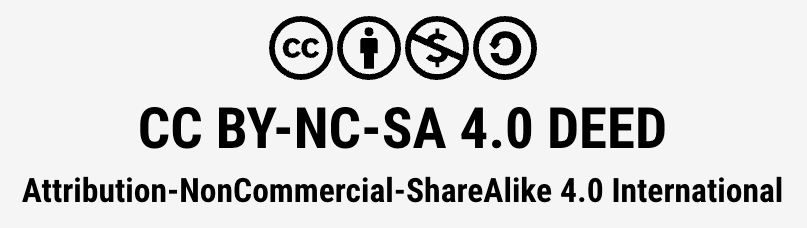

# 许可协议

本仓库全部内容采用以下许可协议。

## 许可类型

知识共享 署名-非商业性使用-相同方式共享 4.0 国际（CC BY-NC-SA 4.0）

## 协议全文

[中文版协议全文](https://creativecommons.org/licenses/by-nc-sa/4.0/deed.zh-hans) ·
[英文版协议全文](https://creativecommons.org/licenses/by-nc-sa/4.0/deed.en)

## 你可以做什么

- **分享**——以任何媒介或格式复制、转载本内容
- **改编**——基于本内容进行再创作、转换与再发布

只要你不违反许可条件，著作权人不能撤销上述权利。

## 你需要遵守什么

- **署名**：必须以合理方式注明作者姓名、来源与协议链接，并说明你做过改动；且不得暗示作者对你的使用方式背书。
- **非商业**：不得将本内容用于商业用途。
- **相同方式共享**：如果你基于本内容再创作，改作须以与原作相同的许可协议发布。
- **不得附加额外限制**：不得施加法律条款或技术手段，限制他人行使许可所允许的行为。

## 免责声明

对于属于公有领域的材料，或你的使用已被适用的例外或限制所许可的材料，你无须遵守本许可。

本协议不提供任何担保。协议所授予的权限未必涵盖你所需的全部用途——例如，隐私权、公开权或精神权利等其他权利仍可能限制你的使用方式。

本页仅为许可协议的摘要，不构成正式许可协议，也不具备法律效力。使用前请仔细阅读[协议全文](https://creativecommons.org/licenses/by-nc-sa/4.0/deed.zh-hans)。

## 商业授权

商业权利由著作权人保留。如需商业授权、出版洽谈，或在商业场景中使用本内容，请通过[联系页](contact.md)与作者取得联系。

## 第三方内容说明

本教材中提及的商标归各自所有者所有；引用的第三方文档、论文与代码遵循其各自的许可协议。
